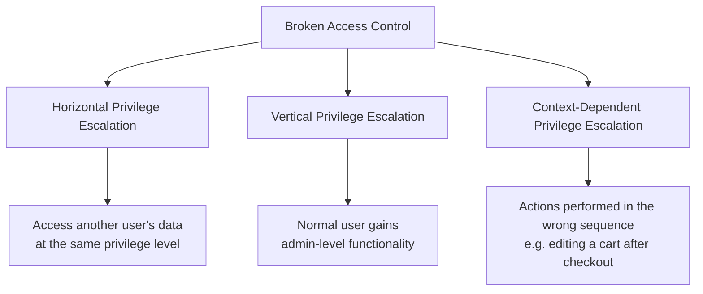
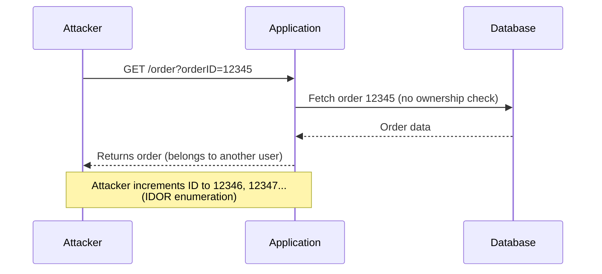
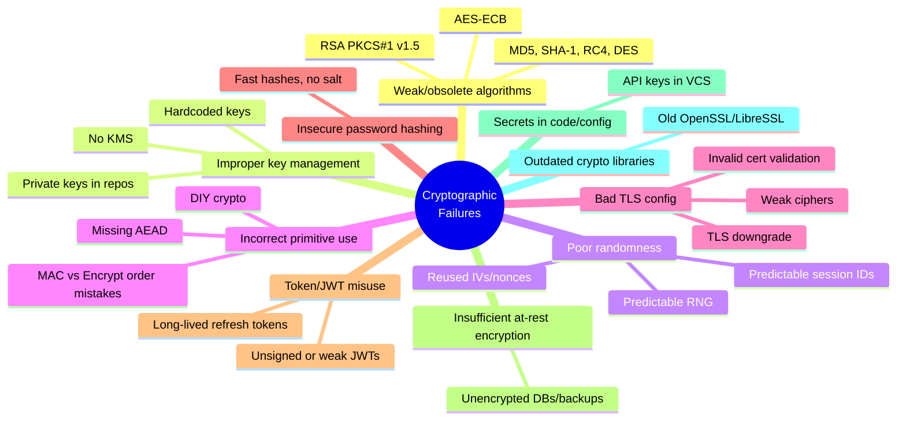
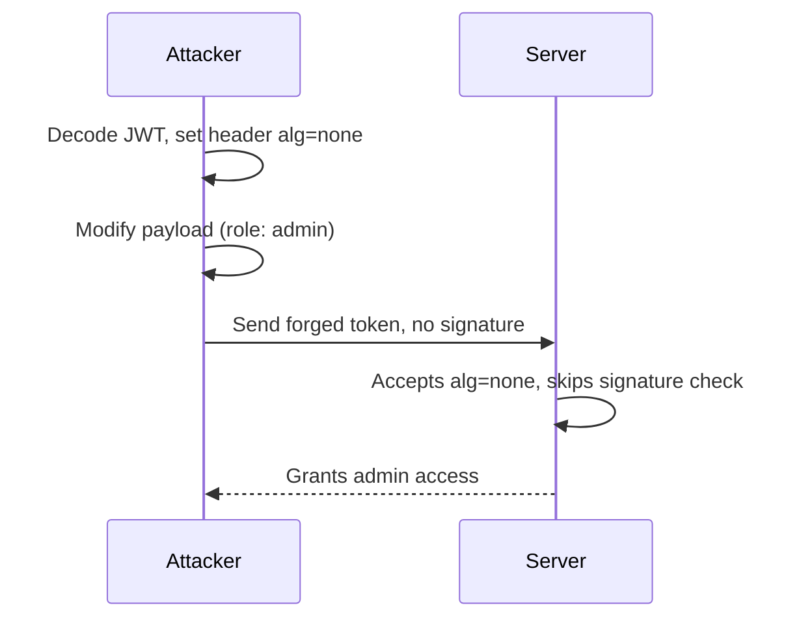
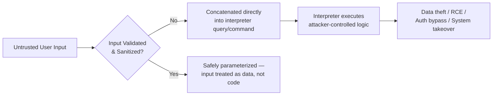
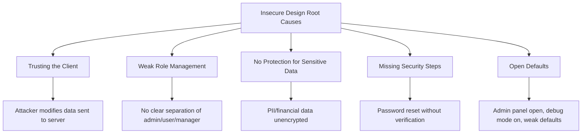
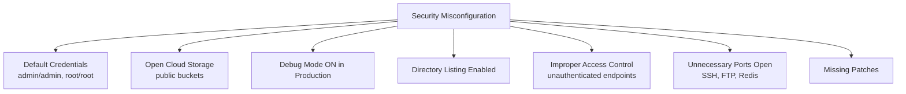
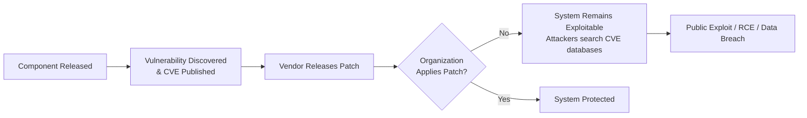

# Web Application Security Notes — Part 1

**Covers:** A01 Broken Access Control · A02 Cryptographic Failures · A03 Injection · A04 Insecure Design · A05 Security Misconfiguration · A06 Vulnerable & Outdated Components

---

## A01 — Broken Access Control

### Introduction

Access control ensures only authorized users can view or modify resources. When implemented poorly, it leads to **Broken Access Control** — users acting beyond their intended permissions, resulting in unauthorized access, data leaks, or manipulation.

### Categories

### Common Attack Scenarios

**Parameter Manipulation**
- **SQL Call Modification** — changing SQL parameters to access other users' data.
- **Forced Browsing** — directly visiting hidden URLs (e.g. `/admin/dashboard`) without logging in.

**Access Control Bypass Techniques**
- **URL Manipulation** — changing query parameters (`role=user` → `role=admin`).
- **Endpoint Exploitation** — sending unauthorized requests to unprotected API endpoints.
- **Privilege Escalation** — altering cookies/tokens to elevate user roles.

**Insecure Direct Object Reference (IDOR)**
- **Guessing Object IDs** — accessing others' data by brute-forcing IDs.
- **Parameter-Based Access** — controlling roles via parameters.
- **Multi-Step Bypass** — skipping process steps to trigger the final action directly.

### Attack Flow

### Prevention Strategies

| Layer | Control Type | Example Mitigation |
|---|---|---|
| Code | Input Validation | Sanitize parameters |
| API | Access Tokens | Role checks on every endpoint |
| Auth | RBAC / ABAC | Assign least privilege |
| Session | Token Expiry | Invalidate on logout |
| Monitoring | Logs & Alerts | Detect privilege misuse |

- **Secure Coding** — validate all inputs, deny access by default.
- **Server-Side Controls** — enforce permissions on the backend, never trust the client.
- **RBAC / ABAC** — Role-Based or Attribute-Based Access Control.
- **Session Management** — invalidate sessions on logout; use short-lived JWTs.
- **Logging & Rate-Limiting** — detect and block brute-force/repeated access attempts.

### Detection & Response

- **Monitoring & Auditing** — log failed attempts, review access patterns regularly.
- **Error Handling** — avoid leaking information in error messages.
- **Admin Access Control** — restrict admin areas, require VPN for remote admins.

### Example Exploits

| Attack Type | Malicious Action | Example URL |
|---|---|---|
| SQL Manipulation | Change account parameter | `acct=54321` |
| Forced Browsing | Direct admin page access | `/admin/dashboard` |
| IDOR | Guess next orderID | `/order?orderID=12346` |
| Privilege Escalation | Modify role | `?role=admin` |
| Multi-Step Bypass | Skip to confirmation | `/confirmOrder` |

### High-Priority Endpoints to Test (Pentest Checklist)

| Category | Examples | Risk |
|---|---|---|
| Admin / Management | `/admin`, `/admin/*`, `/manage/users`, `/dashboard` | Full-privilege actions — highest impact |
| User profile / account | `/user/profile`, `/account`, `/user/settings` | PII exposure, account takeover |
| Object / resource (IDOR) | `/order`, `/invoice`, `/document/{id}`, `/files/{id}` | Predictable IDs → unauthorized access |
| Authorization / role-assignment | `/role/update`, `/users/{id}/roles`, `/promote` | Direct privilege escalation |
| Payment / billing / order flow | `/cart`, `/checkout`, `/payment`, `/order/confirm` | Financial manipulation, multi-step bypass |
| File upload / download / media | `/download?fileId=`, `/media/{id}`, `/attachments/{id}` | Data leakage, path traversal |
| API (REST/GraphQL/RPC) | `/api/*`, `/graphql`, `/rpc/*` | Broad data exposure, weak parameter checks |
| Batch / bulk operations | `/api/bulkDelete`, `/api/bulkUpdate`, `/admin/bulk-import` | Mass data alteration/deletion |
| Client-controlled roles/flags | `?role=`, `isAdmin=true`, `/setRole` | Trusting client input → role tampering |
| Internal / diagnostic | `/health`, `/metrics`, `/actuator`, `/debug`, `/internal/*` | Info disclosure, exposed admin controls |
| Third-party / webhook callbacks | `/webhook/*`, `/callback`, `/payments/webhook` | Forged callbacks bypassing checks |
| Auth & token endpoints | `/login`, `/token/refresh`, `/oauth/callback`, `/logout` | Token tampering, session reuse |
| Static / config / backups | `/.env`, `/config`, `/.git`, `/backup/2025-09-01.zip` | Exposure of credentials/secrets |

---

## A02 — Cryptographic Failures

### Introduction

Cryptographic failures occur when cryptography is applied incorrectly, weak algorithms are used, or keys/secrets are mishandled. These failures lead to data exposure, impersonation, tampering, and full system compromise.

### Categories

### Common Attack Scenarios

- **Man-in-the-Middle (MITM)** — via weak TLS or missing certificate validation, allows eavesdropping or tampering.
- **JWT claim tampering / `alg=none`** — elevation or impersonation if the server accepts unsigned tokens.
- **Key exfiltration** — from repos or misconfigured storage, allowing decryption of historical data or token forgery.
- **Offline password cracking** — after a DB leak, when weak hashes were used.
- **Secret discovery** — via scanning public repos, CI logs, or container images.

### Attack Flow — JWT `alg=none`

### Prevention Strategies

**Algorithm & mode choices**
- Use modern proven primitives: AES-GCM or ChaCha20-Poly1305 (AEAD) for symmetric encryption; RSA-OAEP for encryption; RSA-PSS/ECDSA for signatures.

**Key management**
- Never hard-code secrets — use environment variables or secret managers.
- Enforce key rotation, access controls, and least privilege for key usage.

**TLS & transport**
- Validate certificates properly — hostname checks, chain validation, CRL/OCSP.
- Use HSTS, disable weak ciphers and protocol fallbacks; consider certificate pinning.

**Password handling**
- Hash with memory-hard algorithms: Argon2id or bcrypt/scrypt with per-user salt (and pepper where viable).
- Enforce strong password policies, rate-limit authentication attempts.

**Randomness & nonces**
- Use cryptographically secure RNGs (`SecureRandom`, `os.urandom`, Web Crypto).
- Never reuse nonces/IVs for a given key.

**Token & session security**
- Sign tokens securely, validate signatures and claims server-side.
- Keep tokens short-lived, implement refresh token rotation with revocation lists.
- Don't store sensitive claims (PII, privileges) in client-visible tokens without server validation.

**Secrets hygiene**
- Scan repos/CI/artifacts for secrets (git-secrets, trufflehog).
- Rotate any secret found in a public location immediately.

**Data-at-rest & backups**
- Encrypt DBs and backups with strong keys stored in a KMS; protect offline backups/export paths.

### Detection & Response

- Log all key operations (creation, access, deletion), cert events, token failures.
- Monitor anomalous key usage (unusual IPs/times) and alert.
- Track certificate expiry and automate renewal; detect self-signed/unexpected certs.
- Maintain an inventory of keys/certs and owners.
- Periodically scan public code/containers for secrets; integrate pre-commit checks.

### Example Exploits (PoCs)

- **JWT `alg=none`** — server accepts unsigned tokens, attacker removes signature, modifies claims → becomes admin.
- **Hardcoded private key in repo** — attacker finds `private.pem` on GitHub, uses it to sign tokens and impersonate services.
- **Weak TLS config** — server supports TLS 1.0 and RC4, allows downgrade to weak cipher → MITM.
- **Plaintext backups** — `db_backup.sql` stored in a public-ACL cloud bucket → full data leak.

### Summary Table

| Layer | Failure Type | Example Mitigation |
|---|---|---|
| Transport | Weak TLS / missing validation | TLS 1.2+/1.3, PFS, cert validation, HSTS |
| Keys | Hardcoded / exposed keys | KMS/HSM, key rotation, secret scanning |
| Algorithms | Obsolete/unsafe algorithms | AES-GCM/ChaCha20-Poly1305, RSA-OAEP/ECDSA |
| Tokens | Unsigned/long-lived JWTs | Signed tokens, validated claims, short TTLs |
| Storage | Unencrypted backups/DB | Encrypt-at-rest with KMS keys |
| Passwords | Fast hash / no salt | Argon2id / bcrypt + per-user salt |
| Libraries | Outdated OpenSSL/CVEs | Patch libraries, use vetted libs |
| DevOps | Secrets in repo/CI | Secret scanning, pre-commit hooks, rotation |

---

## A03 — Injection

### Introduction

Injection vulnerabilities occur when **untrusted user input** is sent to an interpreter (SQL, OS shell, LDAP, NoSQL, XML parser, template engine, etc.). Attackers craft input to execute commands, steal data, or compromise the entire system.

Why it's dangerous:
- Very easy to exploit
- Mostly caused by developer mistakes
- Leads to complete system takeover
- Common in login forms, search boxes, APIs, headers, cookies

### How Injection Works

### Types of Injection Attacks

| Type | Target | Example Payload | Impact |
|---|---|---|---|
| SQL Injection (SQLi) | Databases | `' OR 1=1 --`, `UNION SELECT username, password FROM users` | Data theft, account takeover, full DB compromise |
| Command Injection | OS shell | `; ls`, `\| whoami`, `&& cat /etc/passwd` | Server takeover, malware install, root access |
| NoSQL Injection | MongoDB, Firebase, Elasticsearch | `{"$ne": null}`, `{"$gt": ""}` | Unauthorized access, data leakage, privilege escalation |
| LDAP Injection | Directory services | `*)(|(objectClass=*))` | Bypass authentication, extract directory data |
| XPath Injection | XML data queries | `' or '1'='1` | Read sensitive data in XML |
| Template Injection (SSTI) | Jinja2, Twig, Smarty | `{{7*7}}` → `{{config.__class__.__init__.__globals__['os'].popen('id').read()}}` | Remote Code Execution |
| Email Header Injection | Mail forms | Injected `BCC:` line in a form field | Spam sending, phishing, mass mail abuse |

### Real-World Attack Scenarios

1. **Login Bypass (SQLi)** — payload `' OR '1'='1` → logs in without a password.
2. **Dump Full Database** — `UNION SELECT NULL, username, password FROM users --` → credential extraction.
3. **Remote Command Execution** — `&& cat /etc/passwd` → system-level compromise.
4. **NoSQL Credential Bypass** — request body `{"username": {"$ne": null}, "password": {"$ne": null}}` → auth bypass.
5. **SSTI → Full Server Takeover** — Jinja2 payload spawning a subprocess to execute system commands.

### OWASP Testing Techniques

| Category | Test Payloads |
|---|---|
| SQLi | `' OR 1=1 --`, `' OR '1'='1`, `AND SLEEP(5)` (time-based) |
| Command Injection | `; ls`, `\| id`, `&& whoami` |
| NoSQL | `$ne`, `$gt`, `"$where"` expressions |
| SSTI | `{{7*7}}`, `${7*7}` |
| Error-Based | Trigger error messages to check if payloads execute |

### Prevention

- Use parameterized queries / prepared statements — never concatenate strings.
- Apply strict input validation (allowlists over denylists).
- Escape output correctly per interpreter context.
- Use ORM frameworks safely; avoid raw query building.
- Sandbox or disable dangerous template features (avoid `eval`-like SSTI paths).
- Least-privilege database accounts (no `root`/`sa` for app connections).

---

## A04 — Insecure Design

### Introduction

Insecure design means the system is unsafe **from the very beginning** because it was planned without security in mind. Even perfect coding cannot fix a fundamentally flawed design.

### Why Insecure Design Happens

- No planning for security
- No threat modeling (not thinking like an attacker)
- Trusting the user/client too much
- No clear access rules
- Sensitive data not protected well
- Default/weak settings used

### Examples

### Common Attacks Because of Insecure Design

- **Fake Webhook Calls** — system accepts any request without verifying authenticity.
- **Privilege Escalation** — normal user becomes admin by changing a role in the request.
- **Data Leaks** — API returns more information than needed.
- **Race Conditions** — same action triggered multiple times quickly (e.g. double payment).
- **Brute Force** — no rate limit on login, unlimited password attempts.

### Prevention

1. **Threat Modeling** — before building a feature, imagine how it can be abused.
2. **Security Requirements Early** — add a security checklist per feature.
3. **Least Privilege** — minimum access, no extra powers.
4. **Protect Integrations** — verify webhooks, API, and third-party calls.
5. **Secure Defaults** — start locked down, open only what's required.
6. **Logging & Monitoring** — track login, payment, and role-change events.
7. **Rate Limits** — stop unlimited attempts.

### Real-World Examples

| Scenario | What Happened | Weak Design |
|---|---|---|
| Order confirmed without payment | Attacker calls API directly | No verification on callback |
| User becomes admin | Attacker changes role ID in request | Role trusted on client side |
| Double payment refund | Attacker triggers refund twice | No protection against repeat actions |
| Personal data leaked | API returns full records | No data filtering |

---

## A05 — Security Misconfiguration

### Introduction

Security misconfigurations happen when settings, permissions, or system configurations are set up incorrectly, making it easy for attackers to break in — like leaving a door unlocked, not because the lock is broken, but because it was never locked properly.

### Why Misconfigurations Happen

- Not changing default settings
- Not disabling unused features
- Weak server/cloud configuration
- Poor access control setup
- Missing security updates/patches
- Incorrect API/firewall settings
- Lack of review before deployment

### Common Examples

### Common Attacks

- **Unauthorized Access** — login using default/weak credentials.
- **Data Exposure** — sensitive files visible due to open buckets.
- **API Abuse** — endpoints without authentication.
- **Path Traversal** — accessing system files due to bad server config.

### Prevention

1. **Change Defaults** — no default usernames, passwords, ports, or settings.
2. **Patch & Update Regularly** — keep OS, apps, and libraries updated.
3. **Disable Unused Features & Ports** — only enable what's needed.
4. **Proper Access Control** — check authentication on every sensitive endpoint.
5. **Secure Cloud Configurations** — private buckets, IAM roles, limited access.
6. **Automated Security Scanning** — detect open ports, misconfigured servers, weak cloud settings.

### Real-World Examples

| Scenario | What Happened | Misconfiguration |
|---|---|---|
| Database exposed online | Hacker accesses full DB | Default port + no password |
| Sensitive files leaked | S3 bucket open to public | Wrong bucket policy |
| Full server access | Debug ON reveals secrets | Debug mode enabled |
| Ransomware hit | Old software exploited | No patching |
| Internal API hacked | No authentication | Missing access control |

### Advanced: Exposing Sensitive System Files & Endpoints

Publicly accessible server/system files (`.env`, `.config`, `.yaml`, `.ini`, `.bak`, `.zip`, `.sql`) are critical misconfigurations that expose internal secrets, backups, or source code.

**Common Sensitive Endpoints Attackers Scan For**

| Category | Examples |
|---|---|
| Environment & Config Files | `/.env`, `/config.yaml`, `/config.json`, `/settings.ini`, `/application.properties`, `/web.config` |
| Backup & Old Files | `/db.sql`, `/backup.sql`, `/site-backup.zip`, `/config.bak`, `/index.php.old` |
| Source Code & Internal Folders | `/.git/`, `/.svn/`, `/.DS_Store`, `/.idea/`, `/node_modules/`, `/vendor/` |
| Logs & Error Files | `/error.log`, `/app.log`, `/debug.log` |
| Admin/Debug Endpoints | `/admin`, `/adminer.php`, `/phpinfo.php`, `/debug`, `/debug/vars` |

**Why these are dangerous**
- Passwords & tokens, API/database credentials, application secrets
- Full backup copies of the database
- Source code (helps attackers find vulnerabilities)
- Internal server configurations, user PII

**Prevention**
- Restrict access to sensitive files via server rules (Apache/Nginx)
- Keep backups outside the web folder
- Disable directory listing
- Block access to `.git/`, `.env`, `.sql`, `.zip`, `.bak`
- Use CI/CD pipelines to avoid leftover debugging files
- Keep secrets in environment variables, not web folders
- Use secret managers: AWS Secrets Manager, Vault, Azure Key Vault

---

## A06 — Vulnerable & Outdated Components

### Introduction

This happens when a system uses old, unpatched, or insecure versions of libraries, frameworks, plugins, operating systems, dependencies, or server software. Attackers know the weaknesses in old versions and exploit them easily — like installing a door but never updating the lock after everyone learns how to pick it.

### Why This Problem Happens

- Not updating libraries regularly
- Using old plugins "because it works, don't touch it"
- No dependency-check process
- Using unsupported libraries
- No inventory of components in use
- Relying on default OS/server versions

### Vulnerability Lifecycle

### Examples

| Component | Issue |
|---|---|
| Old WordPress Plugins | Hackers upload malicious files through known plugin flaws |
| Old Log4j | Remote Code Execution (Log4Shell) |
| Unsupported PHP (5.x/7.x) | No longer receives security updates |
| Old jQuery/Angular | XSS or prototype pollution issues |
| Unpatched OS | Outdated Ubuntu, Windows Server, kernel vulnerabilities |
| Old DB/Redis/Mongo | Unauthenticated access or RCE possible |

### Common Attacks

- Remote Code Execution (RCE)
- Data breaches
- Website takeover
- Malware injection
- Privilege escalation
- Account compromise
- Server crash / denial of service

Attackers simply Google the version number and search for public exploits.

### Prevention

1. **Update Regularly** — always use the latest stable version of frameworks, libraries, server OS, plugins.
2. **Maintain a Component Inventory** — track what's used, its version, and update schedule.
3. **Use Security Scanning Tools**:

| Tool | Purpose |
|---|---|
| Nmap | Scan open ports, detect outdated services |
| Nessus | Full vulnerability scanner for servers/apps/networks |
| OpenVAS | Free vulnerability scanner similar to Nessus |
| Nikto | Detect outdated server software and misconfigurations |

4. **Avoid Untrusted Components** — no random GitHub repos, abandoned libraries, unknown plugins.
5. **Remove Unused Dependencies** — delete unused packages; they still add risk.
6. **Patch OS & Server** — regularly update Apache/Nginx, MySQL/MongoDB/Redis, Linux kernel, Windows Server.

### Real-World Examples

| Scenario | What Happened | Outdated Component |
|---|---|---|
| Millions hacked via Log4Shell | RCE allowed remote takeover | Outdated Log4j |
| Website defaced | Plugin had known RCE flaw | Old WordPress plugin |
| Server compromised | Old PHP version exploited | PHP 5.x end-of-life |
| System slowed/crashed | Attackers abused public kernel exploit | Old Linux kernel |
