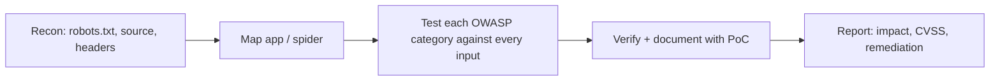

# OWASP Top 10 (2025) — Vulnerability Testing Checklist

Updated for the 2025 edition (released Jan 2026 — first update since 2021). Two categories are new (A03, A10), SSRF was folded into A01, and several categories were reordered/renamed. Pair with Burp Suite (or ZAP) as your intercepting proxy throughout.

---

## 0. Recon / Pre-Testing (do this before touching the app itself)

- [ ] Check `robots.txt` and `sitemap.xml` — disallowed paths often reveal admin panels, staging endpoints, backup dirs
- [ ] Check `security.txt` (`/.well-known/security.txt`) for scope/contact info
- [ ] View source of every page, especially the **login page** — look for:
  - Hidden fields, disabled client-side validation
  - JS files referencing internal API endpoints, hardcoded keys/tokens
  - HTML comments left in by devs (old creds, TODOs, internal hostnames)
  - Client-side-only "security" (e.g. role checks done in JS)
- [ ] `view-source` + JS bundle review for API routes, feature flags, version strings
- [ ] Passive recon: WHOIS, subdomain enum (amass/subfinder), Wayback Machine for old endpoints
- [ ] Fingerprint stack: Wappalyzer, HTTP headers, error pages, `/server-status`, `/actuator` (Spring), `.git/` exposure
- [ ] Map the app manually (spider with Burp) before automated scanning — build a full sitemap of every input point

---

## A01:2025 – Broken Access Control *(includes SSRF, merged from 2021's A10)*

**Access control checks:**
- [ ] IDOR: increment/decrement/UUID-swap object IDs in URLs, JSON bodies, API params (`/user/1001` → `/user/1002`)
- [ ] Force-browse to admin/staff URLs while logged in as a low-priv user
- [ ] Vertical privilege escalation (user → admin actions) by replaying admin requests with a user's session
- [ ] Horizontal privilege escalation (user A accessing user B's data)
- [ ] Tamper with role/permission fields in JWTs, hidden form fields, or cookies (`role=user` → `role=admin`)
- [ ] Check CORS config — is `Access-Control-Allow-Origin: *` combined with `Allow-Credentials: true`?
- [ ] Check if API allows HTTP method override (PUT/DELETE/PATCH) that bypasses UI-level restrictions
- [ ] Directory listing enabled on sensitive paths (`/uploads/`, `/backup/`)

**SSRF checks (now part of this category):**
- [ ] Any feature that fetches a URL server-side (webhooks, "import from URL", PDF generators, image proxies, link previews)
- [ ] Redirect the fetch to internal ranges: `http://127.0.0.1`, `http://169.254.169.254/latest/meta-data/` (cloud metadata), `http://localhost:PORT`
- [ ] Try bypassing naive blocklists: `http://0177.0.0.1` (octal), DNS rebinding, URL-encoded IPs, `http://[::1]`
- [ ] Check for blind SSRF via out-of-band interaction (Burp Collaborator) where no response is shown to you directly

## A02:2025 – Security Misconfiguration *(up from #5 in 2021)*

- [ ] Default credentials on any admin panel, DB, or service (this is where your `robots.txt` + source review from Step 0 pays off)
- [ ] Verbose error messages / stack traces leaking framework version, file paths, DB structure
- [ ] Unnecessary HTTP methods enabled (TRACE, OPTIONS revealing internal routes)
- [ ] Missing security headers: `X-Content-Type-Options`, `X-Frame-Options`/`frame-ancestors`, `Content-Security-Policy`
- [ ] Directory listing on web server
- [ ] Cloud storage misconfig: open S3 buckets / Azure blobs (`bucket-name.s3.amazonaws.com`)
- [ ] Exposed `.env`, `.git`, `.DS_Store`, `web.config`, backup files (`.bak`, `~`)
- [ ] Sample/default apps left installed (Tomcat manager, phpMyAdmin default install)

## A03:2025 – Software Supply Chain Failures *(new — expands 2021's "Vulnerable and Outdated Components")*

Now covers the whole chain — not just an outdated library, but how it got there and what built it.
- [ ] Fingerprint all libraries/frameworks in use (JS libs via Wappalyzer, server via headers/banners)
- [ ] Cross-reference versions against CVE databases / `searchsploit`
- [ ] Check for outdated CMS plugins (WordPress/Drupal) via version disclosure in source or changelog files
- [ ] `npm audit` / `pip-audit` / dependency-check if you have source access (internship/whitebox context)
- [ ] Check for unpatched known CVEs on exposed services (your Metasploitable-style workflow — banner-grab with Nmap, match to CVE)
- [ ] **New scope:** CI/CD pipeline exposure — public Jenkins, exposed `.github/workflows` with secrets in plaintext
- [ ] **New scope:** package typosquatting risk — does the app pull from public registries without pinning exact versions/hashes?
- [ ] **New scope:** build system integrity — are dependencies fetched over HTTPS with checksum/signature verification, or just trusted blindly?

## A04:2025 – Cryptographic Failures *(down from #2 in 2021)*

- [ ] Is the whole app served over HTTPS? Check for mixed content, HTTP fallback
- [ ] Run `testssl.sh` / SSL Labs — check for weak ciphers, expired/self-signed certs, TLS 1.0/1.1 still enabled
- [ ] Check `Strict-Transport-Security` (HSTS) header present
- [ ] Look for sensitive data (PII, tokens, passwords) sent in URL params — ends up in logs/browser history
- [ ] Check password storage: any evidence of MD5/SHA1 (unsalted) via error messages, reset flows, or leaked source
- [ ] Check for hardcoded encryption keys/secrets in JS bundles or config files
- [ ] Sensitive data cached (`Cache-Control` missing on pages with PII/tokens)

## A05:2025 – Injection *(down from #3 in 2021)*

- [ ] SQLi: test every input (login, search, filters, headers like `X-Forwarded-For`) with `'`, `"`, `--`, boolean-based payloads; confirm with `sqlmap` once you've found a candidate manually
- [ ] Blind SQLi: time-based payloads (`SLEEP()`, `WAITFOR DELAY`) where errors are suppressed
- [ ] Command injection: test inputs that might hit shell calls (`;`, `|`, `` ` ``, `$()`) — file upload names, ping/DNS-lookup style features
- [ ] NoSQL injection: `{"$ne": null}`, `{"$gt": ""}` in JSON login bodies
- [ ] LDAP injection on directory-auth login forms
- [ ] XSS (reflected/stored/DOM): standard payloads in every input + URL params, check where user input is reflected unescaped; check stored fields (profile bio, comments) that render for other users
- [ ] Template injection (SSTI): `{{7*7}}`, `${7*7}` in inputs that might be templated server-side
- [ ] XXE: file upload endpoints accepting XML, SOAP/SVG uploads

## A06:2025 – Insecure Design *(down from #4 in 2021)*

- [ ] Business logic flaws: negative quantities in a cart, price manipulation via hidden fields, race conditions on limited-use coupons/vouchers
- [ ] Multi-step processes (checkout, password reset) — can steps be skipped or replayed out of order?
- [ ] Rate limiting absent on sensitive actions (login, OTP, password reset, payment)
- [ ] Workflow bypass: can a "pending approval" state be reached directly via API without approval step?
- [ ] Excessive trust in client-side logic for anything security-relevant

## A07:2025 – Authentication Failures *(renamed from "Identification and Authentication Failures"; holds at #7)*

- [ ] Login page review (Step 0) — check for username enumeration via different error messages ("user not found" vs "wrong password")
- [ ] Brute-force / credential stuffing: is there account lockout, CAPTCHA, or rate limiting? (Hydra to test — you've got this in your lab kit)
- [ ] Weak password policy — test if `password123` is accepted
- [ ] Session token analysis: predictable session IDs, session fixation (does session ID stay the same after login?)
- [ ] Session invalidation: does logout actually kill the session server-side? Old token still work after logout?
- [ ] "Remember me" / password reset token — predictable, non-expiring, or leaked via Referer header?
- [ ] MFA bypass: can the MFA step be skipped by directly hitting the post-auth endpoint?
- [ ] JWT checks: `alg: none` acceptance, weak signing secret (crack with `jwt_tool`/hashcat), missing expiry validation

## A08:2025 – Software or Data Integrity Failures *(holds at #8)*

Narrower than A03 now — this is about trust boundaries at the code/data level, not the whole supply chain.
- [ ] Check for insecure deserialization — Java/PHP/Python objects accepted from user input (error messages revealing serialized data are a strong hint)
- [ ] Auto-update mechanisms without signature/integrity verification
- [ ] Untrusted CDN/third-party JS included without Subresource Integrity (SRI) hashes
- [ ] Check for tampering of client-side state (cookies, localStorage) that the server trusts without re-validation

## A09:2025 – Security Logging & Alerting Failures *(renamed from "...Monitoring Failures"; holds at #9)*

- [ ] Trigger a failed login, SQLi attempt, or 403 — is there any observable indication it's logged/alerted (rate limiting kicking in, IP ban, etc.)?
- [ ] Check if logs would capture enough detail for incident response (ties directly into your Splunk/Sysmon lab — think about what you'd need to see server-side to catch what you just did)
- [ ] Check for log injection — can you inject CRLF/fake log entries via input fields to poison log files?
- [ ] **Emphasis shift for 2025:** logging isn't enough on its own — check whether high-value events (password change, permission change, payment, admin login) actually trigger an *alert*, not just a log line nobody reads

## A10:2025 – Mishandling of Exceptional Conditions *(new category)*

Poor error/exception handling that leads to insecure or unpredictable behavior — crashes, "failing open," data corruption, DoS.
- [ ] Feed malformed/unexpected input (wrong data type, oversized payload, null bytes, unexpected encoding) and see how the app responds
- [ ] Check whether errors "fail open" — e.g. an auth check that throws an exception and defaults to *allowing* access instead of denying it
- [ ] Force a crash/exception mid-transaction (payment, multi-step form) — does the app end in a consistent state, or a corrupted/partial one?
- [ ] Check error responses for leaked sensitive info (stack traces, DB queries, internal paths) — overlaps with A02 but focus here is *why* the error wasn't handled, not just that it leaked
- [ ] Test edge-case inputs: empty arrays, negative numbers where only positive expected, extremely long strings, Unicode/encoding edge cases
- [ ] Check for inconsistent exception handling across similar endpoints (one validates properly, a near-duplicate endpoint doesn't)

---

## Reporting reminder
For every confirmed finding: screenshot/PoC, request-response pair, CVSS score, and a remediation line — matches the report format you've already been using for your Metasploitable write-ups.
