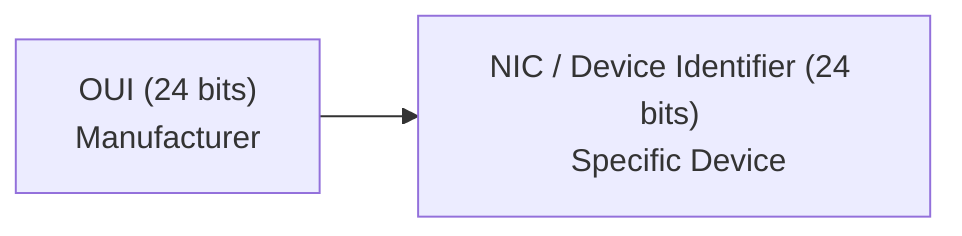

## ARP (Address Resolution Protocol)

ARP is used to find the MAC address of a device when you already know its IP address

- **Why ARP exists?**

Computers communicate on a LAN using MAC addressess, but humans (users) and applications usually know IP addressess.

Example:

IP Address: 192.168.1.10

MAC Address: 00:1A:2B:3C:4D:5E

If you computer wants to send data to 192.168.1.10, it first needs to discover the MAC address.

### How ARP works

### Cybersecurity Relevance

Attackers can perform ARP Spoofing (ARP Poisoning) by sending fake ARP replies and pretending to be another device.

This can allow: 

* MITM attacks
* Traffic interception
* Credential Theft

- OSI Layer: Layer 2 (data link)

## VLSM (Variable Length Subnet Mask)

VLSM allows a network administrator to crete subnets of different sizes from the same network.

- **Why VLSM exists**

Without VLSM, IP addresses can be wasted.

Example:

Suppose a company has:

* HR department -> 20 devices
* IT department -> 100 devices
* Management -> 10 devices

Giving every department the same subnet wastes many IP addresses.

With VLSM

IT -> /25

HR -> /27

Management -> /28

Each department receives only the number of addresses it needs.

Benefits 

* Better IP utilization
* Less waste
* Easier network design
* Improved scalability

### Cybersecurity Relevance 

Security teams often use subnetting and VLSM to:

* Segement departments
* Reduce attack surfaces
* Isolate sensitive systems

Example:
|---|
|Finance VLAN|
|HR VLAN|
|Guest WiFi VLAN|
|Server VLAN|

If an attacker compromises Guest Wifi, they should not automatically reach Finance systems.

## OUI vs NIC

This topic comes from MAC addresses

Remember:

MAC Address: 00:1A:2B:3C:4D:5E

A MAC address is 48 bits long 

## OUI (Organizationally Unique Identifier)

The first 24 bits of the MAC address.

Example:

00:1A:2B

Assigned by the IEEE

It identifies the manufacturer

Example:

* Cisco
* Dell
* HP
* Apple

When you see the OUI, you can often determine who made the device.

## NIC (Device Identifier)

The last 24 bits of the MAC address.

Example: 

3C:4D:5E

Assigned by the manufacturer

This uniquely identifies the specific device.

### OUI vs NIC Diagram

