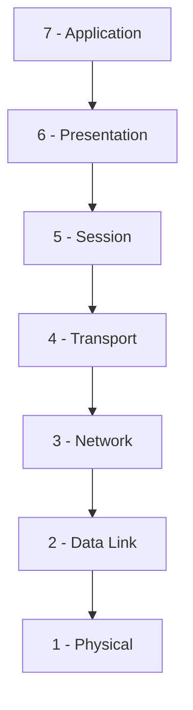
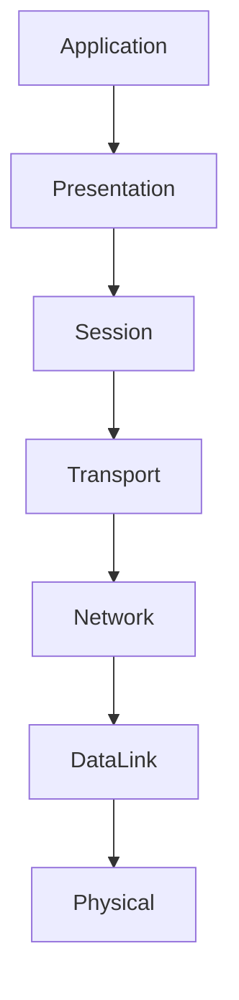
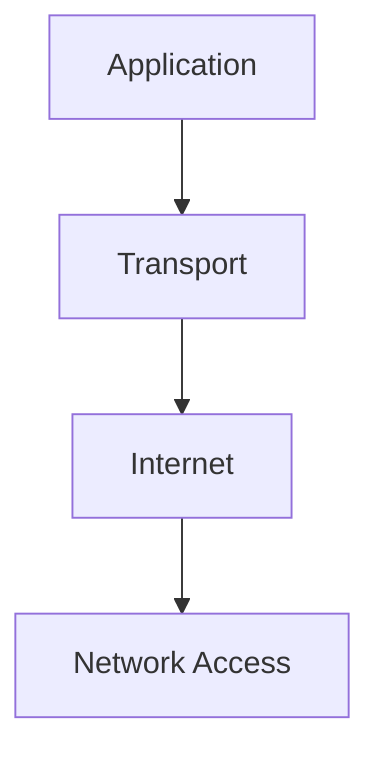
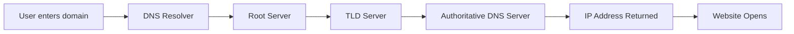
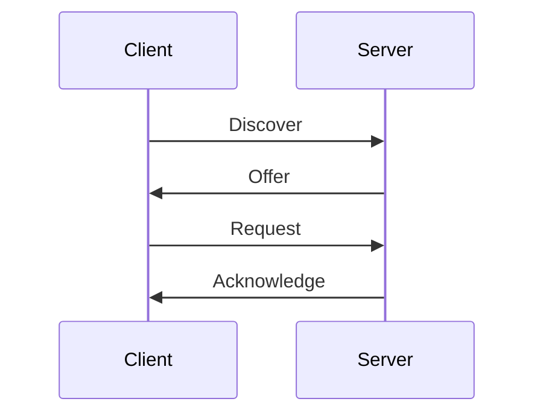

# 🌐 Week 04 - OSI Model, TCP/IP, Network Protocols, DNS & DHCP
Why This Matters for Cybersecurity

Most cyber attacks target network protocols and services.

Examples:

* Phishing → Application Layer
* ARP Spoofing → Data Link Layer
* DDoS → Transport Layer
* DNS Poisoning → DNS Service

Understanding networking helps security professionals identify where attacks occur and how to defend against them.

## The OSI Model

OSI stands for **Open Systems Interconnection.**

It is a theoretical framework that explains how devices communicate across a network using seven layers. Each layer performs a specific task.

### OSI Stack


### Mnemonic
```text
All People Seem To Need Data Processing
```

## OSI Layers Explained

|Layer|	Name|	Examples|	Purpose|
|---|---|---|---|
|7 |	Application	|HTTP, FTP, DNS, SMTP|	User-facing services|
|6 |Presentation	|SSL/TLS, Encryption|	Data formatting & encryption|
|5 |	Session	|APIs, Login Sessions|	Maintains connections|
|4 |	Transport	|TCP, UDP|	End-to-end delivery|
|3 |	Network	|IP, Routers|	Routing|
|2 |	Data Link	|MAC, Switches, ARP|	Local delivery|
|1 | Physical	|Cables, Signals|	Physical transmission|

## How Data Travels Through OSI

When sending data:

Data is encapsulated as it moves down the stack and de-encapsulated on the receiving side.

## TCP/IP Model

TCP/IP is the practical networking model used on the Internet today. It simplifies the OSI model into four layers.

### TCP/IP Stack

### Layers

|TCP/IP Layer	|Examples|
|---|---|
|Application|	HTTP, HTTPS, FTP, DNS, SMTP|
|Transport|	TCP, UDP|
|Internet|	IP, ICMP|
|Network Access|	Ethernet, Wi-Fi|

## OSI vs TCP/IP

|OSI|	TCP/IP|
|---|---|
|7 Layers|	4 Layers|
|Theoretical|	Practical|
|Learning Model|	Real Internet Model|

## TCP vs UDP

TCP (Transmission Control Protocol)

Characteristics:

* Reliable
* Connection-oriented
* Guarantees delivery
* Maintains packet order

Common Uses:

* HTTP
* HTTPS
* FTP

## UDP (User Datagram Protocol)

Characteristics:

* Faster
* Connectionless
* No delivery guarantee

Common Uses:

* Gaming
* Video Streaming
* VoIP

## Common Network Protocols

### Web Protocols

|Protocol|	Purpose|	Port|
|---|---|---|
|HTTP|	Web Traffic|	80|
|HTTPS|	Secure Web Traffic|	443|

### File Transfer

|Protocol	|Purpose	|Port|
|---|---|---|
|FTP	|File Transfer	|21|
|SFTP	|Secure File Transfer	|22|

### Email Protocols

|Protocol	|Purpose	|Port|
|---|---|---|
|SMTP	|Send Email	|25 / 587|
|POP3	|Download Email	|110|
|IMAP	|Synchronize Email	|143|

### Remote Access

|Protocol	|Purpose	|Port|
|---|---|---|
|Telnet	|Remote Login (Insecure)	|23|
|SSH	|Secure Remote Login	|22|
|RDP	|Remote Desktop	|3389|

### Network Management

|Protocol	|Purpose	|Port|
|---|---|---|
|SNMP|	Monitor Devices	|161|
|NTP|	Time Synchronization	|123|

### File Sharing

|Protocol	|Purpose	|Port|
|---|---|---|
|SMB	|Windows File Sharing	|445|

## DNS (Domain Name System)

DNS converts human-readable domain names into IP addresses.

Example:
```text
google.com → 142.250.183.46
```
### DNS Components

* DNS Resolver
* DNS Server
* DNS Records

Common Records:

|Record	|Purpose|
|---|---|
|A	|Domain → IPv4|
|AAAA	|Domain → IPv6|
|CNAME	|Alias|
|MX	|Mail Server|
|NS	|Name Server|
|TXT	|Text Information|

## DNS Resolution Process

### DNS Port
```text
Port 53
```

Uses:

* UDP (Most Queries)
* TCP (Large Responses)

## DHCP (Dynamic Host Configuration Protocol)

DHCP automatically assigns network settings to devices joining a network.

DHCP provides:

* IP Address
* Subnet Mask
* Default Gateway
* DNS Server

## DHCP Components

### DHCP Server

Assigns IP addresses.

### DHCP Client

Requests IP addresses.

Examples:

* Laptop
* Phone
* Printer

 ### IP Pool

Available addresses for assignment.

Example:
```text
192.168.1.100 - 192.168.1.200
```

## DHCP DORA Process

The DHCP process follows DORA:


### DORA

* D = Discover
* O = Offer
* R = Request
* A = Acknowledge

## DHCP Ports

|Device|	Port|
|---|---|
|DHCP Server|	67|
|DHCP Client|	68|

Uses UDP.

### Cybersecurity Notes

|Attack|	Layer|
|---|---|
|ARP Spoofing|	Layer 2|
|DDoS|	Layer 4|
|Phishing|	Layer 7|
|DNS Poisoning|	DNS/Application|

Understanding the OSI model helps security professionals identify where attacks occur and how to investigate them.

## Protocols to Memorize
```text
HTTP  = 80
HTTPS = 443
FTP   = 21
SSH   = 22
Telnet= 23
SMTP  = 25 / 587
DNS   = 53
DHCP  = 67 / 68
POP3  = 110
NTP   = 123
IMAP  = 143
SNMP  = 161
SMB   = 445
RDP   = 3389
```
