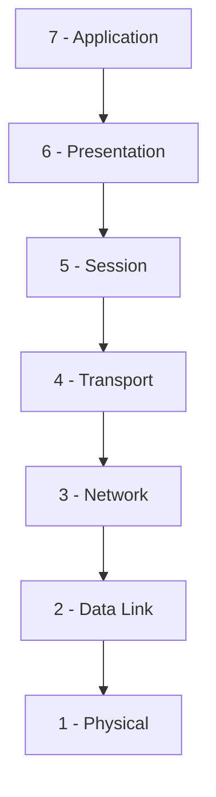

# 🌐 Week 04 - OSI Model, TCP/IP, Network Protocols, DNS & DHCP
Why This Matters for Cybersecurity

Most cyber attacks target network protocols and services.

Examples:

* Phishing → Application Layer
* ARP Spoofing → Data Link Layer
* DDoS → Transport Layer
* DNS Poisoning → DNS Service

Understanding networking helps security professionals identify where attacks occur and how to defend against them.

## The OSI Model

OSI stands for **Open Systems Interconnection.**

It is a theoretical framework that explains how devices communicate across a network using seven layers. Each layer performs a specific task.

### OSI Stack


### Mnemonic
```text
All People Seem To Need Data Processing
```

## OSI Layers Explained

|Layer|	Name|	Examples|	Purpose|
|---|---|---|---|
|7 |	Application	|HTTP, FTP, DNS, SMTP|	User-facing services|
|6 |Presentation	|SSL/TLS, Encryption|	Data formatting & encryption|
|5 |	Session	|APIs, Login Sessions|	Maintains connections|
|4 |	Transport	|TCP, UDP|	End-to-end delivery|
|3 |	Network	|IP, Routers|	Routing|
|2 |	Data Link	|MAC, Switches, ARP|	Local delivery|
|1 | Physical	|Cables, Signals|	Physical transmission|
