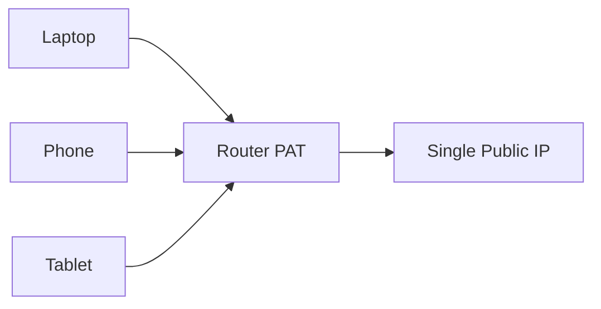

# 🌐 Week 05 – Subnetting, NAT, PAT, Network Monitoring & Troubleshooting

This continues naturally from your previous networking notes.

## Why These Topics Matter

Network administrators and cybersecurity professionals use subnetting, NAT, monitoring tools, and troubleshooting techniques to:

* Improve network performance
* Conserve IP addresses
* Increase security
* Detect attacks
* Diagnose network problems

## Subnetting

### What is a Subnet?

A subnet (subnetwork) is a smaller network created from a larger network.

Example:
```text
192.168.0.0/24
```
can be divided into:
```text
192.168.0.0/28
```
which becomes a subnet of the original network.

## Why Use Subnetting?

### Efficient IP Usage

Avoid wasting IP addresses.

### Better Security

Separate departments and systems.

### Better Performance

Reduces broadcast traffic.

## Network vs Host Portion

An IPv4 address contains:

* Network Portion → Identifies the network
* Host Portion → Identifies the device

## Subnet Mask

A subnet mask separates the network portion from the host portion.

Example:
```text
255.255.255.0
```
Binary:
```text
11111111.11111111.11111111.00000000
```
* 1s = Network bits
* 0s = Host bits

## Common CIDR Reference

|CIDR|	Subnet Mask|	Usable Hosts|
|---|---|---|
|/24|	255.255.255.0|	254|
|/25|	255.255.255.128|	126|
|/26|	255.255.255.192|	62|
|/27|	255.255.255.224|	30|
|/28|	255.255.255.240|	14|
|/29|	255.255.255.248|	6|
|/30|	255.255.255.252|	2|

### Subnetting Formula

Number of Subnets:

Where:

* n = borrowed host bits

### Host Formula

Usable Hosts:

Where:

* h = remaining host bits
* subtract 2 for:
    * Network Address
    * Broadcast Address

### Example

Original Network:
```text
192.168.1.0/24
```
Need:
```text
4 Subnets
```
Borrow:
```text
2 Host Bits
```
New Network:
```text
192.168.1.0/26
```
Creates:

|Subnet|	Range|
|---|---|
|192.168.1.0/26|	1 - 62|
|192.168.1.64/26|	65 - 126|
|192.168.1.128/26|	129 - 190|
|192.168.1.192/26|	193 - 254|

## Network Address Translation (NAT)

### What is NAT?

NAT (Network Address Translation) translates private IP addresses into public IP addresses before traffic is sent to the Internet.

### Why NAT Exists

Home devices use private IPs:

192.168.1.x

The Internet only sees:

One Public IP

## NAT Process


## Types of NAT

### Static NAT

One private IP always maps to the same public IP.

### Dynamic NAT

Uses a pool of public IP addresses.

### PAT (Port Address Translation)

Many private IPs share one public IP using different port numbers.

## PAT (Port Address Translation)

PAT maps multiple private IP addresses to a single public IP address.

Uses:

* Source IP
* Source Port

to uniquely identify connections.

### PAT Example

## Network Monitoring

What is Network Monitoring?

The continuous observation of network performance, availability, and security.

Goals:

* Detect failures
* Detect attacks
* Monitor traffic
* Improve performance

## Wireshark

What is Wireshark?

Wireshark is a packet analysis tool used to capture and inspect network traffic.

Features

* Packet Capture
* Deep Protocol Inspection
* Filtering
* Statistics
* Stream Reassembly

Uses

* Troubleshooting
* Security Analysis
* Incident Investigation

## Ettercap

What is Ettercap?

Ettercap is a network analysis and security testing tool.

Features

* Packet Sniffing
* ARP Poisoning
* Man-in-the-Middle Testing

⚠️ Commonly used in cybersecurity labs.

### Common Network Problems

|Problem|	Possible Cause|
|---|---|
|Connectivity Issues|	Bad cable, configuration errors|
|Slow Network|	Congestion, interference|
|IP Conflict|	Duplicate IP addresses|
|DNS Failure|	Incorrect DNS settings|
|NIC Problems|	Driver or hardware failure|
|Wireless Problems|	Weak signal|
|Firewall Issues|	Blocked traffic|
|VPN Issues|	Incorrect VPN configuration|

## Troubleshooting Tools

### Ping

Purpose:
```text
Check if a host is reachable
```
Example:
```text
ping google.com
```
### Traceroute / Tracert

Purpose:
```text
Show packet path to destination
```
Example:
```text
tracert google.com
Windows
```

```text
traceroute google.com
Linux
```

### Netstat

Purpose:
```text
Display network connections and ports
```
Example:
```text
netstat -an
```

### Nslookup

Purpose:
```text
Query DNS records
```
Example:
```text
nslookup google.com
```
### Dig

Linux DNS troubleshooting tool.

Example:
```text
dig google.com
```

## Cybersecurity Connections

|Topic|	Security Relevance|
|---|---|
|Subnetting|	Network segmentation|
|NAT|	Hides internal IP structure|
|PAT|	Conserves public IPs|
|Wireshark|	Packet analysis|
|Ettercap|	MITM testing|
|Ping|	Connectivity verification|
|Traceroute|	Route investigation|
|Nslookup|	DNS troubleshooting|

## Key Terms to Remember
```text
Subnet = Smaller network inside a larger network
CIDR = /24, /25, /26 etc.
NAT = Network Address Translation
PAT = Port Address Translation
Wireshark = Packet Analyzer
Ettercap = Network Analysis Tool
Ping = Reachability Test
Traceroute = Path Discovery
Netstat = Connection Monitoring
Nslookup = DNS Query Tool
```

## Why Networking is Important in Cybersecurity

Networking is the foundation of cybersecurity because nearly every cyberattack occurs over a network.

Security professionals use networking knowledge to:

- Detect suspicious network traffic
- Protect sensitive data during transmission
- Configure firewalls and network security devices
- Investigate cyber incidents
- Monitor network activity
- Prevent unauthorized access

> **Remember:** You cannot defend what you do not understand.

## LAN

Most internal company attacks occur inside the LAN.

If an attacker gains access to an office network—either physically or through an unsecured Wi-Fi connection—the may be able to target other devices on the same LAN.

## MAN

MANs often rely on infrastructure managed by an Internet Service Provider (ISP).

If communications between locations are not encrypted, attackers may intercept sensitive information while it is in trasits

## WAN

WAN traffic passes through many networks and devices that organizations do not own or control.

Encryption technologies such as HTTPS and VPNs help protect data from interception while it travels across the Inteternet
