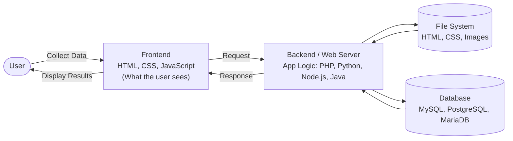
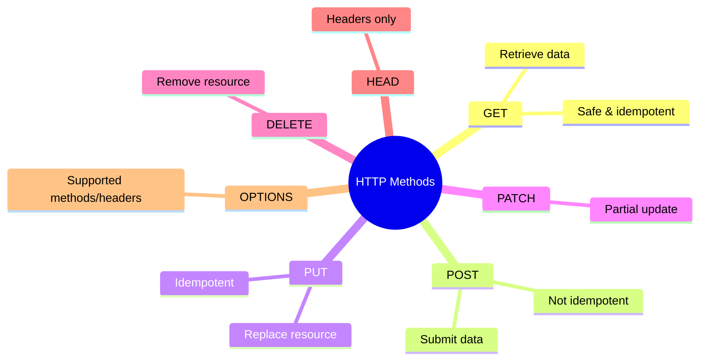
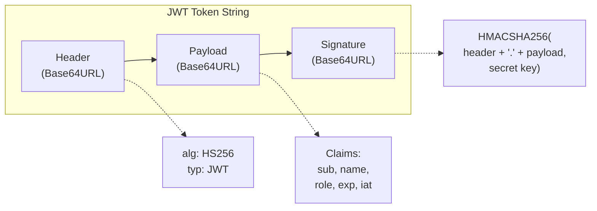
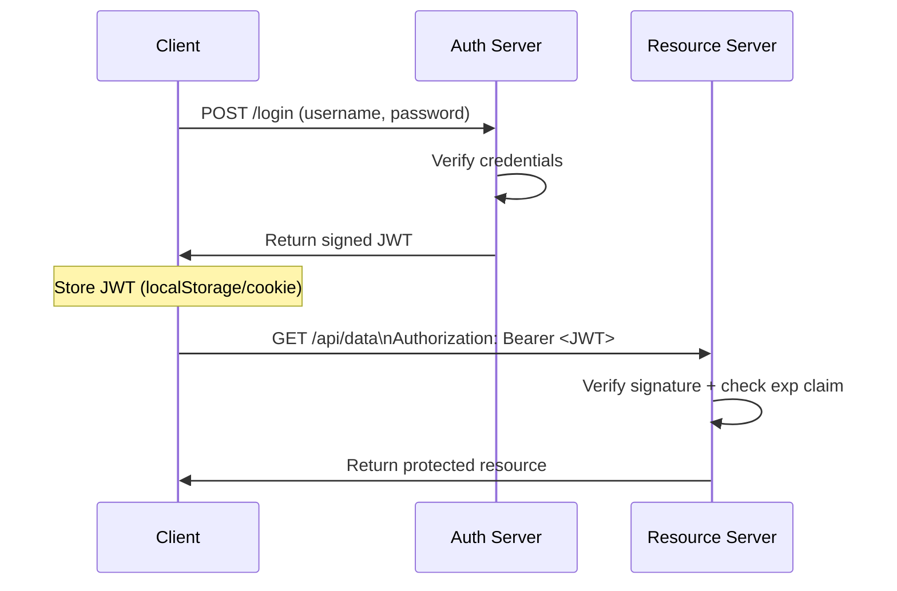
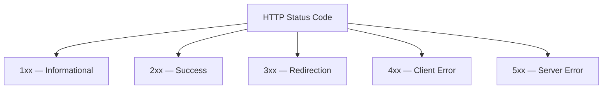

# Web Application Security — Module 1 Notes
### Understanding of Web Application → Architecture → Protocols → Request Methods → JWT → HTTP Status Codes

> Course: Introduction to Web Application Security Testing (RnW / Captain)

---

## 1. What Are Web Applications?

Web applications are software programs that run on web servers and are accessed over the internet through a browser. They provide interactive, dynamic functionality — letting users perform tasks, access information, and interact with data online without installing anything locally.

**Examples:**
- Social media platforms — Facebook, Twitter
- Online email services — Gmail, Outlook
- E-commerce websites — Amazon, eBay
- Cloud productivity tools — Google Workspace, Microsoft Office

### Types of Web Applications & Technologies

| Type | Description | Examples | Technologies |
|---|---|---|---|
| **Static** | Serves pre-rendered content, minimal interactivity | Portfolio sites, landing pages | HTML, CSS, limited JS |
| **Dynamic** | Content changes based on user interaction or server response | Social media, e-commerce | **Backend:** PHP, Python (Django/Flask), Ruby on Rails, Node.js **Frontend:** React, Angular, Vue.js |

---

## 2. Web Application Architecture

A web application architecture diagram lays out all the software components (databases, applications, middleware) and how they interact. It governs how data is delivered over HTTP, ensures client/server can understand each other, and manages authentication + permission-based access to records.

### Components

| Component | Also Called | Role |
|---|---|---|
| **Web Browser** | Client-side / Front-end | Interacts with the user, receives input, manages presentation logic and user interaction. Validates input where required. |
| **Web Server** | Backend / Server-side | Handles business logic, processes requests, routes them to the correct component, manages application operations. |
| **Database Server** | Data layer | Stores and serves data. In multi-tier setups, can also manage business logic via stored procedures. |

---

## 3. Protocols Used in Web Applications

| Protocol | Full Form | Explanation |
|---|---|---|
| **HTTP** | HyperText Transfer Protocol | Enables communication between client and server for delivering web content. Unencrypted. |
| **HTTPS** | HyperText Transfer Protocol Secure | Secures HTTP by encrypting data using SSL/TLS. |
| **WebSocket** | — (not an acronym) | Facilitates full-duplex, real-time communication between client and server (chat apps, live feeds). |
| **FTP** | File Transfer Protocol | Transfers files between client and server over plain text — insecure. |
| **SFTP** | SSH File Transfer Protocol | Secure file transfer using SSH encryption. |
| **SOAP** | Simple Object Access Protocol | Exchanges structured information using XML for web services; strict, enterprise-grade. |
| **REST** | REpresentational State Transfer | Lightweight architectural style for communication via HTTP/HTTPS using JSON or XML. |
| **TLS** | Transport Layer Security | Provides encryption and secure communication over the network; successor to SSL. |
| **DNS** | Domain Name System | Translates human-readable domain names into machine-readable IP addresses. |
| **OAuth** | Open Authorization | Manages secure, delegated authorization for third-party applications. |
| **OpenID Connect (OIDC)** | Open ID Connect | Extends OAuth to add user *authentication* on top of OAuth's *authorization*. |
| **SMTP** | Simple Mail Transfer Protocol | Handles email-sending functionality in web applications. |
| **IMAP** | Internet Message Access Protocol | Retrieves emails from the server while keeping them stored/synced there. |
| **POP3** | Post Office Protocol version 3 | Retrieves emails from the server and downloads them locally. |

**Quick distinctions:**
- **OAuth** = "what can this app do on my behalf?" (authorization) vs **OIDC** = "who is this user?" (authentication) — often used together.
- **SOAP** is rigid/XML-based with built-in security spec (WS-Security); **REST** is a flexible style riding on plain HTTP.
- **TLS** is the modern, secure successor to the deprecated **SSL**.

---

## 4. Web Application Request Methods

| Method | Function |
|---|---|
| **GET** | Retrieves data from the server; requests the resource specified in the URL without modifying server state. Safe and idempotent — repeating it has no side effects. |
| **POST** | Submits data to be processed by the server, typically in the request body. Can change server state; **not** idempotent. |
| **PUT** | Updates or creates a resource at the specified URL, replacing the *entire* resource with the new representation. Creates the resource if it doesn't exist. |
| **DELETE** | Removes the resource specified by the URL. After a successful DELETE, the resource is no longer available at that URL. |
| **PATCH** | Applies *partial* modifications to a resource — similar to PUT but only updates specific parts rather than replacing everything. |
| **HEAD** | Same as GET but retrieves only the response headers, not the body. Useful for checking resource existence/modification dates. |
| **OPTIONS** | Retrieves the communication options available for a target resource — lets clients determine supported methods and headers. |

**Pentest relevance:** verb tampering (sending `PUT`/`DELETE` where only `GET` is expected) and probing `OPTIONS` responses are common checks for broken access control and improper method restrictions.

---

## 5. JWT — JSON Web Token

A **JWT (JSON Web Token)** is a compact, URL-safe token format (RFC 7519) used mainly for **authentication** and **authorization** between client and server, without the server needing to store session state.

A JWT is **not encrypted** — it's Base64URL-*encoded*, so anyone can read its contents. It **is** cryptographically **signed**, so it can't be tampered with undetected (unless the signing key is weak/exposed).

### Structure: `header.payload.signature`

1. **Header** — signing algorithm (e.g., `HS256`, `RS256`) and token type (`JWT`).
2. **Payload** — the claims (data):
   - **Registered claims:** `iss` (issuer), `sub` (subject), `exp` (expiry), `iat` (issued at)
   - **Public/Private claims:** custom data like `role`, `userId`, `email`
3. **Signature** — header + payload signed with a secret (HMAC) or private key (RSA/ECDSA); verifies integrity and authenticity.

### JWT Authentication Flow

### Security Notes (relevant to pentesting)

- **`alg: none` attack:** some libraries accept unsigned tokens if the header algorithm is set to `none`.
- **Algorithm confusion (RS256 → HS256):** if a server accepts either algorithm, an attacker can forge a token signed with the public key treated as an HMAC secret (public keys aren't secret).
- **Weak secret brute-forcing:** HS256 tokens signed with weak secrets can be cracked offline (`hashcat`, `jwt_tool`).
- **No/long expiry:** tokens without a short `exp` widen the attack window if stolen.
- **Sensitive data in payload:** payloads are only encoded, not encrypted — never store passwords/PII there.
- **Storage location:** `localStorage` is vulnerable to XSS theft; `httpOnly` cookies are safer but need CSRF protection.

**Useful tool:** `jwt_tool` (Python) — for JWT analysis, tampering, and signature-cracking.

---

## 6. HTTP Status Codes

### 1xx — Informational
| Code | Name | Meaning |
|---|---|---|
| 100 | Continue | Initial part of the request received; client can continue sending the rest. |
| 101 | Switching Protocols | Server is switching protocols as requested (e.g., upgrading to WebSocket). |
| 102 | Processing | Server received and is processing the request; no response yet (WebDAV). |
| 103 | Early Hints | Preloads resources while the server prepares the final response. |

### 2xx — Success
| Code | Name | Meaning |
|---|---|---|
| 200 | OK | Request succeeded; server returned the desired data. |
| 201 | Created | Request succeeded and a new resource was created. |
| 202 | Accepted | Request accepted for processing but not completed yet. |
| 203 | Non-Authoritative Information | Returned metadata is from a cache/proxy, not the origin server. |
| 204 | No Content | Request succeeded, but there's no content to return. |
| 205 | Reset Content | Tells the client to reset the document view (e.g., clear a form). |
| 206 | Partial Content | Server is delivering only part of the resource (range requests/downloads). |

### 3xx — Redirection
| Code | Name | Meaning |
|---|---|---|
| 300 | Multiple Choices | Multiple possible responses; client/user must choose one. |
| 301 | Moved Permanently | Requested resource has permanently moved to a new URL. |
| 302 | Found | Requested resource resides temporarily at a different URL. |
| 303 | See Other | Client should GET the resource at a different URL (common after POST). |
| 304 | Not Modified | Resource hasn't changed since the last request — cached version still valid. |
| 307 | Temporary Redirect | Like 302, but guarantees the method/body won't change on redirect. |
| 308 | Permanent Redirect | Like 301, but guarantees the method/body won't change on redirect. |

### 4xx — Client Errors
| Code | Name | Meaning |
|---|---|---|
| 400 | Bad Request | Server couldn't understand the request due to invalid syntax. |
| 401 | Unauthorized | Authentication required and has failed or wasn't provided. |
| 402 | Payment Required | Reserved for future use; some APIs use it for billing/quota issues. |
| 403 | Forbidden | Client doesn't have permission to access the resource. |
| 404 | Not Found | Requested resource couldn't be found on the server. |
| 405 | Method Not Allowed | HTTP method used isn't supported for the requested resource. |
| 406 | Not Acceptable | Server can't produce a response matching the client's `Accept` headers. |
| 407 | Proxy Authentication Required | Client must authenticate with a proxy first. |
| 408 | Request Timeout | Server timed out waiting for the request. |
| 409 | Conflict | Request conflicts with the current state of the resource. |
| 410 | Gone | Resource existed before but has been permanently removed. |
| 411 | Length Required | Server requires a `Content-Length` header. |
| 412 | Precondition Failed | A condition in the request headers wasn't met. |
| 413 | Payload Too Large | Request body exceeds server limits. |
| 414 | URI Too Long | Requested URL is too long to process. |
| 415 | Unsupported Media Type | Request payload format isn't supported. |
| 416 | Range Not Satisfiable | Requested byte range can't be fulfilled. |
| 417 | Expectation Failed | Server can't meet requirements of the `Expect` header. |
| 422 | Unprocessable Entity | Well-formed request but semantically invalid data (common in APIs). |
| 425 | Too Early | Server unwilling to process a request that might be replayed. |
| 426 | Upgrade Required | Client should switch to a different protocol (e.g., TLS). |
| 428 | Precondition Required | Server requires the request to be conditional. |
| 429 | Too Many Requests | Rate limiting — too many requests in a given time. |
| 431 | Request Header Fields Too Large | Headers too large for the server to process. |
| 451 | Unavailable For Legal Reasons | Resource blocked due to a legal demand (e.g., censorship). |

**Pentest relevance:** 401 vs 403 distinguishes "not authenticated" from "authenticated but not authorized" — key for access control testing. 429 responses signal rate-limiting/WAF presence.

### 5xx — Server Errors
| Code | Name | Meaning |
|---|---|---|
| 500 | Internal Server Error | Server encountered an unexpected condition preventing it from fulfilling the request. |
| 501 | Not Implemented | Server doesn't support the functionality required to fulfill the request. |
| 502 | Bad Gateway | Server, acting as gateway/proxy, received an invalid response from an upstream server. |
| 503 | Service Unavailable | Server temporarily unable to handle the request (maintenance/overload). |
| 504 | Gateway Timeout | Server didn't receive a timely response from an upstream server. |
| 505 | HTTP Version Not Supported | Server doesn't support the HTTP version used in the request. |
| 506 | Variant Also Negotiates | Internal content negotiation configuration error. |
| 507 | Insufficient Storage | Server can't store the representation needed to complete the request (WebDAV). |
| 508 | Loop Detected | Server detected an infinite loop while processing the request (WebDAV). |
| 510 | Not Extended | Further extensions to the request are required to fulfill it. |
| 511 | Network Authentication Required | Client needs to authenticate to gain network access (e.g., captive portal). |

**Pentest relevance:** 500 errors triggered by malformed/malicious input (e.g., SQLi payloads, oversized inputs) often signal unhandled exceptions worth digging into further — a classic recon signal.

---

## Sources / Reference
- RnW_WEB.pdf — Course slides (Introduction to Web Application Security Testing, Captain)
- RFC 7519 (JSON Web Token)
- RFC 9110 (HTTP Semantics — status codes)
