# Phishing Awareness Lab / Zphisher – Educational Demonstration

## ⚠️Disclaimer

This lab was conducted in a controlled cybersecurity training environment for educational and awareness purposes only.

The objective of this exercise was to understand how phishing attacks are created and delivered, how users may be deceived into submitting credentials, and how organizations and individuals can identify and defend against such attacks.

No real accounts, systems, or third-party users were targeted during this demonstration.

# Objective

The purpose of this lab was to:

* Understand how phishing websites imitate legitimate services.

* Observe how credential harvesting attacks work.

* Analyze the risks associated with phishing campaigns.

* Learn methods for identifying suspicious links and websites.

* Explore defensive measures and security awareness practices.

## Tools Used

* Kali Linux
* Zphisher (Educational Lab Environment)
* Web Browser
* URL Analysis Platforms:
```text
VirusTotal
Hybrid Analysis
MetaDefender
```

# Lab Overview

During the exercise, phishing page templates were observed to understand how attackers attempt to imitate legitimate login portals.

The demonstration showed:

Replication of a legitimate login page appearance.

Credential submission behavior.

Automatic redirection to the legitimate website after form submission.

Collection of submitted test credentials within the controlled lab environment.

Different hosting methods used to expose phishing pages for demonstration purposes.

# Phishing Framework Workflow Observed

During the lab, Zphisher framework was observed to understand the typical steps used to create and host phishing pages for awareness and defensive analysis purposes.

## Observations:

* The framework provided multiple preconfigured website templates that resembled popular online services and social platforms.
* After selectiing a template, the phishing page could be hosted locally using a chosen port, with the default option commonly set to port 8080.
* URL masking features were available to make generated links appear more convincing to potential targets.  
* When accessed, the phishing page closely resembled the legitimate website being imitated.
* After credentials were entered the user was redirected to the legitimate website, which could reduce suspicion and make the phishing attempt less noticeable
* This demonstrates how attackers may attempt to collect credentials while maintaining the appearance of a normal login process.

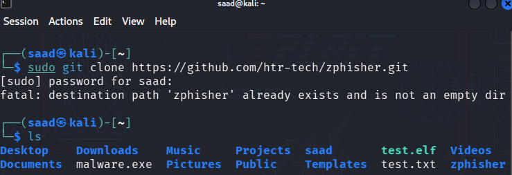

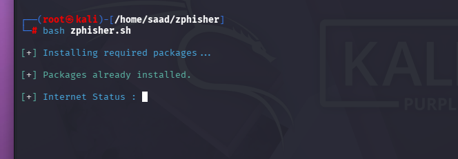

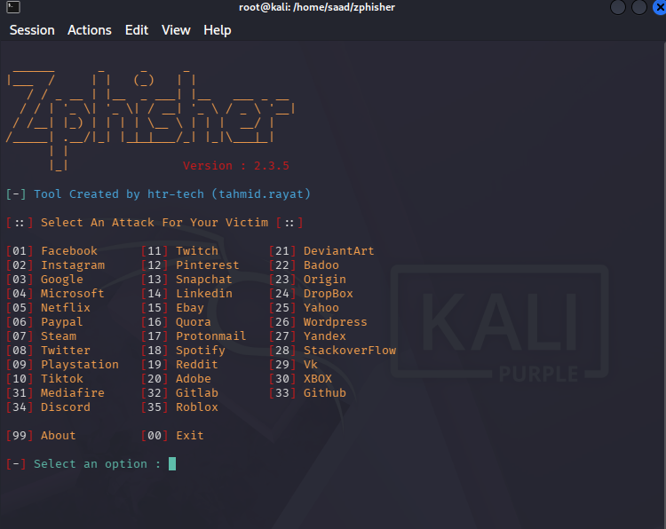

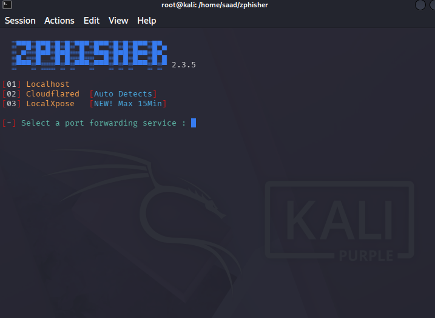

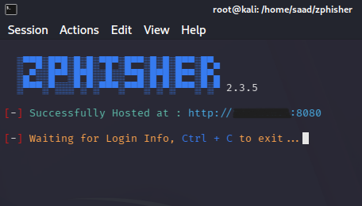

# Scenario 1 – Local Environment Demonstration

A phishing page was generated and accessed only from the local machine.

### Purpose

To understand how credential harvesting works in a safe and isolated environment.

### Observations:

* The phishing page closely resembled the legitimate login portal.
* Test credentials entered into the page were captured by the demonstration environment.
* The user was automatically redirected to the legitimate website after submission.
* This behavior can make phishing attempts appear legitimate to unsuspecting users.

Screenshots

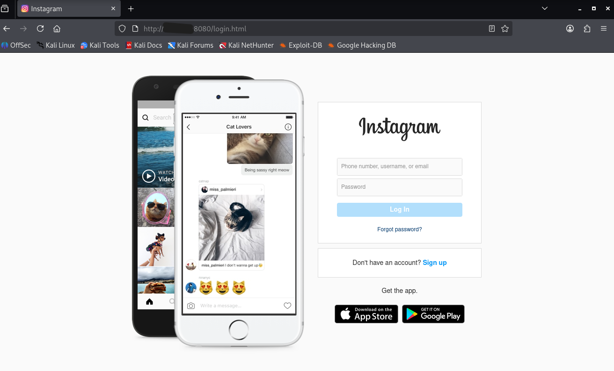

After Victim enters their credentials the page would redirect to the legtimate platform of the website to avoid suspicion

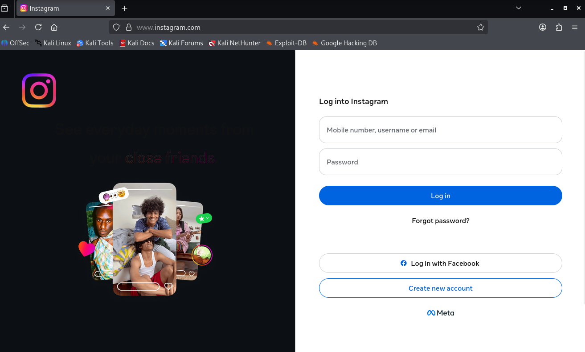

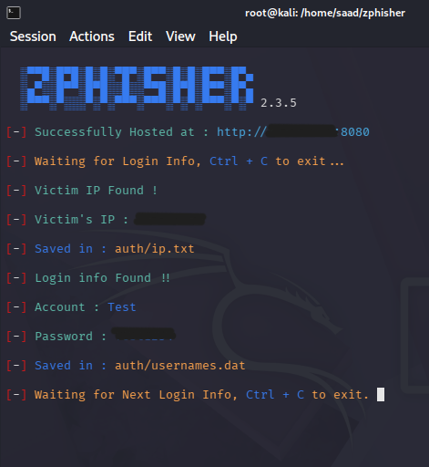

# Scenario 2 – External Access Demonstration

A second demonstration was performed using an externally accessible hosting option.

### Purpose

To understand how phishing campaigns may expose fradulent websites to users outside the attacker's local machine.

### Hosting Methods Observed 

During the lab, different hosting methods were observed to understand how phishing pages can be made accessible beyond a local environment.

## CloudFlared Tunnel

A public URL was generated through a tunneling service, allowing the demonstration page to be accessed from another device over the internet.

### Observations:

* A public URL was generated for demonstration purposes.
* The phishing page could be opened from another device.
* After entering test credentials, the user was redirected to the legitimate website.
* The demonstration environment displayed the submitted credentials.

## LocalXpose

Another tunneling service was observed during the exercise.

### Observations:

* It generated a temporary public URL
* The URL remained active for limited period before expiring
* Similar to other tunneling services, it allows external devices to access locally hosted content.
* Temporary links can make detection and takedown efforts more challenging

### Security Implications

This demonstration highlighted how publicly accessible phishing pages can be distributed through:

* Email
* Social Media Platforms
* Messaging applications
* QR codes
* Malicious advertisements

User should never trust a website solely because it loads correctly or resembles a legitmate service.

Screenshots

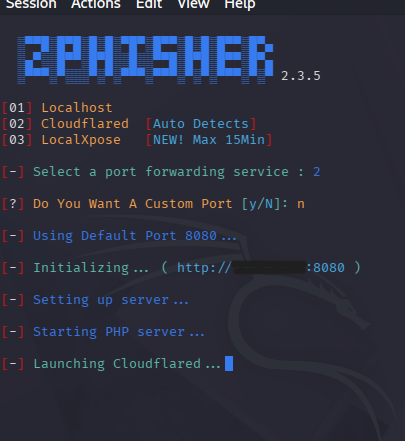

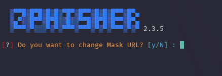

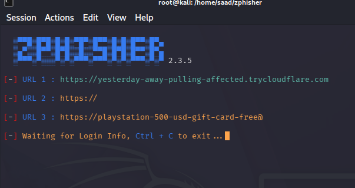


After the URL is sent to victim it will direct to a fake website for credentials

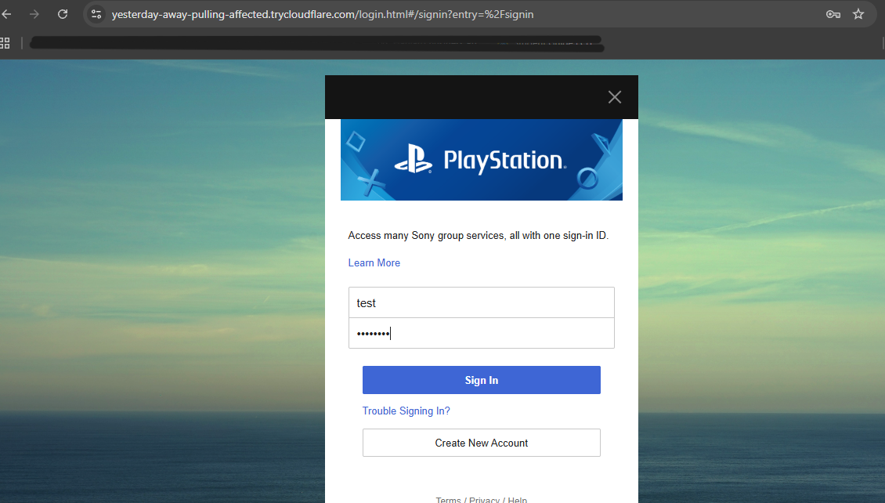

Once victims enters the credentials it will redirect to the legitimate website to avoid suspicion

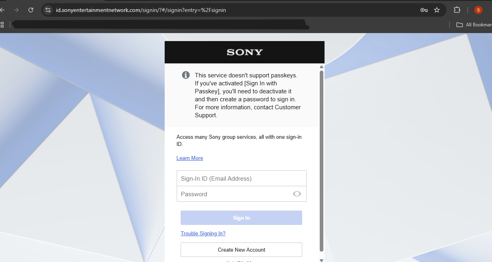

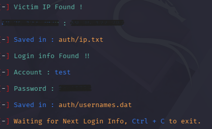

### Security Risks Identified

This exercise highlighted several risks:

* Users often trust pages that visually resemble legitimate websites.
* Automatic redirection can reduce suspicion.
* Users may not verify URLs before entering credentials.
* Social engineering techniques can increase the success rate of phishing attacks.

## Detection and Prevention

To reduce phishing risk:

* Verify URLs before entering credentials.
* Check the domain name carefully.
* Avoid clicking unexpected links received through email or messaging platforms.
* Enable Multi-Factor Authentication (MFA).
* Use password managers that verify domains automatically.
* Report suspicious websites to security teams.

### URL Verification Resources

VirusTotal

Hybrid Analysis

MetaDefender

Using multiple reputation and analysis services can help identify suspicious links and domains.

Key Takeaways

* Phishing remains one of the most common cyberattack methods.
* Visual similarity alone should never be trusted.
* Users should always verify website URLs before entering credentials.
* Security awareness training is essential for reducing phishing success rates.

## Ethical Notice

This repository is intended solely for cybersecurity education, awareness, and defensive learning.

The information provided here must not be used to target individuals, organizations, or systems without explicit authorization.
