# GoPhish Security Awareness Lab

## Introduction

This repository documents my hands-on experience exploring GoPhish within a controlled cybersecurity laboratory environment. The objective was to understand how phishing simulation platforms are used by organizations to conduct security awareness training and measure user engagement with simulated phishing scenarios.

All activities were conducted in an isolated lab environment using authorized systems and accounts.


# Learning Objectives

* Deploy and access the GoPhish platform
* Explore administrative dashboard functionality
* Understand email delivery configuration concepts
* Examine landing page customization features
* Review template management capabilities
* Study campaign administration workflows
* Analyze reporting and campaign metrics


# Environment Setup

| Component        | Details                     |
| ---------------- | --------------------------- |
| Operating System | Kali Linux                  |
| Platform         | GoPhish                     |
| Browser          | Firefox                     |
| Environment      | Virtual Lab                 |
| Purpose          | Security Awareness Research |


# Step 1 – Launching GoPhish

The first stage involved starting the GoPhish application and verifying that all services initialized correctly.

### Activities Performed

* Started the GoPhish service
* Observed startup logs
* Confirmed successful initialization
* Verified management interface availability

### Screenshot
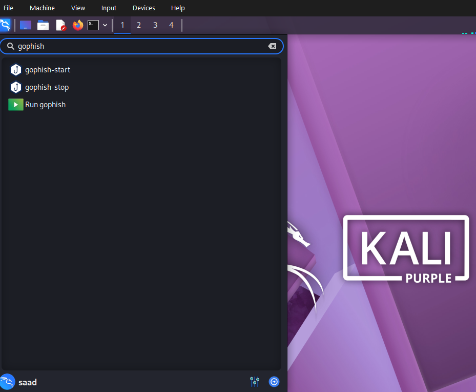

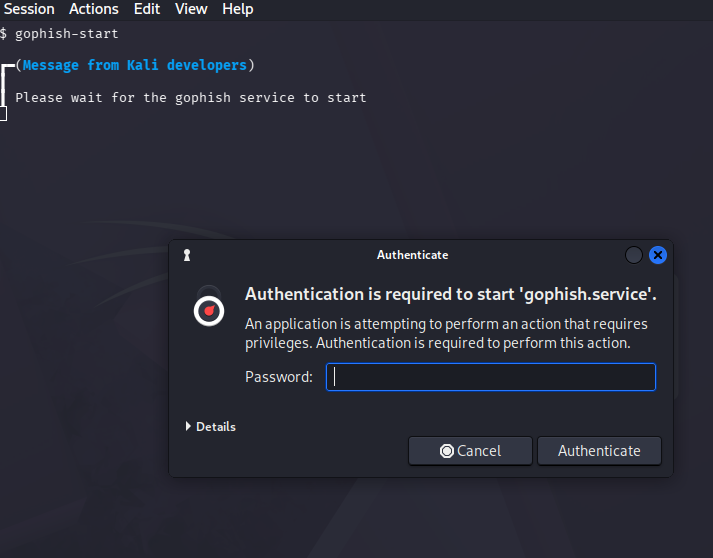

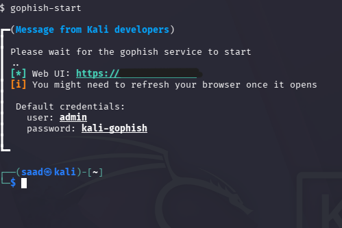

# Step 2 – Accessing the Administration Interface

After startup, the administrative web interface was accessed through the browser.

### Activities Performed

* Opened the management URL
* Reviewed security certificate warning
* Accessed the login page
* Successfully authenticated to the dashboard

### Screenshot

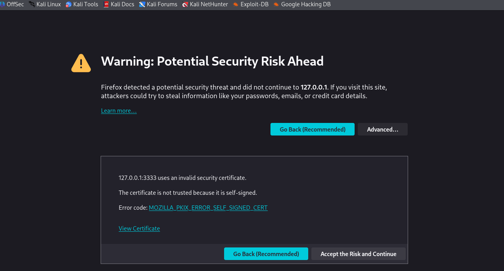

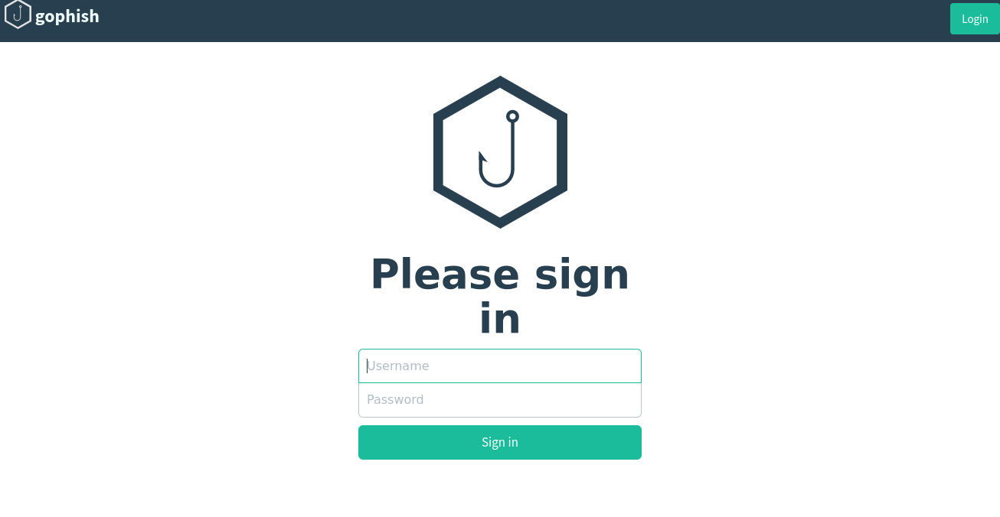

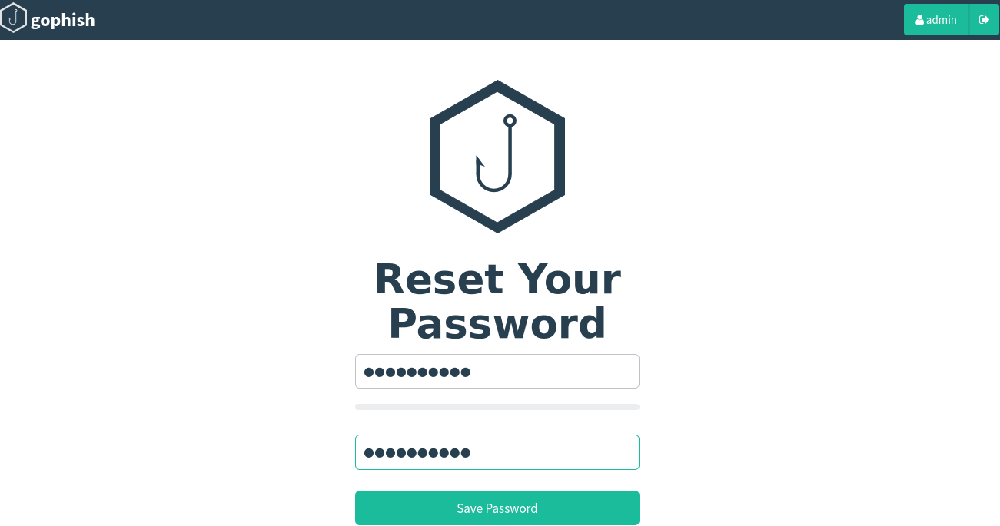


# Step 3 – Exploring the Dashboard

The dashboard provides a centralized view of campaigns, users, templates, landing pages, and reporting data.

### Observations

* Navigation structure
* Administrative controls
* Campaign monitoring capabilities
* Reporting interface

### Screenshot

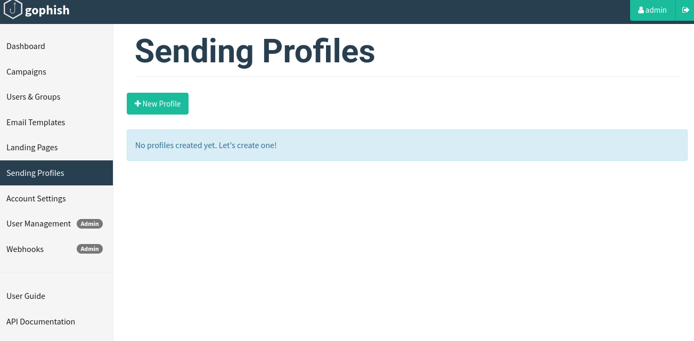

# Step 4 – Preparing a Dedicated Test Email Account

Before configuring email delivery settings, a separate Gmail account was created specifically for laboratory testing purposes. Using a dedicated account helps isolate testing activities from personal or primary email accounts.

### Activities Performed

* Created a test Gmail account named cyberkiddie0@gmail.com
* Logged into the Google Account management portal
* Navigated to Security → App Passwords
* Generated an application-specific password for GoPhish
* Assigned the app password the name "GoPhish"
* Saved the generated password for later use in the GoPhish sending profile configuration

## Why an App Password Was Used

Google does not allow many third-party applications to authenticate using a Gmail account's regular password. To securely connect GoPhish to Gmail, an App Password was generated from the Google Account security settings.

During the setup process:

* A dedicated Gmail account (cyberkiddie0@gmail.com) was created for testing.
* Two-Step Verification was enabled on the account.
* An App Password named "GoPhish" was generated.
* Google automatically created a unique 16-character password.
* This generated password was copied and entered into the GoPhish Sending Profile instead of the normal Gmail password.

### How It Works

The App Password acts as a special authentication token between GoPhish and Gmail.

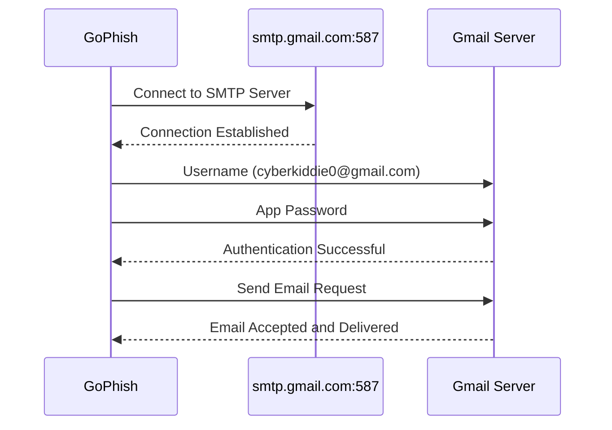
```mermaid
sequenceDiagram
    participant G as GoPhish
    participant S as smtp.gmail.com:587
    participant M as Gmail Server

    G->>S: Connect to SMTP Server
    S-->>G: Connection Established

    G->>M: Username (cyberkiddie0@gmail.com)
    G->>M: App Password

    M-->>G: Authentication Successful

    G->>M: Send Email Request
    M-->>G: Email Accepted and Delivered
```

Using an App Password provides better security because the actual Gmail account password is never shared with the application. If necessary, the App Password can be revoked independently without affecting access to the Gmail account itself.

### Purpose

The generated app password allows GoPhish to authenticate with Gmail's SMTP service without using the account's primary password. This approach is commonly used when integrating third-party applications with Gmail.

### Screenshot

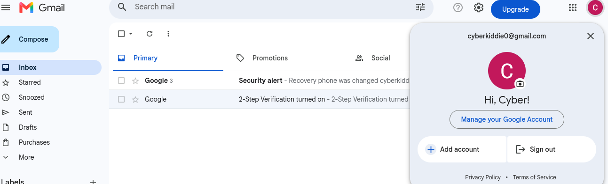

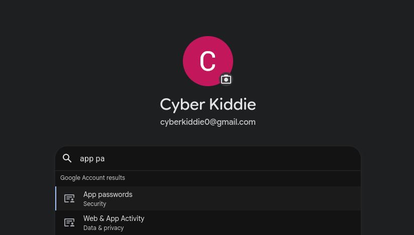

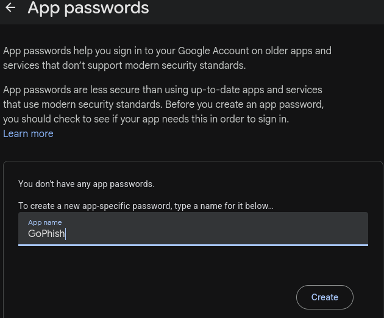

# Step 5 – Reviewing Sending Profile Configuration

This phase explored how GoPhish manages outbound email settings used during awareness simulations.

### Concepts Studied

* SMTP configuration
* Sender identity settings
* Email delivery testing
* Authentication requirements

### Screenshot

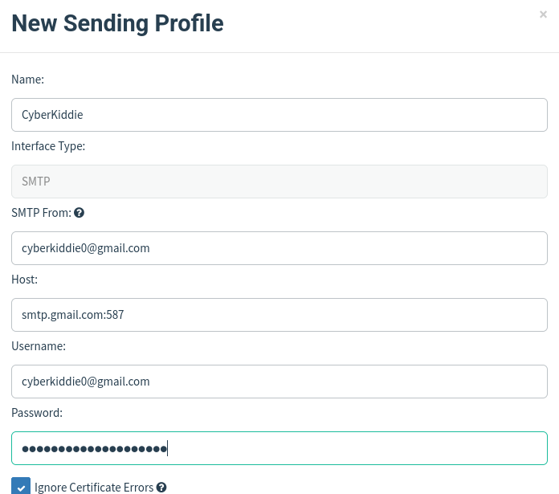

## Why Not Port 25?

Port 25 is the original SMTP port.

However, many ISPs and cloud providers block it because it is commonly abused by spam bots.

Therefore modern email clients usually use:

587 → SMTP + STARTTLS (recommended)
465 → SMTP over SSL/TLS

Google recommends 587 for email submission.

The sending profile was configured to use smtp.gmail.com:587. The hostname smtp.gmail.com refers to Gmail's SMTP server, which is responsible for transmitting outgoing email messages. Port 587 is the standard SMTP submission port and supports secure email transmission using STARTTLS encryption. GoPhish authenticated to Gmail using an App Password and then relayed emails through Gmail's SMTP infrastructure.

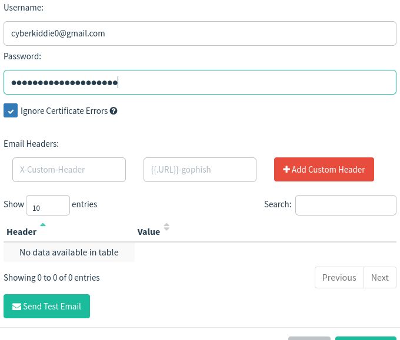

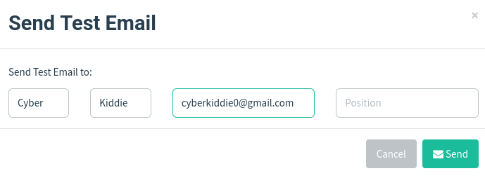

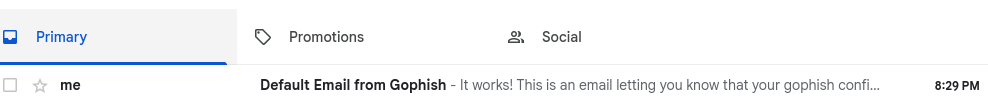

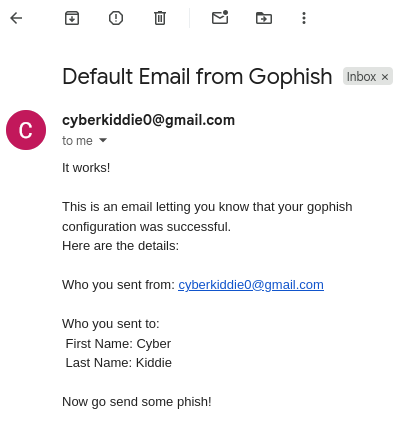

# Step 6 – Landing Page Management

Landing pages are used to simulate websites for awareness exercises and training demonstrations.

This captures the credentials of the user.

### Concepts Studied

* Landing page creation
* HTML customization
* User interaction tracking
* Template editing

Accessing the Google HTML Template Directory

During the lab, the following command was used:

cd /usr/share/set/src/html/templates/google

What Each Directory Represents

|Directory | Purpose|
|---|---|
|/usr |	Stores user applications and shared resources|
|/usr/share | Contains shared application files|
|set |	Files related to the Social-Engineer Toolkit (SET)|
|src |	Source files used by the application|
|html |	HTML content used by the toolkit|
|templates | Collection of web page templates|
|google | Template files associated with a Google-style login page|

Why This Directory Was Accessed

The purpose of navigating to this directory was to locate the HTML template files stored by the toolkit. These files contain the web page structure, styling, and resources that can be viewed, examined, or imported into another application for testing and educational purposes within the laboratory environment.

Learning Outcome

This step demonstrated how Linux applications organize resources within the filesystem and how web templates are stored as HTML files inside application directories. It also provided practical experience navigating the Linux directory structure using terminal commands.

### Screenshot

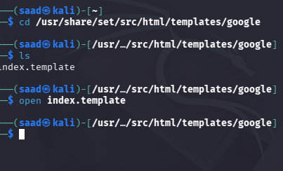

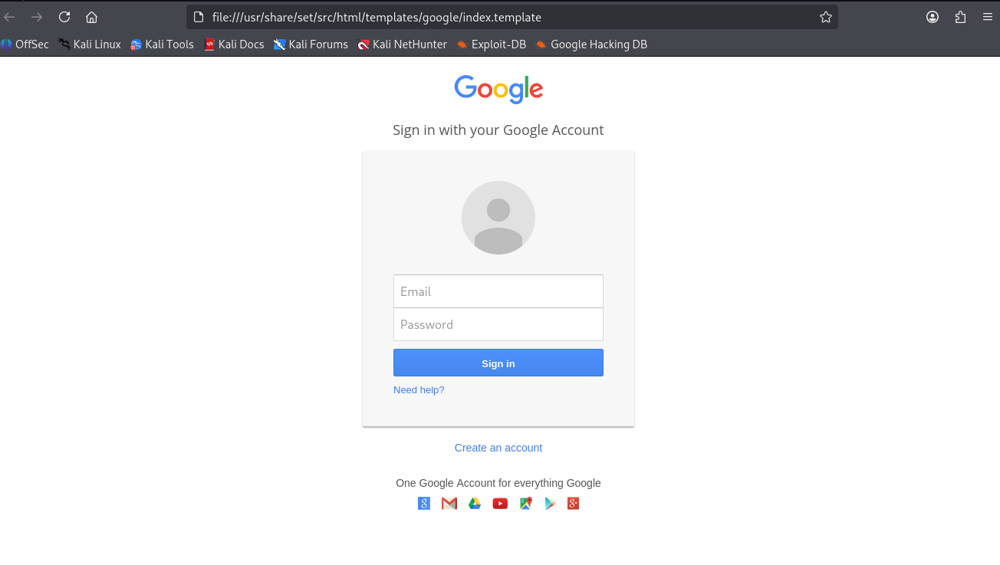

```text
We will right-click on this page and go to view page source
```
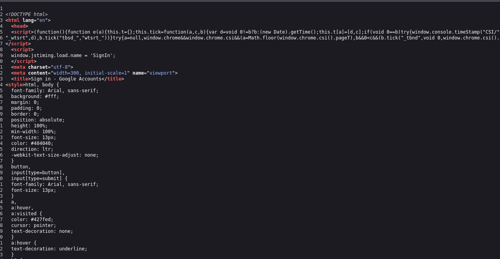

And we will copy the whole code

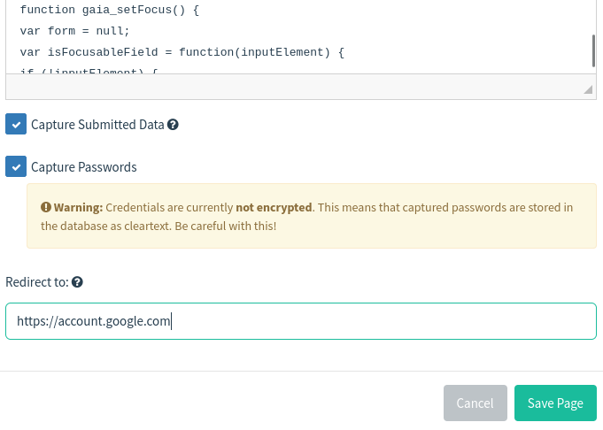

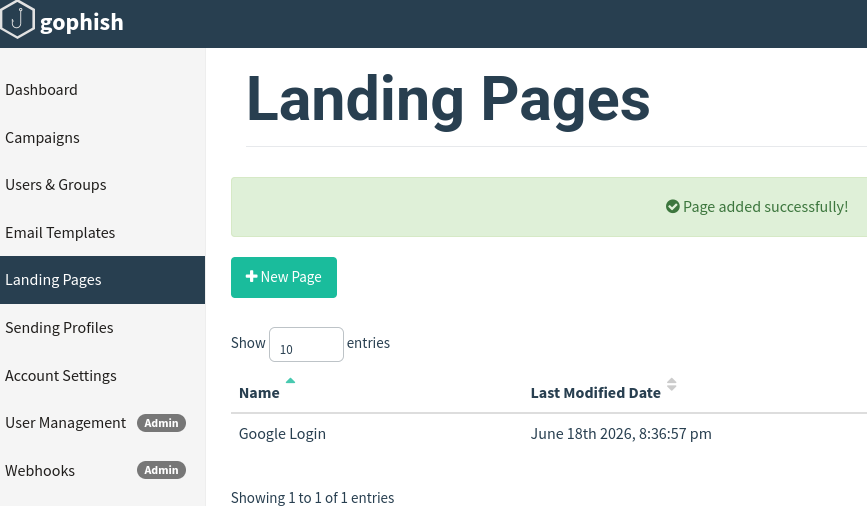

# Step 7 – Email Template Management

GoPhish supports reusable email templates for awareness campaigns.

Prior to creating the email template, an existing email related to Two-Step Verification was reviewed to understand how email content and formatting are structured.

Activities Performed

* Opened a previously received Two-Step Verification email.
* Selected the three-dot menu within the email interface.
* Chose the "Show Original" option.
* Reviewed the raw email information, including headers and message content.
* Used the "Copy to Clipboard" feature to copy the original email source for analysis.

Purpose

The purpose of this step was to examine how a legitimate email is formatted and transmitted. Viewing the original message provides access to technical details such as email headers, sender information, routing data, and the HTML content of the message.

### Concepts Studied

* Template creation
* HTML email structure
* Template imports
* Preview functionality

### Screenshot

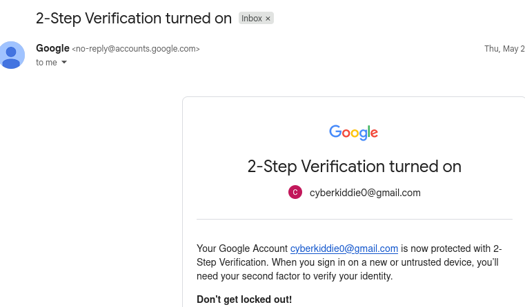

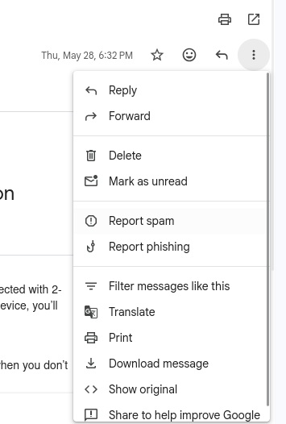

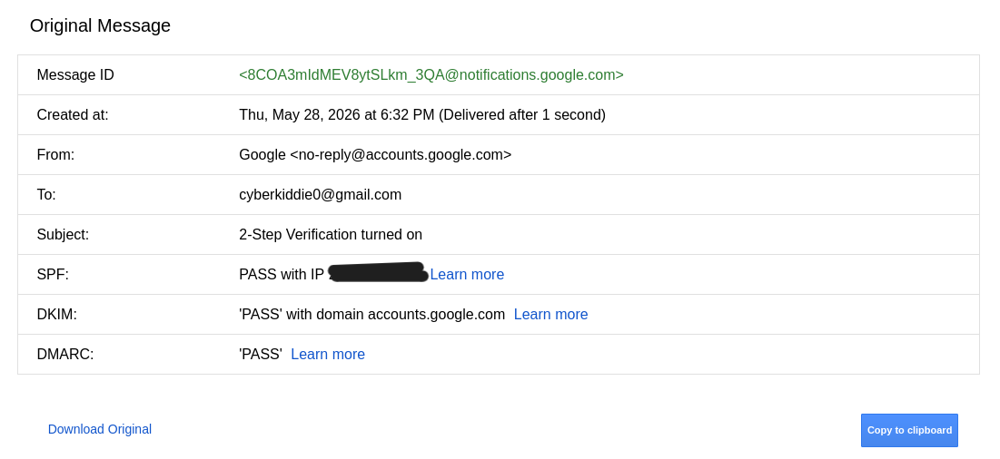

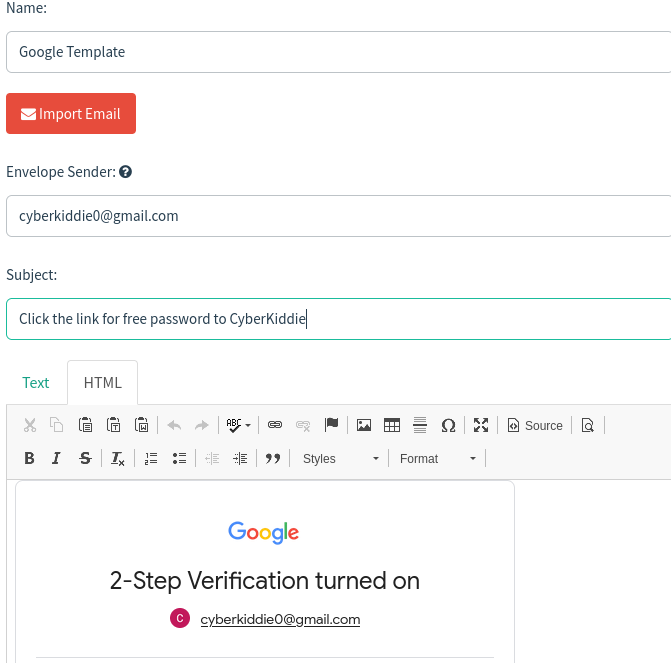

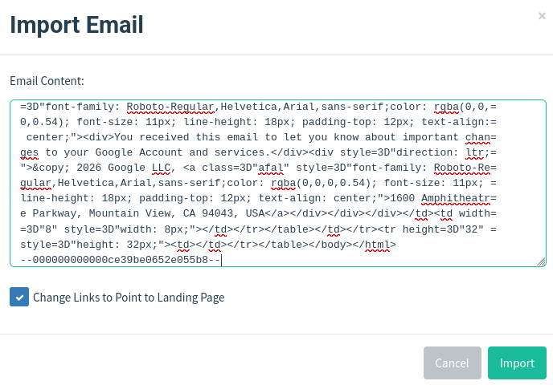


# Step 8 – Target Group Administration

This section explored how users can be organized into groups for awareness campaigns.

In this step, a target group was created by adding recipient information that would be used during the awareness campaign.

Activities Performed

* Navigated to the Users & Groups section.
* Created a new target group.
* Added a target email address manually.
* Saved the group for later use in the campaign configuration.
* Bulk Import Option

GoPhish also provides a Bulk Import Users feature. Instead of entering recipients one at a time, administrators can import multiple users from a CSV file containing information such as:

```text
First Name
Last Name
Email Address
Position (optional)
```

This feature is useful when managing larger groups of recipients.

### Concepts Studied

* User grouping
* Contact management
* Campaign organization
* Target segmentation

### Screenshot

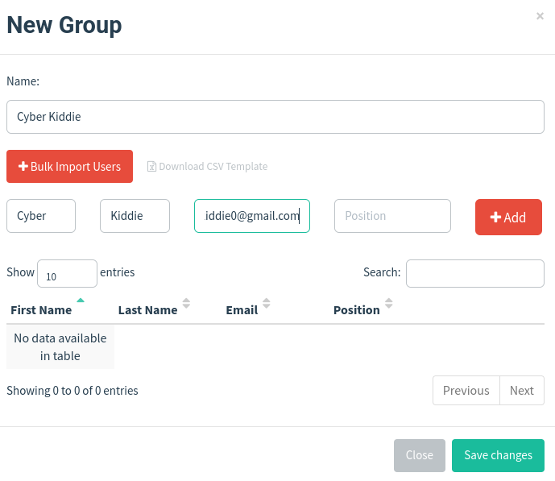


# Step 9 – Campaign Creation Workflow

The campaign interface combines templates, target groups, and landing pages into a complete awareness-training exercise.

### Concepts Studied

* Campaign configuration workflow
* Resource selection process
* Scheduling options
* Monitoring capabilities

### Screenshot

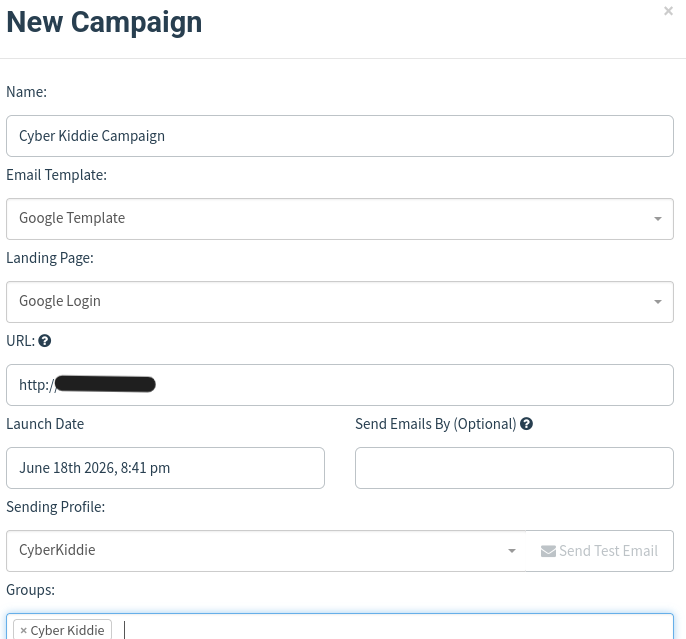

```text
The URL is http://IP Address of the machine that is hosting Gophish
```

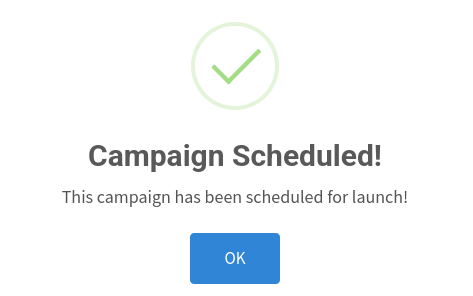

# Step 10 – Monitoring Results

GoPhish provides reporting tools that allow administrators to analyze awareness-training outcomes.

### Metrics Observed

* Delivery status
* Open events
* Click events
* Submission events
* Timeline activity

### Screenshot

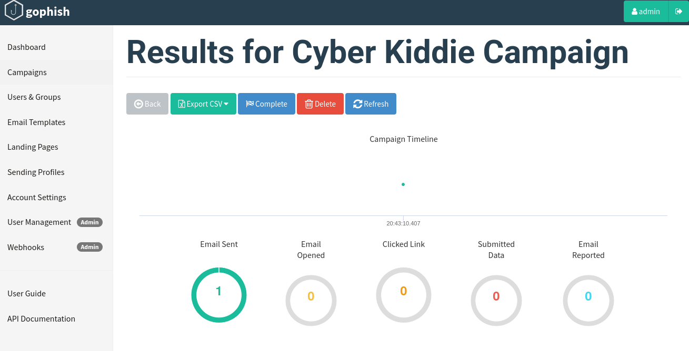

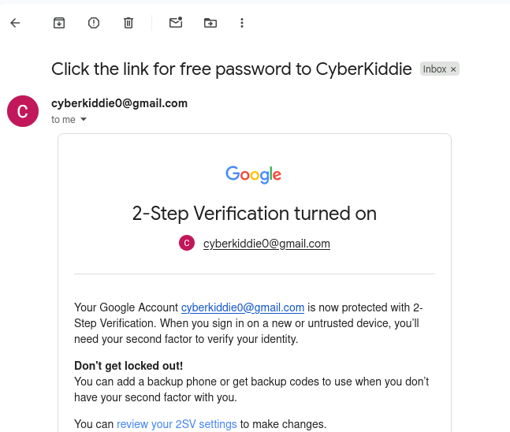

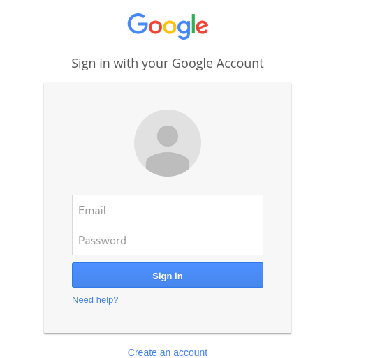

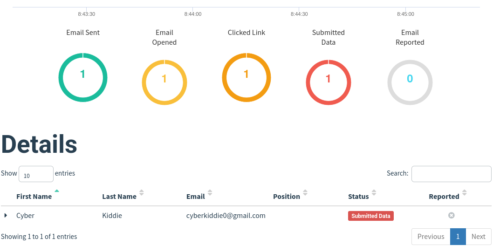

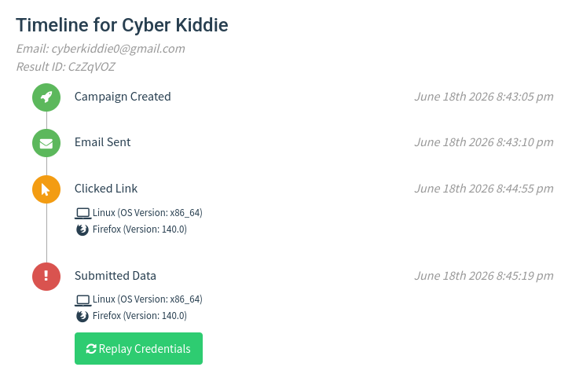

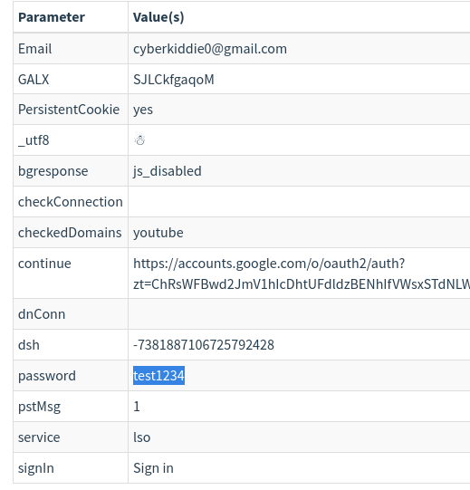

# Key Takeaways

Through this project I gained practical experience with:

* Security awareness platforms
* Administrative dashboard management
* Email infrastructure concepts
* Campaign monitoring workflows
* Security analytics and reporting

The lab provided insight into how organizations conduct phishing-awareness training programs and evaluate employee security awareness levels.


# ⚠️ Disclaimer

This Lab is intended solely for cybersecurity education, research, and defensive security awareness training. Activities were conducted only within a controlled laboratory environment using systems and accounts for which authorization was granted.
