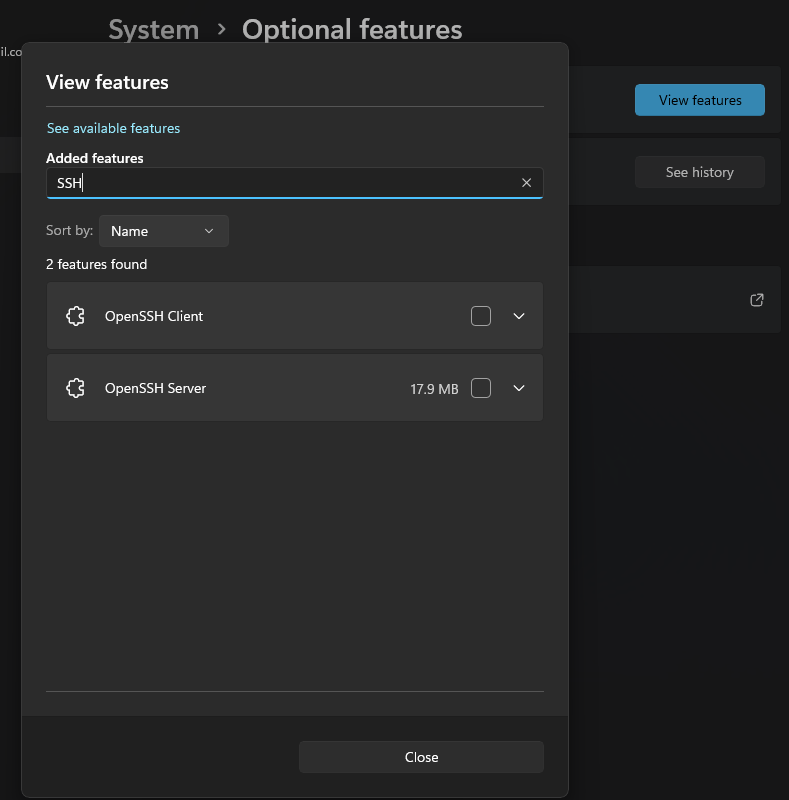
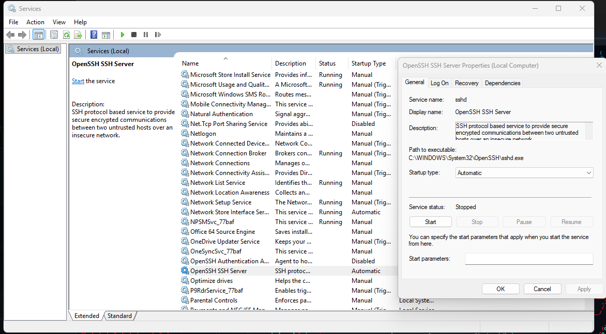
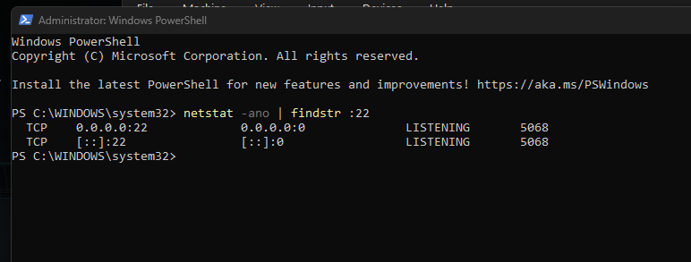
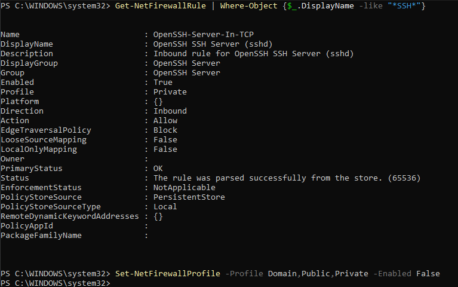
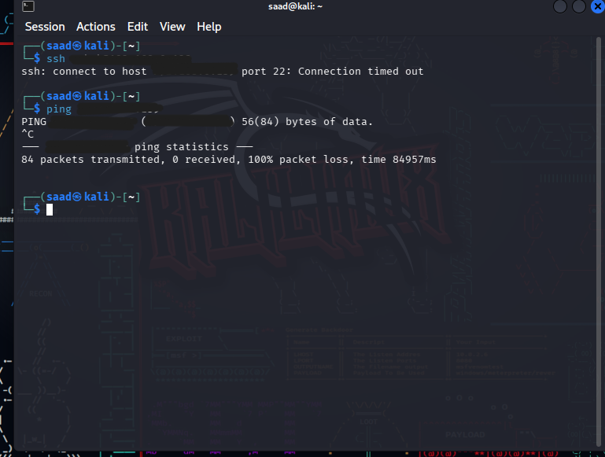
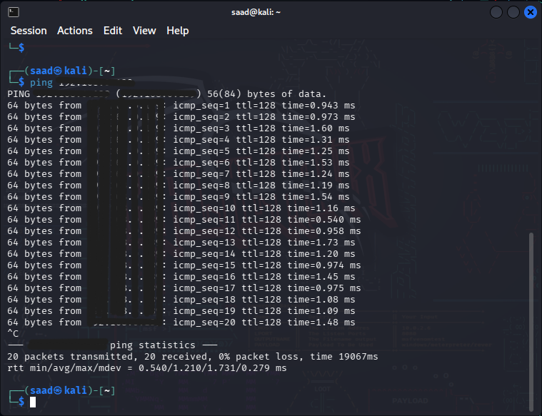
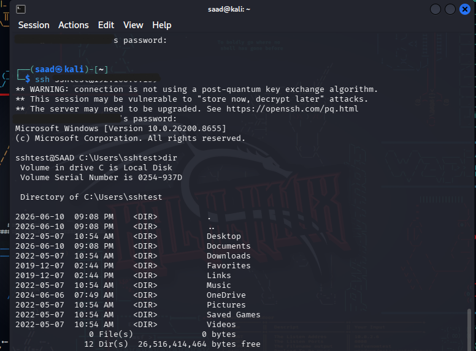

# SSH from Kali Linux to Windows 11 Lab

## Objective

Configure and establish an SSH connection from a Kali Linux virtual machine to a Windows 11 host using OpenSSH Server.


# Lab Environment

| Device          | Operating System | IP Address    |
| --------------- | ---------------- | ------------- |
| Host Machine    | Windows 11       | 192.x.x.x. |
| Virtual Machine | Kali Linux       | 192.x.x.x |

Network Configuration:

* Bridged Adapter
* Same subnet communication

# Initial Problem

After installing and configuring OpenSSH Server on Windows, I attempted to connect from my Kali Linux VM using SSH.

```bash
ssh username@WINDOWS_HOST
```

However, the connection would hang and no password prompt appeared.

At this stage, it was unclear whether the issue was related to:

* SSH configuration
* Network connectivity
* Firewall rules
* User authentication

Instead of making assumptions, I began troubleshooting systematically to identify the root cause.

# Troubleshooting Methodology

To isolate the issue, I performed the following checks:

1. Verified that OpenSSH Server was installed.
2. Verified that the SSH service was running.
3. Confirmed that port 22 was listening.
4. Tested network connectivity between Windows and Kali.
5. Performed ping tests in both directions.
6. Reviewed Windows Firewall rules.
7. Tested SSH locally on the Windows machine.
8. Verified user authentication settings.

This process helped narrow the issue down step-by-step rather than guessing.


# Step 1: Install OpenSSH Server on Windows

1. Open **Settings**
2. Navigate to **System → Optional Features**
3. Select **View Features**
4. Search for:

```text
OpenSSH Server
```

5. Install OpenSSH Server




# Step 2: Configure SSH Service

1. Press:

```text
Win + R
```

2. Type:

```text
services.msc
```

3. Locate:

```text
OpenSSH SSH Server
```

4. Open Properties
   
5. Change Startup Type:

```text
Manual → Automatic
```

6. Start the service



**At this point, OpenSSH Server had been installed and the SSH service was configured to start automatically. However, when attempting to connect from Kali Linux, the SSH connection would time out without displaying a password prompt.**

**To determine whether the issue was caused by the SSH service itself or a network-related problem, I began using PowerShell to verify that the SSH service was running correctly and that port 22 was actively listening for incoming connections.
**

# Step 3: Verify SSH Server is Listening

Run PowerShell as Administrator:

```powershell
netstat -ano | findstr :22
```

Expected Output:

```text
TCP    0.0.0.0:22      LISTENING
TCP    [::]:22         LISTENING
```



# Step 4: Verify Firewall Rule

Run:

```powershell
Get-NetFirewallRule -DisplayName "*SSH*"
```

Expected Output:

```text
OpenSSH SSH Server (sshd)
Enabled : True
```



# Step 5: Verify Network Connectivity

From Kali:

```bash
ping -c 4 192.x.x.x
```

Initial Result:

```text
100% packet loss
```

This indicated that the issue was not SSH itself but network communication.



# Troubleshooting Process

## Problem

SSH connection was hanging:

```bash
ssh -v username@ipaddress
```

Output stopped at:

```text
Connecting to 192.x.x.x port 22
```

No password prompt appeared.

---

## Investigation

### Verified OpenSSH Installation

Confirmed OpenSSH Server was installed.

### Verified Port 22

Confirmed SSH service was listening on port 22.

### Verified IP Addresses

Windows:

```text
192.x.x.x
```

Kali:

```text
192.x.x.x
```

### Ping Testing

Windows → Kali:

```text
Success
```

Kali → Windows:

```text
Failed
```

This indicated a filtering issue.

---

## Root Cause

Windows Firewall was blocking inbound traffic from the Kali VM.

After temporarily disabling Windows Firewall:

```powershell
Set-NetFirewallProfile -Profile Domain,Private,Public -Enabled False
```

Ping succeeded:

```bash
ping -c 4 192.x.x.x
```

Result:

```text
0% packet loss
```


SSH immediately progressed to authentication.

### Screenshot



# Authentication Issue

SSH reached the login prompt:

```text
username@ipaddress's password:
```

However, authentication failed.

Reason:

The Windows account used a PIN (Windows Hello).

SSH requires an actual account password and does not accept:

* PIN
* Fingerprint
* Facial Recognition

# Solution

Created a dedicated local SSH user:

```powershell
net user sshtest Password /add
net localgroup Administrators sshtest /add
```

# Successful SSH Connection

From Kali:

```bash
ssh sshtest@192.x.x.x
```

Successful login:

```text
Microsoft Windows [Version 10.0.xxxxx]

sshtest@SAAD C:\Users\sshtest>
```



# Lessons Learned

1. Not every SSH issue is an SSH issue.
2. Verify network connectivity before troubleshooting services.
3. Windows Firewall can block communication even when services are running.
4. SSH authentication requires a password, not a Windows PIN.
5. Systematic troubleshooting is more effective than guessing.

---

# Skills Practiced

* OpenSSH Configuration
* Windows Services
* Windows Firewall
* PowerShell Administration
* Network Troubleshooting
* SSH Authentication
* Kali Linux Networking
* Virtual Machine Configuration
