# Linux Fundamentals (Part 1, 2 & 3)

> Detailed notes covering the full Linux Fundamentals series from the Cybersecurity 101 pathway — command line basics, filesystem navigation, users/permissions, text editors, processes, package management, and services/logging.

---

# Part 1: Command Line Basics

## 1.1 What is Linux?

**Linux** is an open-source, free operating system originally released in **1991** by **Linus Torvalds**. Because it's open-source, many different "flavors" (distributions) exist, each suited to different needs.

Common distributions:
- **Ubuntu** – beginner-friendly, widely used (used in TryHackMe rooms)
- **Debian** – stable, used as a base for many other distros
- **Kali Linux** – pre-loaded with penetration testing tools
- **Fedora**, **Arch** – other popular distributions

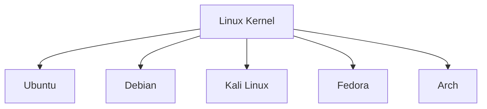

**Key idea:** Linux powers a huge range of technology — servers, cloud infrastructure, IoT devices, Android phones — which is exactly why it's foundational knowledge for cybersecurity.

---

## 1.2 First Commands

| Command | Purpose | Example |
|---------|---------|---------|
| `echo` | Prints text to the terminal | `echo TryHackMe` |
| `whoami` | Shows the currently logged-in user | `whoami` |

```bash
echo TryHackMe
# Output: TryHackMe

whoami
# Output: tryhackme
```

---

## 1.3 Navigating the Filesystem

| Command | Purpose | Example |
|---------|---------|---------|
| `pwd` | Print working directory (shows current location) | `pwd` |
| `ls` | List files/folders in the current directory | `ls` |
| `ls -la` | List all files (including hidden) with details | `ls -la` |
| `cd` | Change directory | `cd folder1` |
| `cd ..` | Move up one directory | `cd ..` |
| `cd ~` or `cd` | Go to home directory | `cd ~` |

```bash
pwd
# Output: /home/tryhackme

ls
# Output: file1  file2  folder1

cd folder1
pwd
# Output: /home/tryhackme/folder1
```

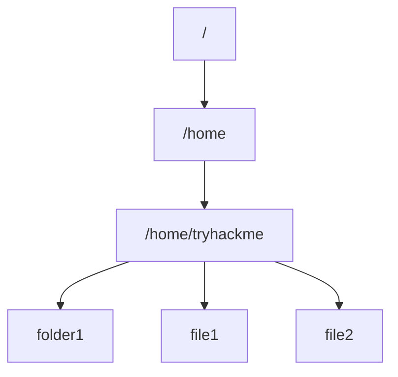

---

## 1.4 Viewing File Contents

| Command | Purpose | Example |
|---------|---------|---------|
| `cat` | Display the full contents of a file | `cat file1` |
| `head` | Show the first 10 lines of a file | `head file1` |
| `tail` | Show the last 10 lines of a file | `tail file1` |

```bash
cat file1
# Prints entire contents of file1 to the terminal
```

---

## 1.5 Searching & Filtering

| Command | Purpose | Example |
|---------|---------|---------|
| `grep` | Search for a pattern within a file | `grep THM access.log` |
| `find` | Search for files/directories by name, type, etc. | `find / -name "*.txt"` |
| `locate` | Quickly find files using a pre-built index | `locate passwords` |

```bash
# Search "access.log" for lines containing "THM"
grep THM access.log

# Search the whole filesystem for a file named notes.txt
find / -name "notes.txt"
```

**Key idea:** `grep` is essential for quickly finding a specific string (like a flag, password, or error message) inside large log/text files without manually reading through them.

---

## 1.6 Wildcards

Wildcards let you match multiple files/patterns at once.

| Wildcard | Meaning | Example |
|----------|---------|---------|
| `*` | Matches any number of characters | `ls *.txt` → all `.txt` files |
| `?` | Matches exactly one character | `ls file?.txt` → file1.txt, file2.txt |
| `[]` | Matches any one character in the brackets | `ls file[12].txt` → file1.txt, file2.txt |

```bash
# List all .txt files in the current directory
ls *.txt
```

---

## 1.7 Redirection & Output Manipulation

| Operator | Purpose | Example |
|----------|---------|---------|
| `>` | Redirects output to a file, **overwriting** its contents | `echo password123 > passwords` |
| `>>` | Redirects output to a file, **appending** to existing contents | `echo tryhackme >> passwords` |
| `\|` (pipe) | Sends the output of one command into another | `cat file1 \| grep THM` |

```bash
# Overwrite "passwords" file with "password123"
echo password123 > passwords

# Add "tryhackme" to "passwords" while keeping existing content
echo tryhackme >> passwords
```

**Key idea:** `>` destroys existing content, while `>>` preserves it and adds to the end — mixing these up is one of the most common beginner mistakes (accidentally wiping a file).

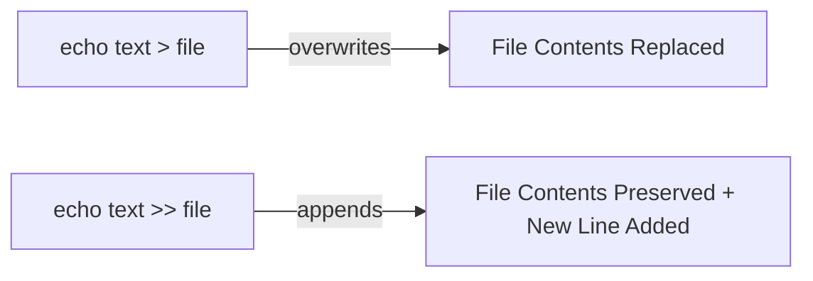

---

# Part 2: Filesystem, Users & Permissions

## 2.1 Connecting via SSH

**SSH (Secure Shell)** is used to remotely log into a Linux machine securely over the network, typically on **port 22**.

```bash
ssh username@target_ip
# Prompts for a password, then drops you into a remote shell
```

---

## 2.2 The Linux Filesystem Hierarchy

| Directory | Purpose |
|-----------|---------|
| `/` | Root — top of the entire filesystem |
| `/home` | Contains personal directories for each user |
| `/etc` | System configuration files (e.g., `passwd`, `shadow`) |
| `/var` | Variable data frequently written by services (e.g., logs) |
| `/bin` | Essential system binaries/commands |
| `/tmp` | Temporary files, cleared periodically |
| `/root` | Home directory for the root (superuser) account |

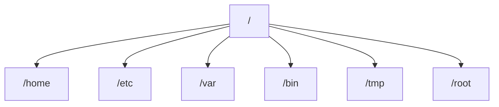

---

## 2.3 Users, Groups & Switching Users

| Command | Purpose | Example |
|---------|---------|---------|
| `su` | Switch to another user | `su bob` |
| `su -l` | Switch user with a full login shell (inherits their environment) | `su -l bob` |
| `sudo` | Run a single command with elevated (root) privileges | `sudo cat /etc/shadow` |
| `whoami` | Show current user | `whoami` |
| `id` | Show current user's UID, GID, and group memberships | `id` |

```bash
# Switch to user "bob" with full environment/login shell
su -l bob
```

**Key idea:** `su` alone switches the user but keeps your current shell environment; `su -l` (or `su -`) starts a fresh login shell as that user — inheriting their environment variables, home directory, and shell settings, which better simulates them actually logging in.

---

## 2.4 File Permissions

Linux permissions control who can **read (r)**, **write (w)**, and **execute (x)** a file, split across three groups: **owner**, **group**, and **others**.

```bash
ls -l file1
# Output example: -rwxr-xr-- 1 bob staff 220 Jan 1 12:00 file1
```

| Field | Meaning |
|-------|---------|
| `-` (1st char) | File type (`-` = file, `d` = directory) |
| `rwx` | Owner's permissions (read, write, execute) |
| `r-x` | Group's permissions |
| `r--` | Others' permissions |

| Command | Purpose | Example |
|---------|---------|---------|
| `chmod` | Change file permissions | `chmod 750 file1` |
| `chown` | Change file owner/group | `chown bob:staff file1` |

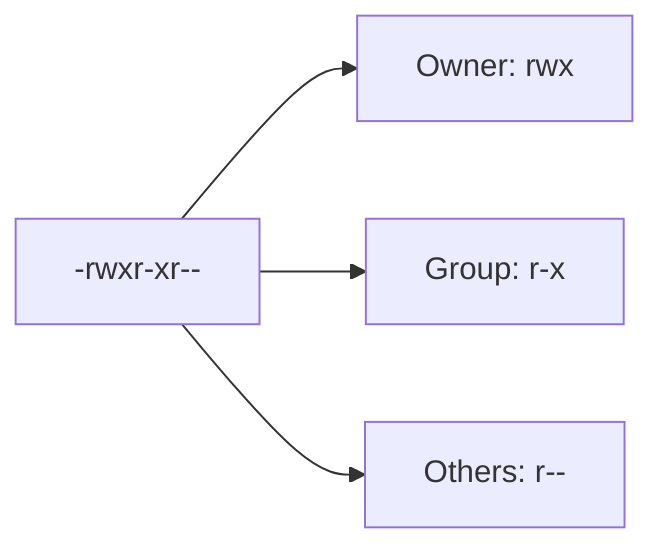

**Key idea:** Permissions are foundational to Linux security — misconfigured permissions (e.g., a world-writable script run by root) are a common privilege escalation vector.

---

## 2.5 File Types

| Command | Purpose | Example |
|---------|---------|---------|
| `file` | Identify the type of a file | `file unknown1` |

```bash
file unknown1
# Output example: unknown1: ASCII text
```

**Key idea:** File extensions can be misleading or missing — the `file` command inspects the actual file content/header (magic bytes) to determine its real type, which is useful when investigating unfamiliar files.

---

# Part 3: Common Utilities, Processes & Automation

## 3.1 Text Editors

| Command | Purpose |
|---------|---------|
| `nano` | Simple, beginner-friendly terminal text editor |
| `vim` | Powerful but steeper learning curve text editor |

```bash
# Open (or create) a file in nano
nano task3.txt
```

**Common nano shortcuts:**

| Shortcut | Action |
|----------|--------|
| `Ctrl + O` | Save the file |
| `Ctrl + X` | Exit nano |
| `Ctrl + K` | Cut a line |
| `Ctrl + U` | Paste a line |

---

## 3.2 Processes

| Command | Purpose | Example |
|---------|---------|---------|
| `ps` | List processes running in the current session | `ps` |
| `ps aux` | List all processes system-wide, including other users' | `ps aux` |
| `top` | Real-time view of running processes and resource usage | `top` |
| `kill` | Send a signal to stop/terminate a process by PID | `kill 1234` |
| `kill -9` | Force kill a process (SIGKILL, cannot be ignored) | `kill -9 1234` |

```bash
ps aux
# Shows PID, user, CPU%, MEM%, and command for every running process
```

**Signals:**

| Signal | Name | Meaning |
|--------|------|---------|
| `SIGTERM` | Terminate (default `kill`) | Politely asks the process to stop cleanly |
| `SIGKILL` (`kill -9`) | Kill | Forcefully terminates the process immediately |

**Key idea:** Each new process gets the next available Process ID (PID) — e.g., if the last process launched had PID 300, the next one launched will typically be PID 301.

---

## 3.3 Foreground & Background Jobs

| Command / Key | Purpose |
|----------------|---------|
| `command &` | Run a command in the background |
| `Ctrl + Z` | Suspend (pause) the current foreground process |
| `bg` | Resume a suspended process in the background |
| `fg` | Bring a background/suspended process back to the foreground |
| `jobs` | List background/suspended jobs in the current session |

```bash
# Start a long-running command in the background
sleep 100 &

# Bring it back to the foreground
fg
```

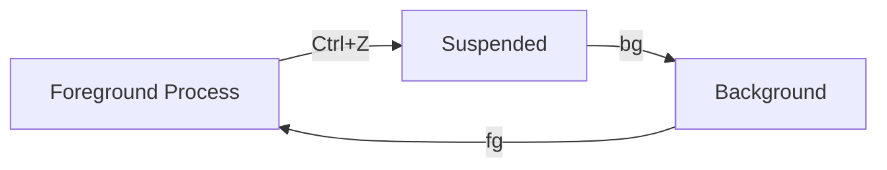

---

## 3.4 Package Management

| Command | Purpose | Example |
|---------|---------|---------|
| `apt update` | Refresh the list of available packages | `sudo apt update` |
| `apt upgrade` | Upgrade all installed packages | `sudo apt upgrade` |
| `apt install` | Install a new package | `sudo apt install nmap` |
| `apt remove` | Remove an installed package | `sudo apt remove nmap` |

```bash
sudo apt update && sudo apt install nmap
```

---

## 3.5 Services (systemctl)

| Command | Purpose | Example |
|---------|---------|---------|
| `systemctl start` | Start a service immediately | `systemctl start myservice` |
| `systemctl stop` | Stop a running service | `systemctl stop myservice` |
| `systemctl enable` | Set a service to start automatically on boot | `systemctl enable myservice` |
| `systemctl status` | Check whether a service is running | `systemctl status myservice` |

```bash
# Stop a service
systemctl stop myservice

# Ensure it starts automatically every time the system boots
systemctl enable myservice
```

---

## 3.6 Scheduling Tasks with Cron

**Cron** allows commands/scripts to run automatically on a schedule.

| Component | Meaning |
|-----------|---------|
| `crontab -e` | Edit the current user's cron jobs |
| `crontab -l` | List current cron jobs |
| `@reboot` | Special cron schedule that runs a job once at system startup |

```bash
# Cron syntax: minute hour day month weekday command
* * * * * /path/to/script.sh

# Run once at every system reboot
@reboot /path/to/script.sh
```

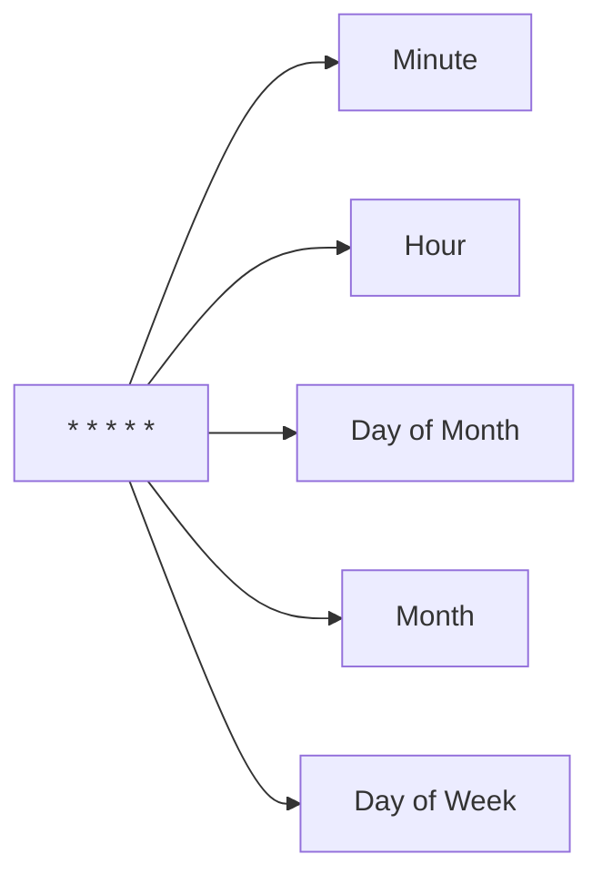

---

## 3.7 Networking Utilities & File Transfer

| Command | Purpose | Example |
|---------|---------|---------|
| `wget` | Download a file from a URL | `wget http://target_ip:8000/file.txt` |
| `curl` | Transfer data to/from a server (supports more protocols/options) | `curl http://target_ip` |
| `python3 -m http.server` | Quickly spin up a basic web server to share files | `python3 -m http.server 8000` |

```bash
# On the "host" machine — serve the current directory over HTTP on port 8000
python3 -m http.server 8000

# On another machine — download a file from that server
wget http://target_ip:8000/file.txt
```

**Key idea:** Python's built-in HTTP server is a quick, no-install way to transfer files between machines during CTFs or pentests — extremely useful when you need to move a tool or exploit onto a target quickly.

---

## 3.8 Logging

| Location | Purpose |
|----------|---------|
| `/var/log/` | Central location for most system and application logs |
| `/var/log/syslog` | General system activity log (Debian/Ubuntu) |
| `/var/log/auth.log` | Authentication attempts and SSH logins |

```bash
# View recent authentication attempts
tail /var/log/auth.log
```

**Key idea:** Logs are one of the most important sources of evidence during incident response and forensics — knowing where to look (`/var/log/`) is a core skill for defenders.

---

# Full Command Reference (Quick Lookup)

| Command | Category | Purpose |
|---------|----------|---------|
| `echo` | Basics | Print text |
| `whoami` | Basics | Show current user |
| `pwd` | Navigation | Show current directory |
| `ls` / `ls -la` | Navigation | List files (incl. hidden) |
| `cd` | Navigation | Change directory |
| `cat` | Files | Display file contents |
| `head` / `tail` | Files | Show first/last lines of a file |
| `grep` | Search | Search text within files |
| `find` | Search | Search for files by name/type/etc |
| `locate` | Search | Fast indexed file search |
| `>` / `>>` | Redirection | Overwrite / append output to a file |
| `\|` | Redirection | Pipe output between commands |
| `ssh` | Remote Access | Log into a remote machine |
| `su` / `su -l` | Users | Switch user (with/without full login shell) |
| `sudo` | Users | Run a command as root |
| `id` | Users | Show UID/GID/group info |
| `chmod` | Permissions | Change file permissions |
| `chown` | Permissions | Change file owner/group |
| `file` | Files | Identify file type |
| `nano` / `vim` | Editors | Edit files in the terminal |
| `ps` / `ps aux` | Processes | List running processes |
| `top` | Processes | Real-time process monitor |
| `kill` / `kill -9` | Processes | Terminate a process |
| `bg` / `fg` / `jobs` | Processes | Manage background/foreground jobs |
| `apt update/upgrade/install` | Packages | Manage installed software |
| `systemctl start/stop/enable/status` | Services | Manage system services |
| `crontab -e` / `-l` | Automation | Schedule recurring tasks |
| `wget` / `curl` | Networking | Download/transfer files over HTTP |
| `python3 -m http.server` | Networking | Quick file-sharing web server |

---

## Quick Recap

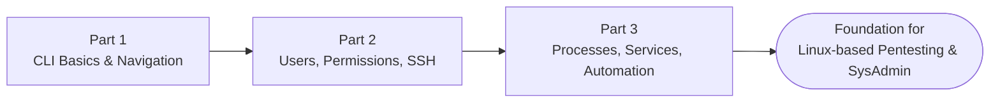

# PaperCut MF/NG: CVE-2023-27350

> Detailed notes on the PaperCut authentication bypass → Remote Code Execution vulnerability — one of the most significant real-world exploited CVEs of 2023.

---

## 1. Overview

| Field | Detail |
|-------|--------|
| **CVE ID** | CVE-2023-27350 |
| **Also known as** | ZDI-CAN-18987 / ZDI-23-233 |
| **Affected software** | PaperCut NG and PaperCut MF (print management software) |
| **Affected versions** | Version 8.0 and later, across all supported operating systems |
| **CVSS v3.1 Score** | **9.8 (Critical)** |
| **Vulnerability type** | Improper Access Control → Authentication Bypass → Remote Code Execution |
| **Authentication required?** | **No** — fully unauthenticated |
| **Privileges gained** | SYSTEM (on Windows) |
| **Disclosed / Patched** | March 8, 2023 (patched in versions 20.1.7, 21.2.11, and 22.0.9) |
| **Exploited in the wild** | From ~April 14–18, 2023 onward, added to CISA's Known Exploited Vulnerabilities (KEV) catalog |

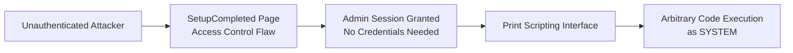

**Key idea:** This vulnerability chained two separate weaknesses — an authentication bypass and abuse of a legitimate built-in feature (print scripting) — to go from zero access to full SYSTEM-level code execution, with no valid credentials at any point.

---

## 2. What is PaperCut?

**PaperCut MF/NG** is print management software used by over **100 million users** across roughly **70,000+ organizations** worldwide (schools, universities, government agencies, businesses) to track, control, and manage printing.

- Built on **Java**, following a service-oriented architecture
- Deployed with a **Primary Application Server** and optional **secondary servers**
- Includes a web-based admin console, typically on **port 9191** (HTTP) or **9192** (HTTPS)

---

## 3. Root Cause: The `SetupCompleted` Flaw

When a PaperCut installation finishes its initial setup, it redirects to a page called **`SetupCompleted`**. This page is meant to only be reachable once, right after installation, to let the installer log in and access the admin console for the first time.

The vulnerability existed because the code behind this page called an internal `performLogin` function **without actually validating that the request was legitimate or that the user had provided any credentials**. In other words, visiting this page at any time (not just right after install) and clicking "login" would grant a full **admin session** — no username, no password, no MFA required.

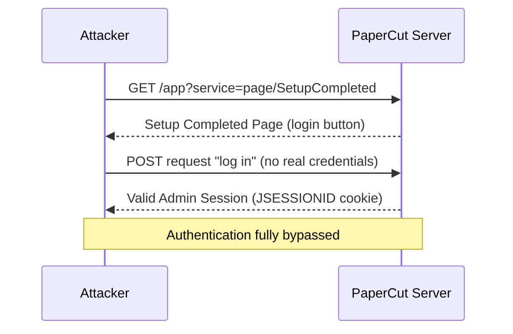

**Key idea:** The flaw wasn't a password guess or brute force — it was a logic error where a page meant only for post-installation setup could be revisited at any time to silently grant administrator access.

### THM Terminology: Session Puzzling

TryHackMe's room specifically frames this bug as an example of **Session Puzzling** (also called **Session Puzzles**) — a logic vulnerability that occurs when **session or authentication-related variables/functions are reused for more than one purpose** in an application.

In PaperCut's case, the `SetupCompleted` class's login function was originally intended only to be triggered once, right after installation — but because the same session-setting logic could be re-triggered later without re-validating that the user was in a genuine "just installed" state, it ended up doubling as a general-purpose (and unintended) admin login mechanism.

**Key idea:** Session Puzzling bugs are dangerous precisely because they don't look like "broken" authentication in the traditional sense (no missing password check on a login form) — the flaw is in a *different* feature that happens to touch the same session state, so it's easy for developers and code reviewers to miss.

---

## 4. From Admin Access to Remote Code Execution

Once an attacker has an authenticated admin session, they abuse a **legitimate PaperCut feature** — the **print scripting interface** — rather than needing a separate exploit. PaperCut allows administrators to attach scripts to printers that run when print jobs occur; these scripts execute using Java's runtime, which can be used to run arbitrary OS commands.

**General attack chain (conceptual, high level):**

1. Attacker requests the `SetupCompleted` page and logs in without credentials → gains admin session
2. Attacker enables settings required for print scripting (if not already enabled) via admin settings pages
3. Attacker locates or creates a printer entry within the admin console
4. Attacker attaches a malicious script to the printer's "print job hook," using PaperCut's scripting API (which exposes access to Java's `Runtime.getRuntime()`)
5. Triggering a print event (or the script assignment itself) causes the attached script to execute — running arbitrary commands with **SYSTEM** privileges

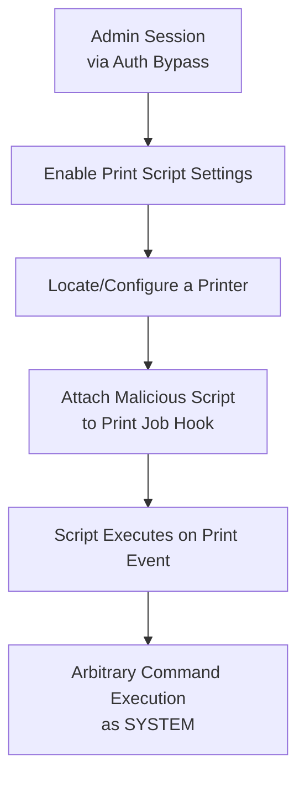

**Key idea:** This is a great example of "living off the land" in a web application context — the attacker didn't need a memory-corruption exploit or custom malware delivery mechanism; they simply abused a legitimate admin feature (print scripting) that PaperCut ships by design, once they had unauthorized admin access.

---

## 4a. Practical Walkthrough (as covered in the THM room)

The TryHackMe room walks through the exploit both **manually** (via the browser) and via an **automated Metasploit module**. Here's the practical flow:

### Step 1 — Trigger the Authentication Bypass

Visiting the `SetupCompleted` service page directly grants an authenticated admin session, regardless of the server's actual setup state:

```
http://<target-hostname>:9191/app?service=page/SetupCompleted
```

*(Example from the room: for a host named `PRINT.TRYHACKME.LOC`, the URL would be `http://PRINT.TRYHACKME.LOC:9191/app?service=page/SetupCompleted`.)*

Clicking "Login" on the resulting page returns a valid `JSESSIONID` session cookie with full administrator rights — no credentials required.

### Step 2 — Enable Print Scripting Settings

From the now-accessible admin console, the required scripting-related settings are enabled (e.g., `print-and-device.script.enabled` set to `Y`, `print.script.sandboxed` set to `N`) so that scripts attached to a printer are permitted to run without sandbox restrictions.

### Step 3 — Inject a Malicious Script via the Script Manager

Navigating to a printer's configuration → **Scripting → Script Manager**, an attacker can add a one-liner that uses Java's runtime to execute an OS command. The room's example, used to prove code execution (spawning the Windows calculator), is:

```java
java.lang.Runtime.getRuntime().exec('calc.exe');
```

In a real attack, this same technique would instead execute a reverse shell payload or download-and-run a malicious binary.

### Step 4 — Trigger Execution & Confirm Access

Once the script is saved/associated with a print event, it executes on the server with **SYSTEM** privileges. In the room, this is proven by locating a flag file placed on the **Administrator's Desktop** — confirming full SYSTEM-level filesystem access.

### Automated Exploitation (Metasploit)

The room also demonstrates using a **Metasploit module** to automate the entire chain above (authentication bypass → enabling scripting → injecting a payload → catching a shell) in a single command, rather than performing each step manually through the browser.

### Log Analysis

The room also highlights that this activity is visible in **PaperCut's own application logs** — specifically, log entries show which **printer name** had its "print script" updated, which is a useful detection/forensics artifact (see the Detection section below).

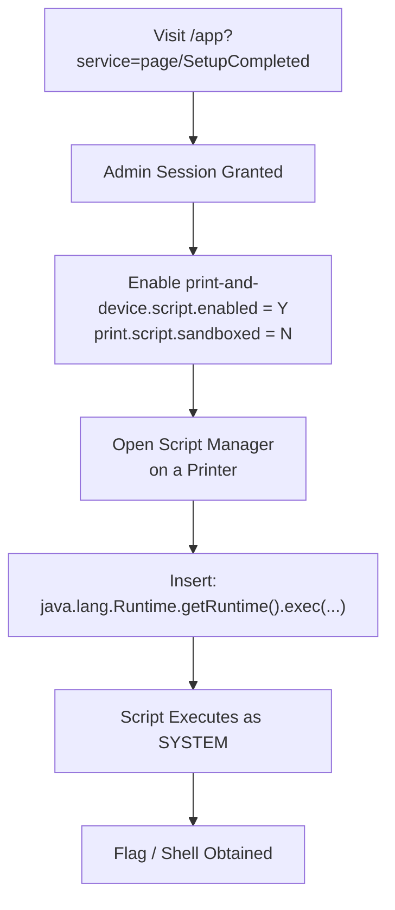

---

## 5. Real-World Exploitation

- **April 14–18, 2023** – First suspected exploitation activity reported by a PaperCut customer
- **April 21, 2023** – CVE publicly disclosed/detailed further by Trend Micro's Zero Day Initiative (ZDI)
- **April 24, 2023** – Added to CISA's Known Exploited Vulnerabilities (KEV) catalog
- **Early May 2023** – The **Bl00dy Ransomware Gang** exploited vulnerable, internet-exposed PaperCut servers, primarily targeting the **Education sector**, leading to data exfiltration and ransomware deployment
- **Clop ransomware** operators were also linked to related PaperCut exploitation activity, using it to deploy legitimate remote management tools (Atera, Syncro) for persistence

**Observed post-exploitation behavior (per CISA/FBI advisory):**
- Execution of `pc-app.exe` (a legitimate PaperCut process) to facilitate further code execution
- PowerShell scripts used to download and run malicious payloads
- Use of `netsh.exe` to modify firewall rules and allow payload downloads
- Payloads hosted on short-lived (~60 minute) file-hosting sites to hinder forensic tracing
- Use of Tor/other proxies to mask outbound command-and-control traffic

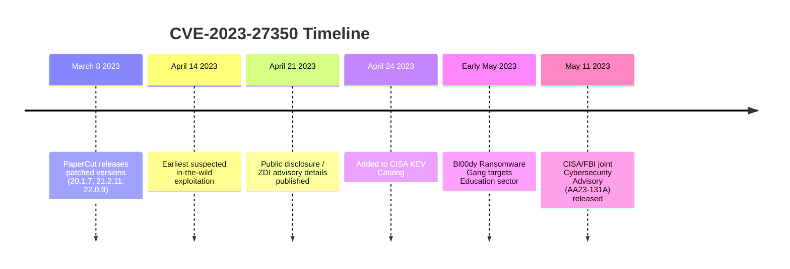

---

## 6. Detection

| Method | What to Look For |
|--------|-------------------|
| **Web server / access logs** | Repeated or unexpected `GET` requests to `/app?service=page/SetupCompleted` after initial installation |
| **Network signatures (IDS/IPS)** | Emerging Threat Suricata/Snort signatures for SetupCompleted page requests |
| **DNS logs** | Lookups for known malicious domains associated with post-exploitation payloads (as identified in CISA's advisory) |
| **Process monitoring** | Unexpected child processes spawned from PaperCut's Java process, especially `powershell.exe`, `cmd.exe`, or `netsh.exe` |
| **PaperCut application logs** | Unexpected admin logins or settings changes with no corresponding legitimate administrator action; specifically look for log entries showing a **printer's "print script" being updated** unexpectedly — a direct artifact of this exploitation technique |

**Key idea:** Because the exploit reuses a legitimate application page and legitimate features (not a memory-corruption exploit), detection relies heavily on behavioral and log-based indicators rather than signature-based malware detection alone.

---

## THM Room Quick Reference

| Task | Concept / Question | Answer / Key Detail |
|------|----------------------|------------------------|
| Task 2 | Name of the logic vulnerability where session/auth functions serve multiple purposes | Session Puzzling |
| Task 2 | Java class containing the authentication bypass | `SetupCompleted` |
| Task 3 | URL used to perform the authentication bypass | `http://<host>:9191/app?service=page/SetupCompleted` |
| Task 3 | Script Manager one-liner to prove code execution | `java.lang.Runtime.getRuntime().exec('calc.exe');` |
| Task 3 | Where the proof-of-exploitation flag is found | Administrator's Desktop |
| Task 3 | What confirms automated exploit success | Specific success text the automated exploit script checks for in the response |
| Task 3 | What the application logs reveal | The name of the printer whose "print script" was modified |

---

## 7. Mitigation & Remediation

| Action | Details |
|--------|---------|
| **Patch immediately** | Upgrade to PaperCut MF/NG version **20.1.7, 21.2.11, 22.0.9**, or later |
| **Restrict network exposure** | Do not expose the PaperCut Application Server admin interface (default port 9191/9192) directly to the internet |
| **Network segmentation** | Place PaperCut servers behind a firewall/VPN, limiting access to only trusted internal networks |
| **If already compromised** | Take backups, wipe and rebuild the Application Server, and restore the database from a known-clean backup point predating the compromise |
| **Monitor logs** | Review PaperCut and OS-level logs for indicators of compromise described above |

**Key idea:** Even after patching, if a server was exploited *before* the patch was applied, simply updating the software does not remove any backdoors or persistence mechanisms an attacker may have already planted — a full rebuild from a clean backup is the recommended response for confirmed compromises.

---

## Quick Recap

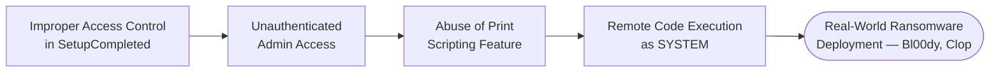

- **Root cause:** A page meant only for first-time setup could be revisited to bypass authentication entirely
- **Escalation:** Abused a legitimate admin feature (print scripting) rather than needing a separate RCE exploit
- **Impact:** CVSS 9.8, unauthenticated, SYSTEM-level code execution — actively exploited by ransomware groups
- **Lesson:** Post-installation/setup pages must always re-validate authentication state — "setup complete" should never imply "still authenticated"

- Part 1 → navigating the filesystem, searching, and manipulating text/output
- Part 2 → understanding users, permissions, and remote access — critical for privilege escalation concepts
- Part 3 → managing processes, services, and automation — essential day-to-day skills for both attackers and defenders
