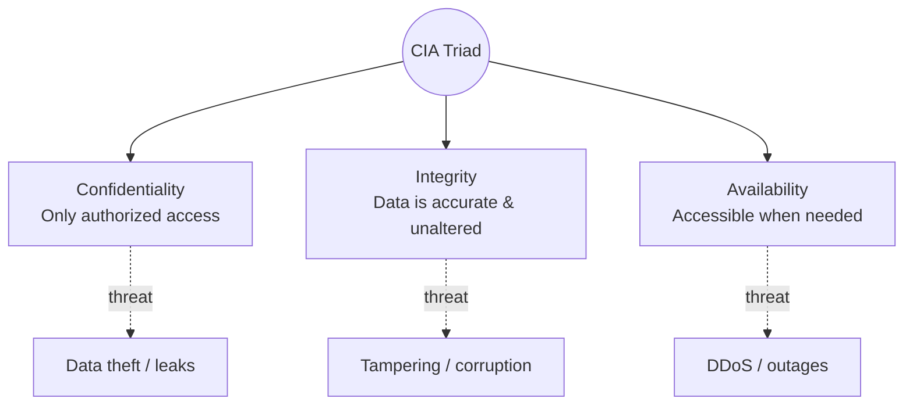
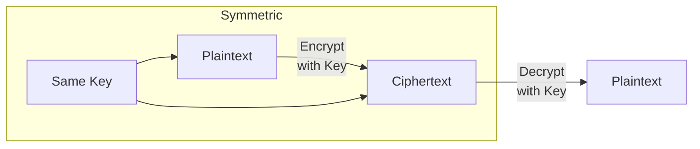
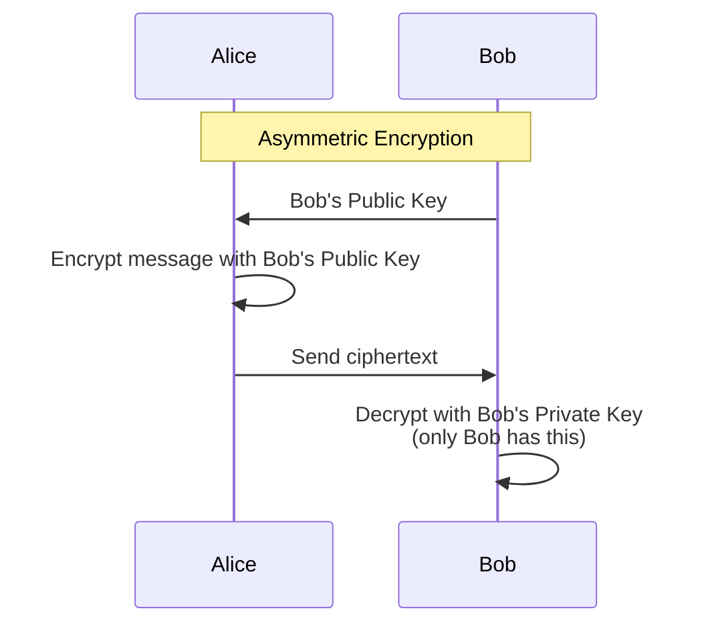
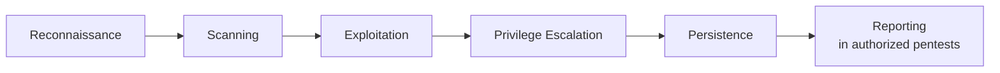
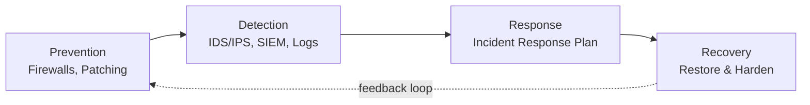
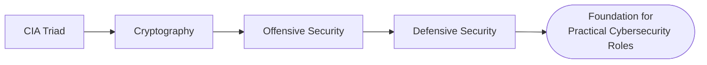

# Attacks and Defenses

> Notes covering Module 7 of the Pre Security path — the CIA Triad, cryptography concepts, offensive security basics, and defensive security basics.

---

## 1. The CIA Triad

The **CIA Triad** is the foundational model for information security, made up of three core principles that every security control aims to protect.

- **Confidentiality** – ensuring data is only accessible to authorized people (e.g., encryption, access controls)
- **Integrity** – ensuring data is accurate and unaltered (e.g., checksums, hashing, version control)
- **Availability** – ensuring systems/data are accessible when needed (e.g., backups, redundancy, DDoS protection)

**Key idea:** Almost every security control maps back to protecting one (or more) of these three pillars — and almost every attack is trying to violate one of them.

---

## 2. Cryptography Concepts

**Cryptography** protects data by transforming it so only intended parties can read or verify it.

- **Encryption** – converts readable data (plaintext) into unreadable data (ciphertext) using a key
- **Decryption** – reverses encryption back into plaintext using the correct key
- **Symmetric Encryption** – same key used to encrypt and decrypt (fast, but key must be shared securely) — e.g., AES
- **Asymmetric Encryption** – uses a public/private key pair (slower, but solves the key-sharing problem) — e.g., RSA
- **Hashing** – one-way transformation used to verify integrity (not reversible) — e.g., SHA-256

**Key idea:** Symmetric encryption is fast but requires securely sharing the key beforehand; asymmetric encryption solves that problem by letting anyone encrypt with a public key, while only the private key holder can decrypt.

---

## 3. Become a Hacker (Offensive Security Basics)

Offensive security involves thinking like an attacker to find weaknesses before malicious actors do.

- **Reconnaissance** – gathering information about a target (passive/active)
- **Scanning** – identifying open ports, services, and vulnerabilities
- **Exploitation** – taking advantage of a vulnerability to gain access
- **Privilege Escalation** – gaining higher-level access after initial foothold
- **Persistence** – maintaining access to a compromised system
- **Penetration Testing** – authorized, simulated attacks to test defenses

**Key idea:** Ethical hacking follows the same steps as a real attacker, but with explicit authorization and a goal of *reporting* findings rather than causing harm.

---

## 4. Become a Defender (Defensive Security Basics)

Defensive security focuses on preventing, detecting, and responding to attacks.

- **Prevention** – firewalls, patching, access controls, secure configurations
- **Detection** – monitoring logs, IDS/IPS, SIEM systems for suspicious activity
- **Response** – incident response plans to contain and remediate an attack
- **Security Operations Center (SOC)** – team responsible for continuous monitoring/defense
- **Blue Team** – the defensive counterpart to offensive "Red Team" testers

**Key idea:** Defense is a continuous cycle, not a one-time setup — prevention reduces risk, detection catches what gets through, and response/recovery ensures the organization bounces back and improves.

---

## Offense vs Defense — Quick Comparison

| Aspect | Offensive (Red Team) | Defensive (Blue Team) |
|--------|------------------------|---------------------------|
| Goal | Find and exploit weaknesses | Prevent, detect, and respond to attacks |
| Mindset | "How can I break in?" | "How do I stop/catch this?" |
| Common tools | Nmap, Metasploit, Burp Suite | SIEM, IDS/IPS, firewalls, EDR |
| Output | Vulnerability/pentest report | Incident reports, hardened systems |

---

## Quick Recap

- CIA Triad → the "why" behind every security control
- Cryptography → protects confidentiality and integrity of data
- Offensive security → understanding attacker methodology (recon → exploitation → persistence)
- Defensive security → the ongoing cycle of prevention, detection, and response
