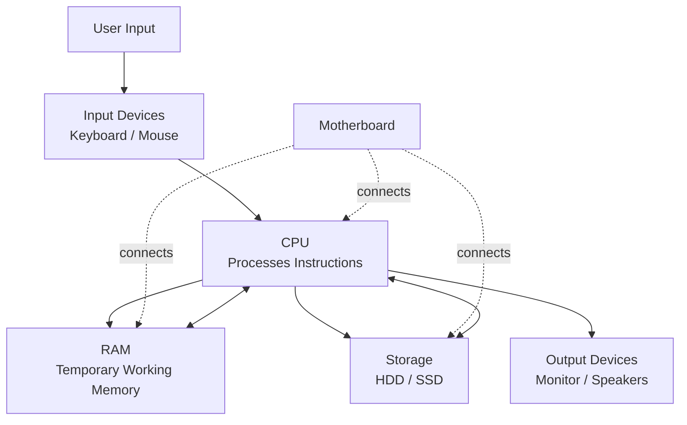
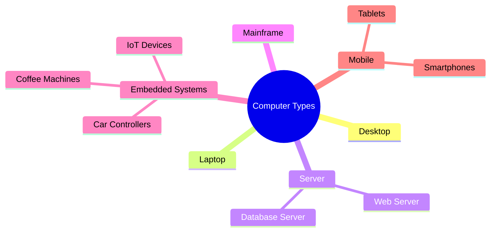
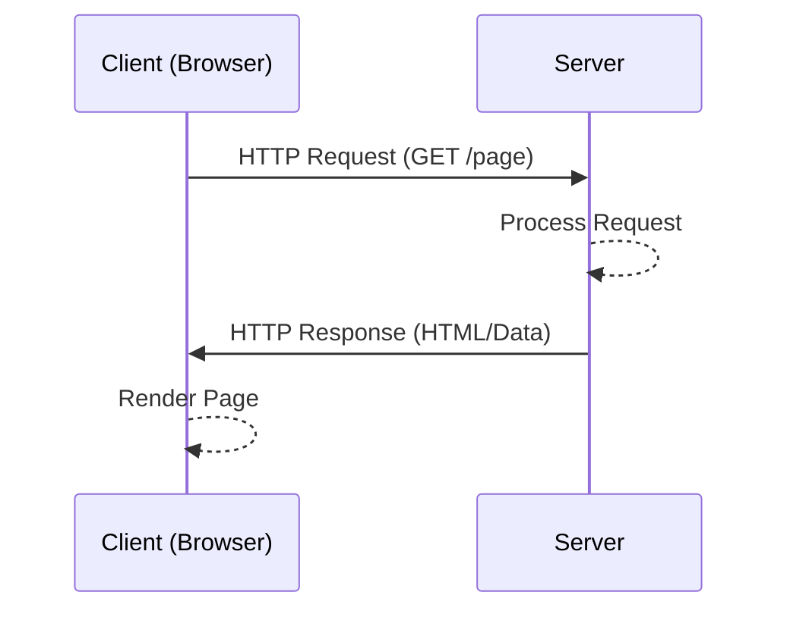
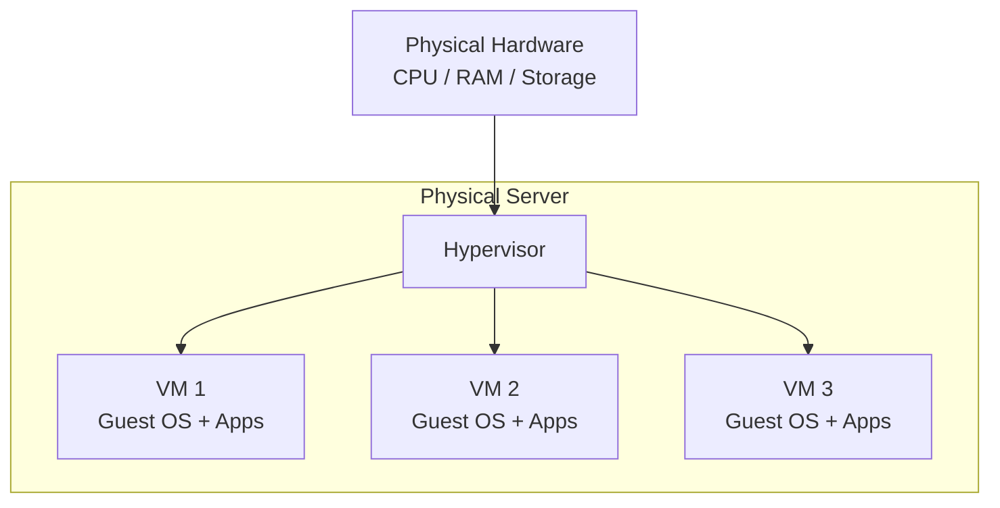
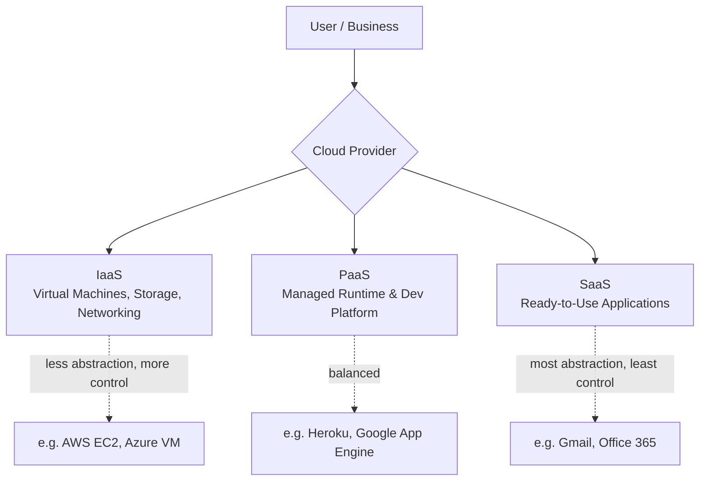
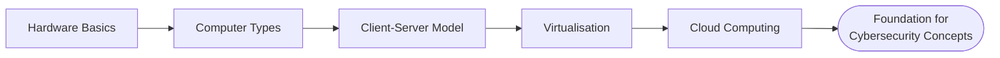

# Computer Fundamentals

> Notes covering the core building blocks of computers and modern IT — from hardware, to computer types, to client-server architecture, virtualisation, and the cloud.

---

## 1. Inside a Computer System

Every computer, no matter its size or purpose, is built from the same core components working together.

- **CPU (Central Processing Unit)** – the "brain"; executes instructions
- **RAM (Memory)** – fast, temporary working storage
- **Storage (HDD/SSD)** – long-term data storage
- **Motherboard** – connects all components together
- **I/O Devices** – keyboard, mouse, monitor, etc.
- **OS (Operating System)** – manages hardware and runs software

**Key idea:** The CPU constantly reads instructions and data from RAM, processes them, and sends results to storage or output devices. The motherboard is the physical backbone linking every part.

---

## 2. Computer Types

Computers come in many forms — from powerful servers to tiny embedded chips.

| Type | Description | Example |
|------|-------------|---------|
| Desktop | Fixed, general-purpose computer | Office PC |
| Laptop | Portable general-purpose computer | MacBook |
| Server | Powerful machine serving many users/requests | Web server |
| Mainframe | Large-scale, high-reliability enterprise computer | Banking systems |
| Embedded System | Small chip dedicated to one task | Coffee machine, car ECU |
| Mobile Device | Compact, touch-based computer | Smartphone |

**Key idea:** Not every "computer" looks like a PC — embedded systems are everywhere, silently running fixed tasks with minimal resources.

---

## 3. Client-Server Basics

The **client-server model** is the foundation of most networked applications, including the web.

- **Client** – requests a service or resource (e.g., a browser)
- **Server** – provides the service or resource (e.g., a web server)
- Communication typically happens over a network using protocols like **HTTP/HTTPS**

**Key idea:** A single server can handle requests from many clients simultaneously, which is why servers are typically more powerful than the average client machine.

---

## 4. Virtualisation Basics

**Virtualisation** allows one physical machine to run multiple isolated virtual machines (VMs), each with its own OS.

- **Hypervisor** – software that creates and manages VMs
  - **Type 1 (Bare-metal):** runs directly on hardware (e.g., ESXi, Hyper-V)
  - **Type 2 (Hosted):** runs on top of an existing OS (e.g., VirtualBox, VMware Workstation)
- Improves efficiency, isolation, and resource utilisation

**Key idea:** Virtualisation lets a single physical machine be "sliced" into isolated environments — great for testing, security separation, and efficient use of hardware.

---

## 5. Cloud Computing Fundamentals

**Cloud computing** delivers computing resources (servers, storage, databases, networking) over the internet, on demand.

### Service Models
- **IaaS** (Infrastructure as a Service) – raw compute/storage/network (e.g., AWS EC2)
- **PaaS** (Platform as a Service) – managed platform for building apps (e.g., Heroku)
- **SaaS** (Software as a Service) – ready-to-use software (e.g., Gmail)

### Deployment Models
- **Public Cloud** – shared infrastructure, third-party provider
- **Private Cloud** – dedicated infrastructure for one organization
- **Hybrid Cloud** – mix of public and private

**Key idea:** As you move from IaaS → PaaS → SaaS, you trade control for convenience — the provider manages more of the stack for you.

---

## Quick Recap

- Understanding hardware → understanding how systems can be attacked/defended
- Client-server model → basis for web app security
- Virtualisation & cloud → modern infrastructure, and modern attack surfaces
