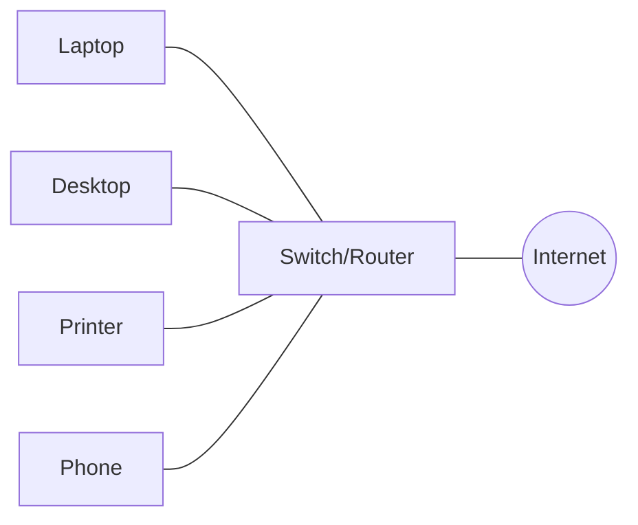
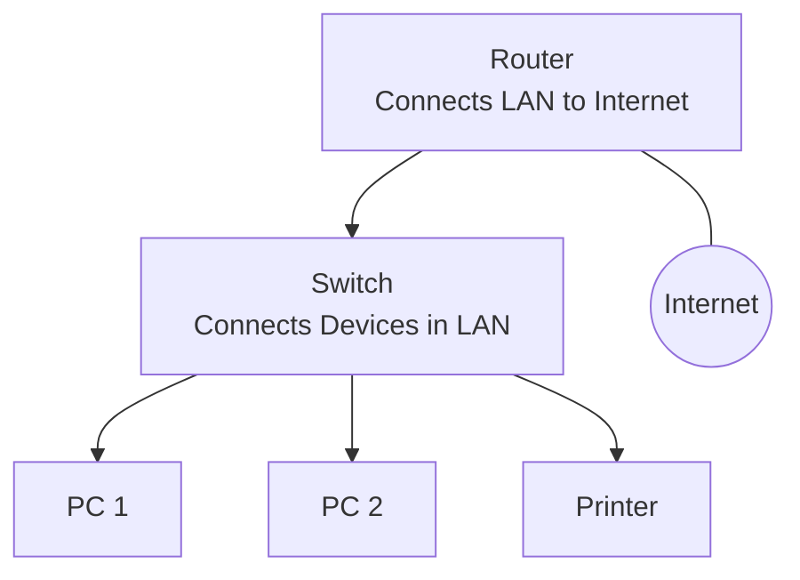
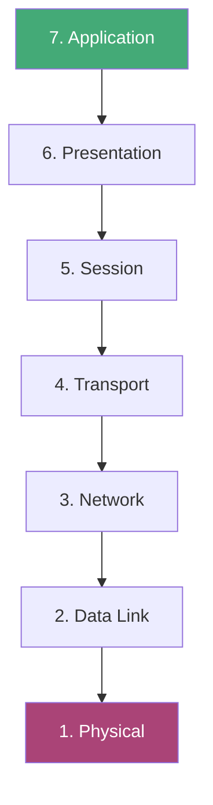
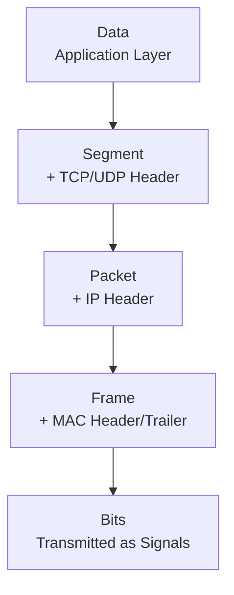
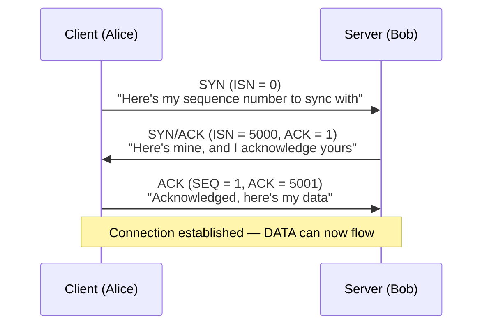
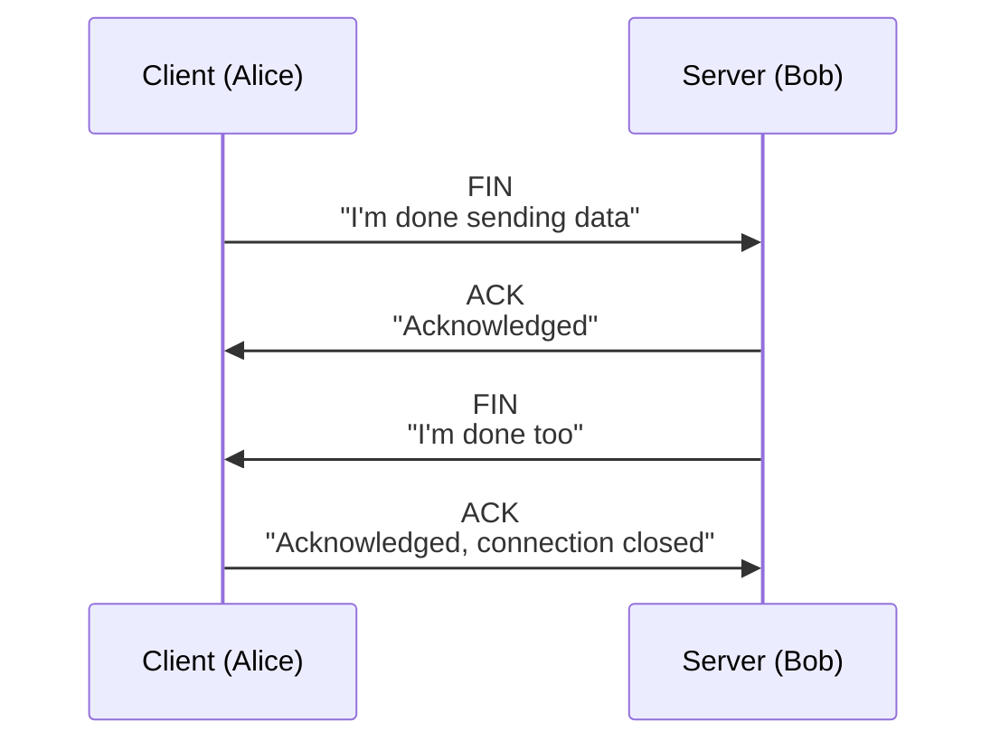
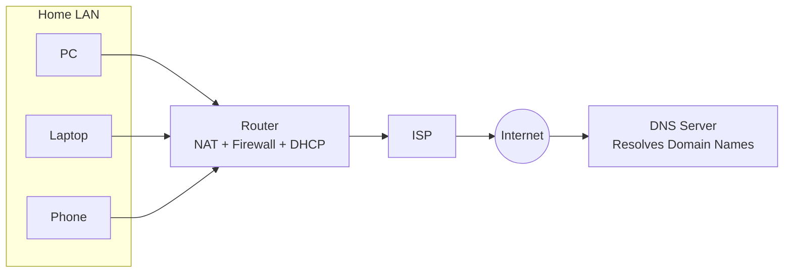
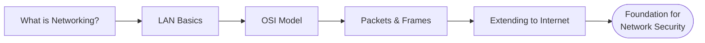

# Networking Fundamentals

> Notes covering the Pre Security networking module — from what networking is, to LANs, the OSI model, packets/frames, and extending networks to the internet.

---

## 1. What is Networking?

**Networking** is the practice of connecting computers and devices together so they can communicate and share resources (files, printers, internet access, etc.).

- **Node** – any device connected to a network (PC, phone, printer, server)
- **Network** – two or more nodes connected together
- Networks let devices **send and receive data** using agreed-upon rules (protocols)

**Key idea:** Without networking, every device would be isolated — networking is what turns individual computers into a connected system.

---

## 2. Intro to LAN

A **LAN (Local Area Network)** is a network confined to a small physical area — like a home, office, or building.

- **Router** – connects the LAN to other networks (e.g., the internet)
- **Switch** – connects multiple devices within the same LAN, forwarding data to the correct device
- **Hub** *(legacy)* – broadcasts data to all connected devices (inefficient, mostly replaced by switches)
- **IP Address** – identifies a device within the network
- **MAC Address** – identifies a device's physical network hardware

**Key idea:** A switch keeps traffic local and efficient (only sends data to the intended device), while the router is the gateway out to other networks.

---

## 3. OSI Model

The **OSI (Open Systems Interconnection) Model** is a 7-layer framework describing how data travels across a network, from physical transmission to the application using it.

| Layer | Name | Function | Example |
|-------|------|----------|---------|
| 7 | Application | User-facing services | HTTP, FTP, DNS |
| 6 | Presentation | Data formatting/encryption | SSL/TLS, JPEG |
| 5 | Session | Manages connections/sessions | NetBIOS, RPC |
| 4 | Transport | Reliable data delivery | TCP, UDP |
| 3 | Network | Routing between networks | IP, ICMP |
| 2 | Data Link | Node-to-node delivery | Ethernet, MAC |
| 1 | Physical | Raw bit transmission | Cables, Wi-Fi signals |

**Key idea:** Data moves *down* the layers when sent (encapsulation) and *up* the layers when received (decapsulation) — mnemonic: **"All People Seem To Need Data Processing"**.

---

## 4. Packets & Frames

As data travels down the OSI layers, it gets broken up and wrapped with headers at each stage — this process is called **encapsulation**.

- **Data** – raw information at the Application layer
- **Segment** – Transport layer (TCP/UDP header added)
- **Packet** – Network layer (IP header added)
- **Frame** – Data Link layer (MAC header + trailer added)
- **Bits** – Physical layer (converted to electrical/optical/radio signals)

**Key idea:** Each layer only understands its own header — a switch reads frames, a router reads packets. This is what makes the internet's layered design flexible and interoperable.

### 4.1 TCP/IP Model

**TCP (Transmission Control Protocol)** is one of the core rules used in networking, and works similarly to the OSI model — just summarised into **4 layers** instead of 7:

| TCP/IP Layer | Roughly Equivalent OSI Layers |
|--------------|-------------------------------|
| Application | Application, Presentation, Session |
| Transport | Transport |
| Internet | Network |
| Network Interface | Data Link, Physical |

TCP is **connection-based** — a connection must be established between client and server *before* any data is sent. This guarantees that data sent is actually received, unlike UDP.

| Advantages of TCP | Disadvantages of TCP |
|--------------------|------------------------|
| Guarantees data integrity | Requires a reliable connection — one missing chunk means the whole chunk must be re-sent |
| Synchronises devices to prevent data arriving out of order | A slow connection can bottleneck the other device (connection stays reserved) |
| More reliability checks built in | Slower than UDP due to the extra overhead/processing |

**Key TCP header fields:**

| Header | Description |
|--------|-------------|
| Source Port | Random port opened by the sender (0–65535, unused) |
| Destination Port | Fixed port the target service is running on (e.g., port 80 for a web server) |
| Source IP | Sender's IP address |
| Destination IP | Recipient's IP address |
| Sequence Number | Random starting number assigned to the first piece of data sent |
| Acknowledgement Number | Sequence number of the next expected piece of data (previous + 1) |
| Checksum | Mathematical value used to verify data wasn't corrupted in transit |
| Data | The actual bytes/content being transmitted |
| Flag | Controls how the packet is handled (SYN, ACK, FIN, RST, etc.) |

#### The Three-Way Handshake

Before sending data, TCP establishes a connection using three steps — the **Three-Way Handshake**. Each side picks an **Initial Sequence Number (ISN)** to synchronise with, and increments it by 1 for each exchange.

| Step | Message | Description |
|------|---------|-------------|
| 1 | **SYN** | Client sends its Initial Sequence Number (ISN) to synchronise |
| 2 | **SYN/ACK** | Server sends its own ISN and acknowledges the client's ISN |
| 3 | **ACK** | Client acknowledges the server's ISN and begins sending data (ISN + 1) |
| — | **DATA** | Actual data is transmitted once the connection is established |
| — | **FIN** | Cleanly closes the connection once all data has been sent |
| — | **RST** | Abruptly terminates the connection (used when something goes wrong) |

**Sequence number example:**

| Device | Initial Sequence Number (ISN) | Final Sequence Number |
|--------|-------------------------------|-------------------------|
| Client (Sender) | 0 | 0 + 1 = 1 |
| Client (Sender) | 1 | 1 + 1 = 2 |
| Client (Sender) | 2 | 2 + 1 = 3 |

Both devices must agree on the same sequence numbers so data can be reconstructed in the correct order on arrival.

#### Closing a TCP Connection

TCP closes a connection once a device confirms all data has been successfully received — since TCP reserves system resources for the duration of a connection, closing it promptly is best practice.

**Key idea:** The three-way handshake (SYN → SYN/ACK → ACK) is what makes TCP *reliable* — both sides confirm they're synced before data flows, and a similar handshake-style exchange (FIN → ACK → FIN → ACK) is used to close the connection cleanly.

---

## 5. Extending Your Network

To connect a LAN to the wider internet, additional technologies and devices are needed.

- **NAT (Network Address Translation)** – lets multiple devices on a private LAN share one public IP address
- **Firewall** – filters traffic in/out of the network based on security rules
- **DHCP** – automatically assigns IP addresses to devices on the network
- **DNS** – translates domain names (e.g., google.com) into IP addresses
- **ISP (Internet Service Provider)** – provides the connection from your network to the internet

**Key idea:** NAT and firewalls let an entire home/office network share one public IP while staying protected — this is also why internal devices aren't directly reachable from the internet by default.

---

## Quick Recap

- Understanding LANs → basis for scoping internal vs external attack surfaces
- OSI Model → essential for understanding where attacks/defenses operate (e.g., Layer 2 ARP spoofing vs Layer 7 web attacks)
- Packets & Frames → foundation for packet analysis (Wireshark, tcpdump)
- NAT/Firewalls/DNS → core concepts behind network segmentation and DNS-based attacks (spoofing, tunneling)
