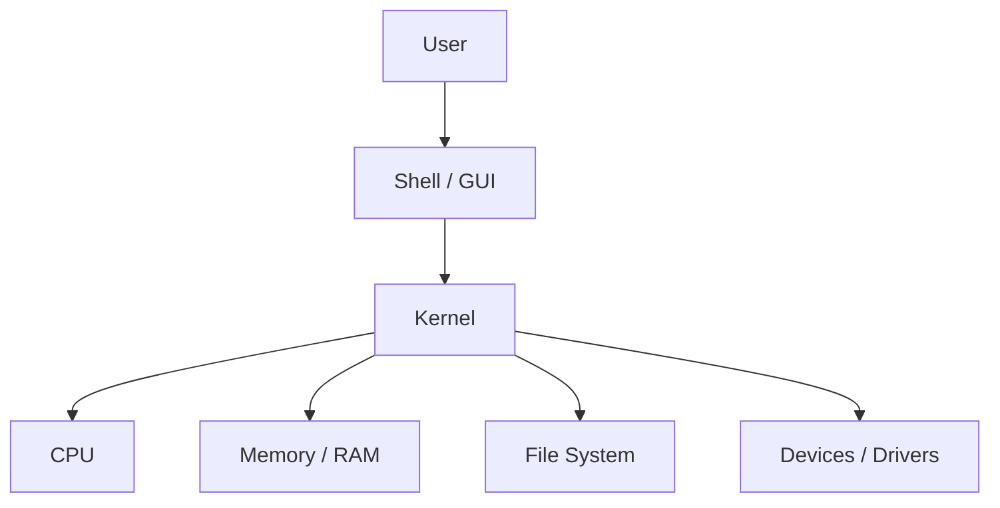
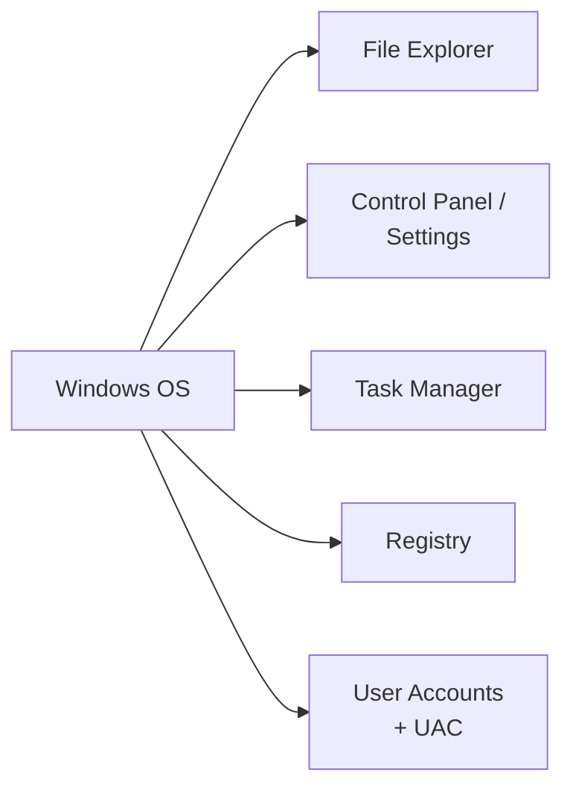
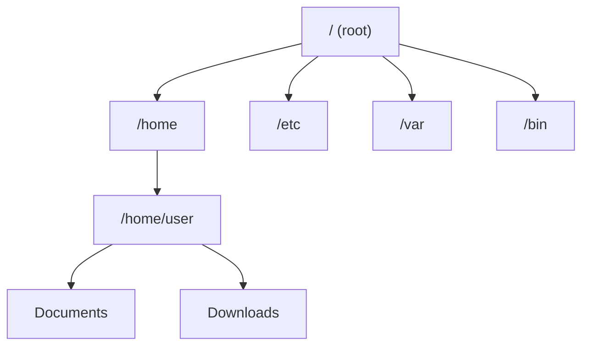
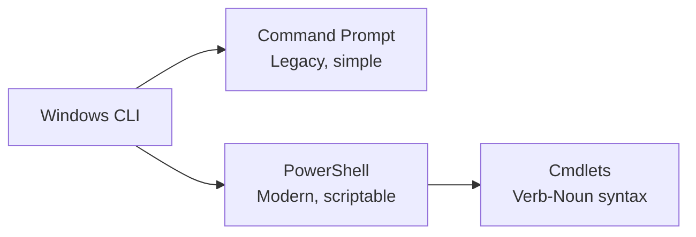
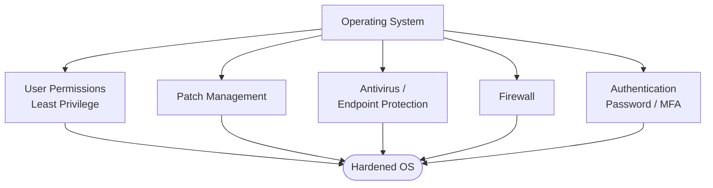
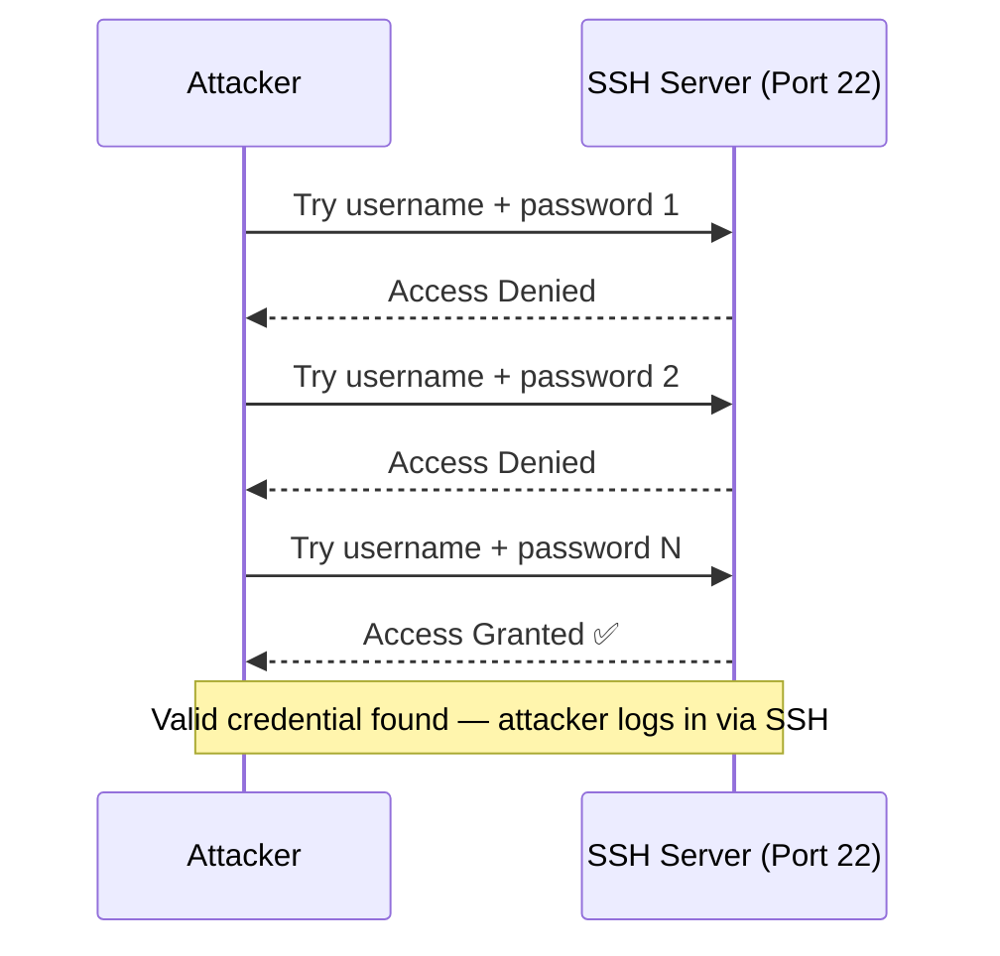
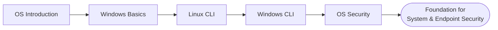

# Operating Systems Basics

> Notes covering Module 5 of the Pre Security path — OS fundamentals, Windows basics, Linux CLI, Windows CLI, and Operating System Security.

---

## 1. Operating Systems: Introduction

An **Operating System (OS)** is the software that manages a computer's hardware and provides a platform for applications to run on.

- **Kernel** – the core of the OS; manages CPU, memory, and hardware directly
- **Shell/GUI** – how users interact with the OS (command line or graphical interface)
- **File System** – organizes how data is stored and retrieved (e.g., NTFS, ext4)
- **Process Management** – handles running programs, scheduling, and multitasking
- **Common OS types:** Windows, Linux, macOS



**Key idea:** The OS sits between the user/applications and the raw hardware — it's the translator that lets software use hardware resources safely and efficiently.

---

## 2. Windows Basics

**Windows** is the most widely used desktop OS, known for its GUI-first approach and broad software/hardware compatibility.

- **File Explorer** – navigate the file system visually
- **Control Panel / Settings** – configure system settings
- **Task Manager** – view/manage running processes
- **Registry** – central database storing OS/application configuration
- **User Account Control (UAC)** – prompts for permission before system changes



**Key idea:** Windows favors accessibility via GUI, but almost everything it does graphically can also be done — often more powerfully — through its command-line tools.

---

## 3. Linux CLI Basics

**Linux** is an open-source OS widely used on servers and in cybersecurity, typically interacted with via the **command line interface (CLI)**.

Common commands:

| Command | Purpose |
|---------|---------|
| `pwd` | Print current working directory |
| `ls` | List files/directories |
| `cd` | Change directory |
| `cat` | Display file contents |
| `mkdir` | Create a new directory |
| `rm` | Remove a file/directory |
| `whoami` | Show current logged-in user |
| `sudo` | Run a command with elevated (admin) privileges |
| `find` | Search for files/directories matching criteria |



**Key idea:** Linux's file system is a single hierarchical tree starting at `/` (root) — unlike Windows' drive-letter system (`C:\`, `D:\`), everything, including other drives, is mounted somewhere under `/`.

### The `find` Command

`find` is one of the most important Linux commands for security work — it searches for files/directories based on criteria like name, type, size, permissions, or modification time. This makes it essential for enumeration (e.g., hunting for config files, credentials, or SUID binaries during privilege escalation).

**Basic syntax:**

```bash
find <path> <options>
```

**Common examples:**

```bash
# Find a file by name, starting search from root
find / -name "config.php"

# Find a file by name, case-insensitive
find / -iname "*password*"

# Find all files owned by a specific user
find / -user bob

# Find files larger than 100MB
find / -size +100M

# Find files with SUID permission set (common in privilege escalation)
find / -perm -4000 -type f 2>/dev/null

# Find files modified in the last 1 day
find / -mtime -1
```

| Flag | Meaning |
|------|---------|
| `-name` | Search by exact filename (case-sensitive) |
| `-iname` | Search by filename (case-insensitive) |
| `-type f` | Only match files (not directories) |
| `-type d` | Only match directories |
| `-user` | Match files owned by a specific user |
| `-perm` | Match files with specific permissions |
| `2>/dev/null` | Suppresses "permission denied" error messages |

**Key idea:** `find` is a go-to enumeration tool in CTFs and real pentests — searching for readable config files, SUID binaries, or recently modified files is often one of the first steps after gaining a foothold on a Linux system.

---

## 4. Windows CLI Basics

Windows also has a powerful command line, primarily through **Command Prompt (cmd)** and **PowerShell**.

| Command (cmd) | Purpose |
|----------------|---------|
| `dir` | List files/directories (like `ls`) |
| `cd` | Change directory |
| `type` | Display file contents (like `cat`) |
| `mkdir` | Create a new directory |
| `del` | Delete a file |
| `whoami` | Show current logged-in user |
| `ipconfig` | Show network configuration |

**PowerShell** is a more advanced shell built on .NET, using cmdlets (`Verb-Noun` format) like `Get-Process`, `Get-ChildItem`.

### Using `dir` with a Path

`dir` lists the contents of a directory — by default, the current one. You can also point it at a specific path to search for a file or list a different folder's contents without navigating there first.

**Basic syntax:**

```cmd
dir <path>
```

**Common examples:**

```cmd
:: List contents of the current directory
dir

:: List contents of a specific folder
dir C:\Users\Bob\Documents

:: Search for a specific file within a folder
dir C:\Users\Bob\Documents\notes.txt

:: Search recursively through subfolders for a file (e.g., finding a specific file anywhere on C:)
dir C:\*password* /s

:: Show hidden files as well
dir /a C:\Users\Bob
```

| Flag | Meaning |
|------|---------|
| `/s` | Search the specified directory and all subdirectories |
| `/a` | Show all files, including hidden/system files |
| `/b` | Bare format — just file names, no extra details |

**Key idea:** You don't need to `cd` into a folder first — pointing `dir` directly at a path (or a path with a filename/wildcard) lets you check a location's contents or hunt for a specific file in one command, which is especially useful combined with `/s` for a recursive search.



**Key idea:** cmd and PowerShell both let you do everything the GUI does — faster and scriptable — which is why CLI proficiency matters heavily in cybersecurity (automation, forensics, remote administration).

---

## 5. Operating System Security

Securing an OS involves controlling access, patching vulnerabilities, and limiting what users/processes can do.

- **User Permissions** – restrict what each user account can access or modify
- **Least Privilege** – give users/processes only the access they need
- **Patch Management** – regularly updating the OS to fix security vulnerabilities
- **Antivirus/Endpoint Protection** – detects and blocks malicious software
- **Firewall** – controls inbound/outbound network traffic at the OS level
- **Authentication** – passwords, biometrics, MFA to verify identity



**Key idea:** OS security is layered — no single control is enough. Weak permissions, unpatched systems, or missing MFA can each individually undermine an otherwise secure setup.

### SSH & Password Guessing

**SSH (Secure Shell)** is used to remotely and securely access another machine's command line, typically on **port 22**. It's one of the most common services exposed on Linux servers — and a common target for **brute-forcing/password guessing** attacks.

- If SSH allows password authentication (instead of only key-based auth), a weak or guessable password can be attacked directly
- Attackers (or pentesters, with authorization) can try a list of common/likely passwords against a known username until one works
- This is exactly why **strong passwords**, **key-based authentication**, and **rate-limiting/account lockout** matter

**Connecting to SSH normally:**

```bash
ssh username@target_ip
```

**Guessing/brute-forcing an SSH password (example using Hydra):**

```bash
hydra -l <username> -P <wordlist.txt> ssh://<target_ip>
```

| Flag | Meaning |
|------|---------|
| `-l` | Specifies a single known username |
| `-L` | Specifies a file containing a list of usernames |
| `-P` | Specifies a wordlist file of passwords to try |
| `-p` | Specifies a single password to try |
| `ssh://<ip>` | Target service and IP address |

**Example walkthrough:**

```bash
# We know the username is "user" and have a password wordlist
hydra -l user -P rockyou.txt ssh://10.10.10.10

# Once Hydra finds a valid password, connect using it
ssh user@10.10.10.10
```



**Key idea:** Password-guessing against SSH works because many systems still allow password authentication with weak/reused passwords. Defensively, this is mitigated with strong password policies, disabling password auth in favor of SSH keys, fail2ban/rate-limiting, and not exposing SSH to the public internet unnecessarily.

---

## Quick Recap



- Understanding OS internals → basis for privilege escalation concepts
- Linux/Windows CLI fluency → essential for enumeration, scripting, and forensics
- OS Security controls → foundation for hardening and defense-in-depth
