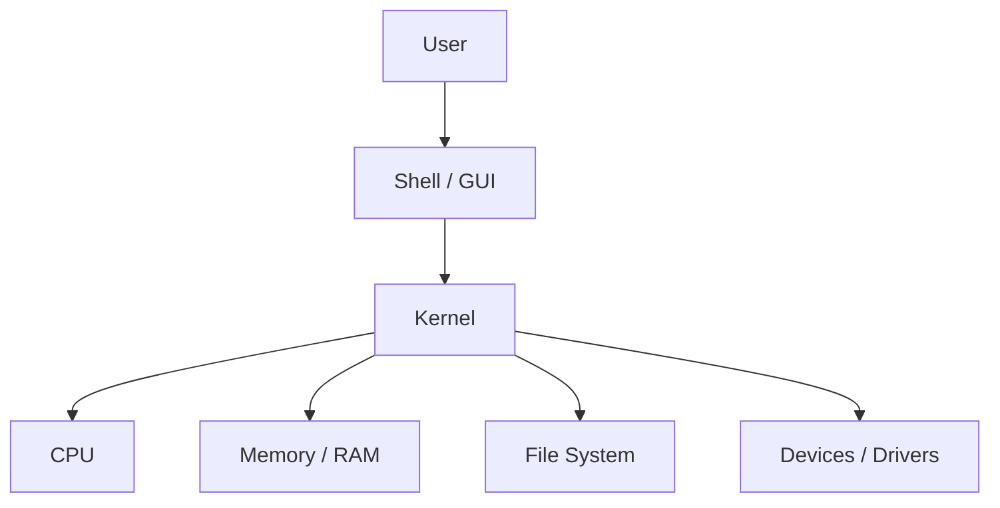
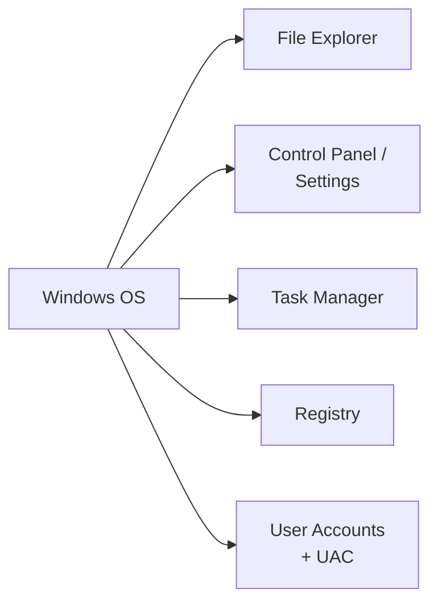
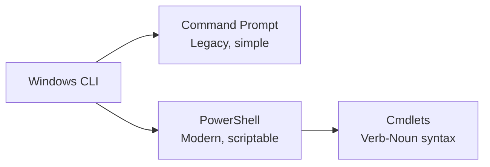

# Operating Systems Basics

> Notes covering Module 5 of the Pre Security path — OS fundamentals, Windows basics, Linux CLI, Windows CLI, and Operating System Security.

---

## 1. Operating Systems: Introduction

An **Operating System (OS)** is the software that manages a computer's hardware and provides a platform for applications to run on.

- **Kernel** – the core of the OS; manages CPU, memory, and hardware directly
- **Shell/GUI** – how users interact with the OS (command line or graphical interface)
- **File System** – organizes how data is stored and retrieved (e.g., NTFS, ext4)
- **Process Management** – handles running programs, scheduling, and multitasking
- **Common OS types:** Windows, Linux, macOS



**Key idea:** The OS sits between the user/applications and the raw hardware — it's the translator that lets software use hardware resources safely and efficiently.

---

## 2. Windows Basics

**Windows** is the most widely used desktop OS, known for its GUI-first approach and broad software/hardware compatibility.

- **File Explorer** – navigate the file system visually
- **Control Panel / Settings** – configure system settings
- **Task Manager** – view/manage running processes
- **Registry** – central database storing OS/application configuration
- **User Account Control (UAC)** – prompts for permission before system changes



**Key idea:** Windows favors accessibility via GUI, but almost everything it does graphically can also be done — often more powerfully — through its command-line tools.

---

## 3. Linux CLI Basics

**Linux** is an open-source OS widely used on servers and in cybersecurity, typically interacted with via the **command line interface (CLI)**.

Common commands:

| Command | Purpose |
|---------|---------|
| `pwd` | Print current working directory |
| `ls` | List files/directories |
| `cd` | Change directory |
| `cat` | Display file contents |
| `mkdir` | Create a new directory |
| `rm` | Remove a file/directory |
| `whoami` | Show current logged-in user |
| `sudo` | Run a command with elevated (admin) privileges |

```mermaid
graph TD
    Root["/ (root)"] --> Home[/home]
    Root --> Etc[/etc]
    Root --> Var[/var]
    Root --> Bin[/bin]
    Home --> User[/home/user]
    User --> Docs[Documents]
    User --> Downloads[Downloads]
```

**Key idea:** Linux's file system is a single hierarchical tree starting at `/` (root) — unlike Windows' drive-letter system (`C:\`, `D:\`), everything, including other drives, is mounted somewhere under `/`.

---

## 4. Windows CLI Basics

Windows also has a powerful command line, primarily through **Command Prompt (cmd)** and **PowerShell**.

| Command (cmd) | Purpose |
|----------------|---------|
| `dir` | List files/directories (like `ls`) |
| `cd` | Change directory |
| `type` | Display file contents (like `cat`) |
| `mkdir` | Create a new directory |
| `del` | Delete a file |
| `whoami` | Show current logged-in user |
| `ipconfig` | Show network configuration |

**PowerShell** is a more advanced shell built on .NET, using cmdlets (`Verb-Noun` format) like `Get-Process`, `Get-ChildItem`.



**Key idea:** cmd and PowerShell both let you do everything the GUI does — faster and scriptable — which is why CLI proficiency matters heavily in cybersecurity (automation, forensics, remote administration).

---

## 5. Operating System Security

Securing an OS involves controlling access, patching vulnerabilities, and limiting what users/processes can do.

- **User Permissions** – restrict what each user account can access or modify
- **Least Privilege** – give users/processes only the access they need
- **Patch Management** – regularly updating the OS to fix security vulnerabilities
- **Antivirus/Endpoint Protection** – detects and blocks malicious software
- **Firewall** – controls inbound/outbound network traffic at the OS level
- **Authentication** – passwords, biometrics, MFA to verify identity


**Key idea:** OS security is layered — no single control is enough. Weak permissions, unpatched systems, or missing MFA can each individually undermine an otherwise secure setup.

---

## Quick Recap


- Understanding OS internals → basis for privilege escalation concepts
- Linux/Windows CLI fluency → essential for enumeration, scripting, and forensics
- OS Security controls → foundation for hardening and defense-in-depth
