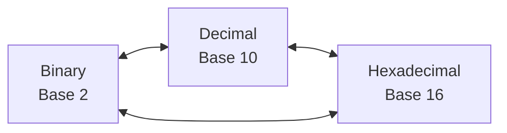
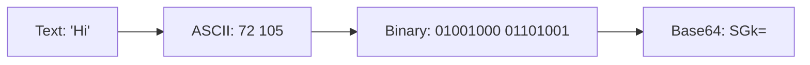
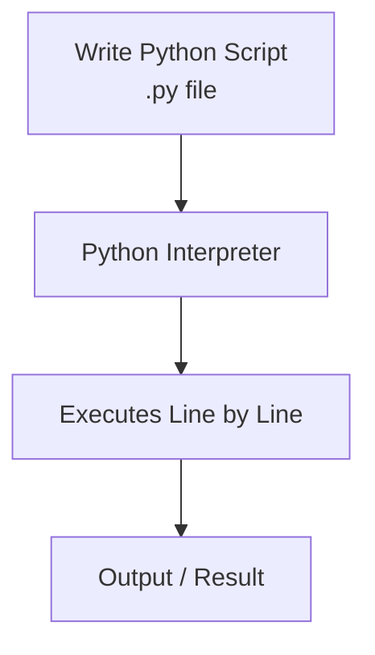
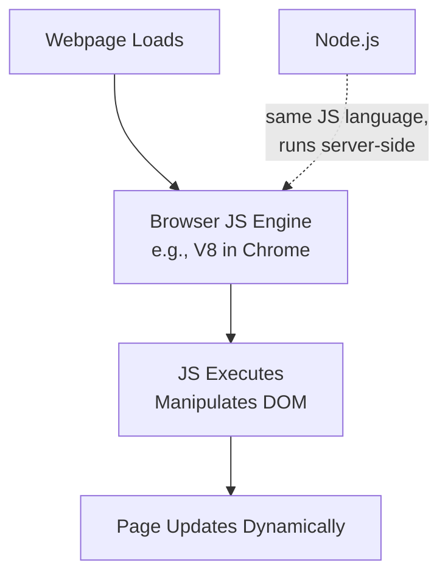
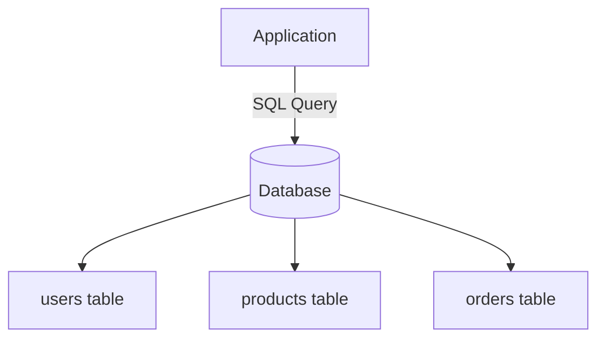
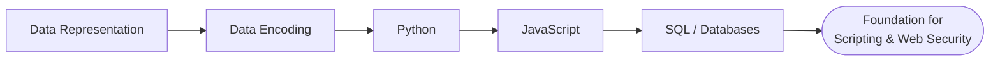

# Software Basics

> Notes covering Module 6 of the Pre Security path — data representation, data encoding, Python, JavaScript, and database/SQL basics.

---

## 1. Data Representation

Computers only understand **binary** (0s and 1s) at the lowest level. Everything — text, images, numbers, instructions — is ultimately represented as binary data, just interpreted differently depending on context.

- **Bit** – a single 0 or 1, the smallest unit of data
- **Byte** – 8 bits grouped together (can represent 256 values, 0–255)
- **Binary** – base-2 number system (0, 1)
- **Decimal** – base-10, the number system humans normally use
- **Hexadecimal** – base-16, often used as a compact way to represent binary data (e.g., colors, memory addresses)

| Decimal | Binary | Hexadecimal |
|---------|--------|-------------|
| 0 | 0000 | 0 |
| 5 | 0101 | 5 |
| 10 | 1010 | A |
| 15 | 1111 | F |
| 255 | 11111111 | FF |



**Key idea:** The same underlying value can be represented in binary, decimal, or hex — converting between them is a core skill for reading memory dumps, network packets, and file headers.

---

## 2. Data Encoding

**Encoding** is the process of converting data from one format into another so it can be stored, transmitted, or displayed correctly — it is **not encryption** (it's reversible with no secret key needed).

- **ASCII** – maps each character to a number (0–127), e.g., `A` = 65
- **Unicode/UTF-8** – extends ASCII to represent characters from virtually all languages/symbols
- **Base64** – encodes binary data as readable ASCII text (commonly seen in web/email data, and CTFs)



**Key idea:** Encoding schemes like Base64 are everywhere in web traffic and CTF challenges — recognizing the pattern (e.g., `=` padding, character set) is a common first step in decoding hidden data.

---

## 3. Python: Simple Demo

**Python** is a high-level, beginner-friendly, interpreted programming language widely used in cybersecurity for scripting, automation, and exploit development.

**Why Python matters in security:**
- Used to write automation scripts (scanning, enumeration, exploit PoCs)
- Simple, readable syntax — fast to write and modify
- Huge ecosystem of libraries (`requests`, `scapy`, `pwntools`, `socket`)
- Interpreted (no compilation step) — runs directly via `python3 script.py`

**Basic syntax example:**

```python
# Variables and data types
name = "Alice"        # string
age = 25               # integer
is_admin = False       # boolean

# Conditional logic
if is_admin:
    print(f"{name} has admin access")
else:
    print(f"{name} has standard access")

# Loop example
for i in range(3):
    print(f"Attempt {i + 1}")

# Simple function
def greet(user):
    return f"Hello, {user}!"

print(greet(name))
```

| Concept | Example | Purpose |
|---------|---------|---------|
| Variable | `x = 10` | Stores a value |
| Conditional | `if / else` | Executes code based on a condition |
| Loop | `for` / `while` | Repeats an action |
| Function | `def name():` | Reusable block of code |
| Import | `import socket` | Brings in external libraries |



**Key idea:** Python's interpreted nature means there's no separate compile step — you write code and run it directly, which makes it ideal for quick scripting during security assessments (e.g., a custom port scanner or brute-forcer).

---

## 4. JavaScript: Simple Demo

**JavaScript (JS)** is the primary programming language of the web — it runs in the browser (client-side) and can also run server-side via **Node.js**.

**Why JavaScript matters in security:**
- Almost every website uses it — understanding JS is essential for web app security (XSS, DOM manipulation attacks)
- Runs directly in the browser — no compilation, executed by the browser's JS engine
- Node.js extends JS to the backend, meaning it's also relevant for server-side vulnerabilities

**Basic syntax example:**

```javascript
// Variables and data types
let name = "Alice";       // string
let age = 25;              // number
let isAdmin = false;       // boolean

// Conditional logic
if (isAdmin) {
    console.log(`${name} has admin access`);
} else {
    console.log(`${name} has standard access`);
}

// Loop example
for (let i = 0; i < 3; i++) {
    console.log(`Attempt ${i + 1}`);
}

// Simple function
function greet(user) {
    return `Hello, ${user}!`;
}

console.log(greet(name));
```

| Concept | Example | Purpose |
|---------|---------|---------|
| Variable | `let x = 10;` | Stores a value |
| Conditional | `if / else` | Executes code based on a condition |
| Loop | `for` / `while` | Repeats an action |
| Function | `function name() {}` | Reusable block of code |
| DOM Access | `document.getElementById()` | Interacts with webpage elements |



**Key idea:** Because JavaScript runs directly in the user's browser and can manipulate the page (the DOM), it's the language behind client-side attacks like **Cross-Site Scripting (XSS)** — understanding basic JS syntax helps you recognize what a malicious script is actually doing.

### Python vs JavaScript — Quick Comparison

| Feature | Python | JavaScript |
|---------|--------|------------|
| Primary environment | Terminal / scripts / backend | Browser (+ Node.js for backend) |
| Typing | Dynamically typed | Dynamically typed |
| Common security use | Automation, exploit scripting, tooling | Web app attacks (XSS), browser-based exploitation |
| Execution | Interpreted via Python interpreter | Interpreted/JIT-compiled via JS engine |

---

## 5. Database SQL Basics

A **database** stores structured data, and **SQL (Structured Query Language)** is used to interact with relational databases.

- **Table** – organizes data into rows and columns
- **Row** – a single record/entry
- **Column** – a specific attribute/field
- **Query** – a request to retrieve, insert, update, or delete data

**Common SQL commands:**

```sql
-- Retrieve data
SELECT username, email FROM users;

-- Filter data
SELECT * FROM users WHERE role = 'admin';

-- Insert data
INSERT INTO users (username, password) VALUES ('bob', 'hunter2');

-- Update data
UPDATE users SET role = 'admin' WHERE username = 'alice';

-- Delete data
DELETE FROM users WHERE username = 'bob';
```



**Key idea:** SQL underpins most web applications' data storage — and improperly sanitized input in SQL queries is exactly what leads to **SQL Injection**, one of the most well-known web vulnerabilities.

---

## Quick Recap



- Data representation/encoding → basis for reading raw data, memory dumps, and CTF decoding challenges
- Python → the go-to language for security automation and exploit scripting
- JavaScript → essential for understanding client-side web attacks like XSS
- SQL → essential for understanding SQL Injection and database security
